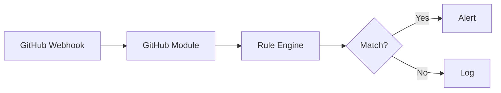

# Sentinel documentation style guide

This guide defines the standards for all documentation in the Sentinel repository. It applies to contributors writing new pages, engineers updating API references, and anyone editing existing content. Follow these guidelines to keep the documentation consistent, scannable, and correct.

Sentinel documentation follows the [Google Developer Documentation Style Guide](https://developers.google.com/style) as the baseline. This document covers Sentinel-specific conventions and highlights the rules that are most commonly needed.

---

## Audience

This guide is for **documentation authors** -- people writing or editing files in `docs/`. It is not a user-facing document. If you are looking for how to use Sentinel, see [`docs/user/getting-started`](user/getting-started).

---

## Voice and tone

### Active voice

Write in active voice. Active voice makes sentences shorter, clearer, and easier to translate.

| Avoid (passive) | Prefer (active) |
|-----------------|-----------------|
| "The alert is raised by the correlation engine." | "The correlation engine raises the alert." |
| "Secrets are encrypted before they are stored." | "Sentinel encrypts secrets before storing them." |
| "Rate limits can be configured by the operator." | "You can configure rate limits in the environment variables." |

### Second person

Address the reader as "you." Do not use "the user," "the developer," or "one."

- **Correct:** "You configure notification channels from the Channels page."
- **Incorrect:** "The user configures notification channels from the Channels page."

### Authoritative and precise

State facts directly. Avoid hedging language ("might," "perhaps," "should probably") unless genuine uncertainty exists and you are documenting a known gap.

- **Correct:** "The API returns HTTP 403 when the CSRF (Cross-Site Request Forgery) header is missing."
- **Incorrect:** "The API might return a 403 error if the CSRF header seems to be missing."

Do not use filler phrases: "simply," "just," "easily," "of course," "obviously."

---

## Document types

Sentinel documentation follows the [Diataxis](https://diataxis.fr/) framework. Every document belongs to one of four types. Identify the type at the start of writing -- it determines structure and scope.

| Type | Purpose | Reader's goal | Example |
|------|---------|---------------|---------|
| **Tutorial** | Learning-oriented walkthrough | Gain hands-on experience | `user/getting-started` |
| **How-to guide** | Goal-oriented procedure | Accomplish a specific task | `user/integrations` |
| **Reference** | Information-oriented catalog | Look up precise details | `app/api-reference` |
| **Explanation** | Understanding-oriented discussion | Understand why and how | `app/correlation-engine` |

Do not mix types in a single document. If a reference page needs procedural content, link to a how-to guide instead of embedding steps.

---

## Formatting

### Headings

Use ATX-style headings (`#` prefixes). The page title is H1. Body sections use H2. Subsections use H3. H4 is the maximum depth -- restructure the content if you need H5 or deeper.

```markdown
# Page title

## Major section

### Subsection

#### Detail level (use sparingly)
```

Do not skip heading levels. Do not use bold text as a substitute for a heading.

Use sentence case for headings: capitalize only the first word and proper nouns.

- **Correct:** "Setting up the development environment"
- **Incorrect:** "Setting Up the Development Environment"

### Code blocks

Every code block must have a language tag. Never use a bare ` ``` ` fence.

Common language tags used in this repository:

| Tag | Use for |
|-----|---------|
| `typescript` | TypeScript and JavaScript source code |
| `bash` | Shell commands and scripts |
| `sql` | SQL queries and schema fragments |
| `json` | JSON payloads and configuration files |
| `yaml` | YAML configuration files |
| `mermaid` | Architecture and flow diagrams |
| `text` | Plain text output, log lines, file paths |

All commands in code blocks must be copy-pastable. Do not include shell prompts (`$`, `%`, `#`) in command blocks. Include them only in example output blocks where the distinction between input and output matters.

```bash
# Correct -- no prompt, copy-pastable
pnpm install --frozen-lockfile

# Acceptable when showing input vs. output
$ pnpm --version
9.15.4
```

When a command requires a placeholder value that the reader must substitute, use angle brackets with a descriptive name:

```bash
pnpm --filter @sentinel/<package-name> dev
```

Document what the placeholder represents immediately below the code block.

### Inline code

Use backtick inline code for:

- File paths: `apps/api/src/index.ts`
- Environment variable names: `DATABASE_URL`
- Command names: `pnpm db:migrate`
- TypeScript type names: `DetectionModule`, `CorrelationRuleConfig`
- HTTP methods and status codes: `GET`, `POST`, `HTTP 403`
- JSON field names: `correlationKey`, `windowMinutes`
- Route paths: `/api/correlation-rules`

Do not use inline code for product names (Sentinel, GitHub, AWS, Slack) or general terms.

### Tables

Use tables for reference data with two or more comparable attributes. Align columns with spaces for readability in source. Keep table cell content short -- link to a separate page for detailed explanations.

```markdown
| Column one | Column two | Column three |
|------------|------------|--------------|
| Value      | Value      | Value        |
```

Do not use tables for sequential steps -- use a numbered list instead.

### Lists

Use numbered lists for sequential steps where order matters. Use bulleted lists for unordered items.

Keep list items parallel in grammatical form. If one item is a complete sentence, all items in that list should be complete sentences.

Do not nest lists more than two levels deep.

### Callouts

Use blockquotes for callouts. Prefix the callout with a bold label that identifies its type.

**Note** -- additional context that helps but is not critical:

> **Note:** The health check endpoint at `/health` does not require authentication.

**Warning** -- information the reader must act on to avoid a problem:

> **Warning:** Rotating the `ENCRYPTION_KEY` without re-encrypting stored secrets will cause all existing integration credentials to become unreadable.

**Tip** -- an optional shortcut or best practice:

> **Tip:** Run `pnpm test:watch` during development to get immediate feedback on test failures as you edit files.

Use callouts sparingly. If every paragraph has a callout, none of them carry weight.

---

## API documentation conventions

### Endpoint format

Document each API endpoint with the following structure:

```markdown
### `POST /api/detections`

Create a new detection rule.

**Authentication:** Session cookie or API key with `write` scope.

**Request body:**

| Field | Type | Required | Description |
|-------|------|----------|-------------|
| `name` | `string` | Yes | Human-readable detection name |
| `moduleId` | `string` | Yes | Module identifier: `github`, `chain`, `infra`, `registry`, or `aws` |
| `severity` | `string` | No | One of `low`, `medium`, `high`, `critical`. Defaults to `high` |

**Example request:**

```bash
curl -X POST http://localhost:4000/api/detections \
  -H "Content-Type: application/json" \
  -H "Cookie: sentinel.sid=<session-id>" \
  -H "x-csrf-token: <csrf-token>" \
  -d '{
    "name": "Branch protection disabled",
    "moduleId": "github",
    "severity": "critical"
  }'
```

**Response (201):**

```json
{
  "id": "550e8400-e29b-41d4-a716-446655440000",
  "name": "Branch protection disabled",
  "moduleId": "github",
  "severity": "critical",
  "status": "active"
}
```

**Error responses:**

| Status | Reason |
|--------|--------|
| `400` | Invalid request body (Zod validation failure) |
| `401` | Missing or expired session |
| `403` | Insufficient permissions (requires `editor` or `admin` role) |
```

### cURL examples

Include a cURL example for every mutating endpoint (`POST`, `PUT`, `PATCH`, `DELETE`). For `GET` endpoints, include a cURL example when the endpoint has non-obvious query parameters.

All cURL examples must:

- Use long-form flags (`--header` is acceptable; `-H` is preferred for brevity in repeated headers).
- Include the `Content-Type: application/json` header for JSON request bodies.
- Use placeholder values in angle brackets for authentication tokens and dynamic identifiers.
- Be copy-pastable with only placeholder substitution.

### Request and response format

- Show request bodies as JSON objects with representative example values.
- Show response bodies as JSON objects. Include only the fields that are relevant to the endpoint's purpose.
- Use `...` to indicate truncated arrays or objects when the full response is too long.

---

## Acronyms and abbreviations

Spell out an acronym on first use in each document, followed by the acronym in parentheses. Use the acronym alone for subsequent occurrences.

Examples of required spell-outs:

| Acronym | Full form |
|---------|-----------|
| API | Application Programming Interface |
| RBAC | Role-Based Access Control |
| CSRF | Cross-Site Request Forgery |
| CI/CD | Continuous Integration/Continuous Delivery |
| ORM | Object-Relational Mapper |
| EVM | Ethereum Virtual Machine |
| VPS | Virtual Private Server |
| SSM | AWS Systems Manager Parameter Store |
| HSTS | HTTP Strict Transport Security |
| JSONB | JSON Binary (PostgreSQL column type) |
| REST | Representational State Transfer |
| DevSecOps | Development, Security, and Operations |
| RPC | Remote Procedure Call |

After the first spell-out, use the acronym form exclusively. Do not alternate between spelled-out and acronym forms in the same document.

---

## Sentinel-specific terminology

Use these terms consistently across all documentation.

| Term | Correct usage | Notes |
|------|---------------|-------|
| Sentinel | Always capitalized | Do not write "sentinel" in lowercase when referring to the product |
| detection rule | Lowercase | The unit of evaluation logic within a module |
| detection template | Lowercase | A reusable, user-configurable rule blueprint |
| correlation rule | Lowercase | A multi-event pattern: sequence, aggregation, or absence |
| alert | Lowercase | The output produced when a detection or correlation rule fires |
| event | Lowercase | A normalized, timestamped occurrence ingested by a module |
| module | Lowercase | A self-contained integration: `github`, `chain`, `infra`, `registry`, `aws` |
| module ID | Use the exact ID strings from code | Use backtick inline code formatting: `github`, `chain`, `infra`, `registry`, `aws` |
| organization | Full word | Do not abbreviate as "org" in documentation prose (acceptable in code and config) |
| notification channel | Lowercase | Slack, email, or webhook destination for alerts |
| evaluator | Lowercase | Short form of "rule evaluator." Acceptable in technical documentation; prefer "rule evaluator" in operator-facing docs |
| rule evaluator | Lowercase | The TypeScript class implementing `RuleEvaluator` within a module |
| job handler | Lowercase | The TypeScript class implementing `JobHandler` within a module |
| sequence rule | Lowercase | A correlation rule that matches an ordered series of events within a time window |
| aggregation rule | Lowercase | A correlation rule that fires when event counts or sums exceed a threshold in a window |
| absence rule | Lowercase | A correlation rule that fires when an expected event does not occur within a time window |
| correlation key | Lowercase | The field or composite of fields used to group related events in a correlation rule |
| event type | Lowercase | A string identifier for a category of normalized events (e.g., `github.push`, `chain.transaction`) |
| normalizer | Lowercase | The function that transforms raw external data into Sentinel's canonical event schema |
| poll sweep | Lowercase | A scheduled job that iterates over monitored resources and polls for changes |
| notify key | Lowercase | An organization-scoped API key prefixed with `snk_` for CI pipeline and external integration authentication |
| grace period | Lowercase | A configurable delay before a deferred rule evaluation fires, allowing cancellation if a compensating event arrives |

### Product and library names

| Name | Correct casing | Notes |
|------|----------------|-------|
| BullMQ | Exactly this casing | Do not write "Bull", "bullmq", or "Bull MQ" |
| Drizzle ORM | Exactly this casing | Do not write "drizzle" |
| Hono | Exactly this casing | Do not write "hono" |
| Next.js | Exactly this casing | Do not write "Next" or "NextJS" |
| Vitest | Exactly this casing | Do not write "vitest" |
| PostgreSQL | Exactly this casing | Do not write "Postgres" or "postgres" in prose |
| Redis | Exactly this casing | Do not write "redis" in prose |
| Docker Compose | Two words, both capitalized | Do not write "docker-compose" in prose |
| GitHub Actions | Exactly this casing | |
| Hetzner | Exactly this casing | |
| Slack Block Kit | Exactly this casing | The Slack notification formatting API |

### Severity levels

Severity levels are always lowercase in prose. When referring to a specific level as a value, use inline code.

- "The rule fires with `critical` severity."
- "Create a high-severity detection for this event type."

The four valid severity levels in ascending order: `low`, `medium`, `high`, `critical`.

### Role names

Role names are lowercase in prose. The three RBAC roles are `admin`, `editor`, and `viewer`.

- "Assign the `editor` role to developers who write detection rules."

---

## Diagrams

### When to use Mermaid

Use Mermaid diagrams for:

- System architecture showing service-to-service relationships
- Data flow through the processing pipeline
- State machines (correlation rule lifecycle, alert states)
- Decision trees in complex how-to guides

Use Mermaid in a fenced code block with the `mermaid` language tag:

````markdown

````

### Mermaid style guidelines

- Use `graph LR` (left-to-right) for data flow diagrams.
- Use `graph TD` (top-down) for hierarchy and architecture diagrams.
- Use `sequenceDiagram` for request/response flows.
- Use `stateDiagram-v2` for state machines.
- Keep node labels short (3-5 words maximum).
- Use bracket shapes consistently: `[Service]` for services, `(Process)` for processes, `{Decision}` for decision points, `[(Database)]` for data stores.
- Do not use color overrides or custom styles -- diagrams must render correctly in both light and dark GitHub themes.

### When to use ASCII diagrams

Use ASCII diagrams only when Mermaid cannot represent the concept -- for example, packet formats, memory layouts, or table schemas. Keep ASCII diagrams narrow enough to display without horizontal scrolling (80 characters maximum).

### Diagram captions

Place a plain-text description immediately below each diagram that explains what the diagram shows. Do not rely on the diagram alone to convey meaning -- some readers use screen readers or render docs in environments that do not process Mermaid.

---

## File naming conventions

### Documentation files

Use kebab-case for all documentation file names. Use lowercase letters, hyphens, and the `.md` extension only.

- **Correct:** `correlation-engine.md`, `api-reference.md`, `quick-start.md`
- **Incorrect:** `correlationEngine.md`, `API-Reference.md`, `Quick_Start.md`

### Directory structure

Place all documentation files under `docs/`. Use the track subdirectories for content:

```text
docs/
├── README.md              # Documentation hub
├── CONTRIBUTING.md        # Contributor guide
├── STYLE-GUIDE.md         # This style guide
├── TESTING.md             # Testing guide
├── security-scanning.md   # Security scanning overview
├── app/                   # Technical track
│   ├── architecture/      # System architecture and data flow
│   ├── api-reference/     # REST API endpoint documentation
│   ├── modules/           # Module interface and per-module references
│   ├── correlation-engine/ # Correlation engine internals
│   ├── data-model/        # Database schema and conventions
│   ├── deployment/        # Production deployment guides
│   ├── configuration/     # Environment variables and secrets
│   ├── getting-started/   # Developer setup guide
│   └── services/          # Core service documentation
└── user/                  # Operator track
    ├── getting-started/   # Installation and first-alert walkthrough
    ├── integrations/      # External service connection guides
    ├── detections/        # Detection rule authoring
    ├── alerts/            # Alert management and notification channels
    ├── administration/    # RBAC, audit log, API keys
    ├── core-concepts/     # Domain model explanations
    ├── glossary.md        # Terminology reference
    └── troubleshooting/   # Common issues and resolutions
```

Do not add documentation files to application source directories (`apps/`, `modules/`, `packages/`). Inline code comments serve a different purpose than documentation.

### Image and asset files

Store images referenced by documentation in a `docs/assets/` directory. Use descriptive, kebab-case file names that include the page they belong to:

```text
docs/assets/architecture-data-flow.png
docs/assets/correlation-sequence-diagram.png
```

---

## Links

### Internal links

Use relative paths for links between documentation files. Do not use absolute URLs for internal links.

```markdown
<!-- Correct -->
See [module interface](app/modules/module-interface.md) for the full contract.

<!-- Incorrect -->
See [module interface](https://github.com/your-org/sentinel/blob/main/docs/app/modules/module-interface.md).
```

Link to a specific heading by appending the heading anchor:

```markdown
See [correlation key fields](app/correlation-engine.md#correlation-key-fields).
```

### External links

For links to external sites that readers should open in a new tab (such as third-party service documentation), use HTML anchor syntax with `target="_blank"` and `rel="noopener noreferrer"`:

```html
See the <a href="https://api.slack.com/block-kit" target="_blank" rel="noopener noreferrer">Slack Block Kit documentation</a>.
```

### Link text

Write descriptive link text. Do not use "click here," "this link," or bare URLs as link text.

- **Correct:** "See [Writing correlation rules](user/correlation-rules.md) for examples."
- **Incorrect:** "For more information, [click here](user/correlation-rules.md)."

---

## Security content conventions

### Never publish real credentials

Do not include real API keys, passwords, tokens, session secrets, or encryption keys in documentation. Use clearly synthetic placeholders:

```bash
SESSION_SECRET=<your-session-secret-at-least-32-characters>
ENCRYPTION_KEY=<64-hex-characters>
```

Prefer `<descriptive-placeholder>` syntax over `YOUR_VALUE_HERE` -- angle bracket placeholders are visually distinct from real values.

### Describing authentication flows

When documenting authentication:

1. Name the mechanism precisely: "session cookie," "API key," "CSRF defense header," not just "auth."
2. Specify which HTTP header or cookie carries the credential: `Authorization: Bearer <key>`, `Cookie: sentinel.sid`.
3. Document failure modes: what status code the API returns when the credential is missing or invalid.

### Writing about secrets at rest

When documenting how Sentinel stores sensitive data, state the mechanism explicitly:

- "Sentinel encrypts integration credentials with AES-256-GCM before writing them to the database."
- Not: "Credentials are stored securely."

### Describing Role-Based Access Control

When describing an action that requires a specific role, state the role requirement at the start of the procedure, not buried in a later step:

> This procedure requires the `admin` role. If you have the `editor` or `viewer` role, contact your organization's administrator.

### Security warnings

Use the Warning callout format for any content where a misconfiguration could cause a security incident:

> **Warning:** Setting `ALLOWED_ORIGINS=*` disables the CORS (Cross-Origin Resource Sharing) origin allowlist and permits requests from any domain. Do not use this value in production.

---

## Review checklist

Before submitting a documentation PR, verify each item in this checklist.

### Content

- [ ] The document belongs to one Diataxis type and does not mix types.
- [ ] All factual claims are accurate and match the current codebase.
- [ ] New environment variables, API endpoints, or configuration options are documented.
- [ ] Removed features or breaking changes are removed from the documentation in the same PR.
- [ ] External links are reachable.

### Voice and style

- [ ] Active voice throughout. No passive constructions where active is possible.
- [ ] Second person ("you") used consistently.
- [ ] No filler phrases: "simply," "just," "easily," "of course."
- [ ] Acronyms spelled out on first use.
- [ ] Sentinel-specific terms use the correct capitalization and spelling per the terminology table.

### Formatting

- [ ] All headings use sentence case.
- [ ] No heading depth exceeds H4.
- [ ] Every code block has a language tag.
- [ ] All commands in code blocks are copy-pastable with no shell prompts.
- [ ] Tables are used for reference data, not for sequential steps.
- [ ] No emojis or decorative symbols.

### Links

- [ ] Internal links use relative paths.
- [ ] External links that should open in a new tab use HTML `target="_blank" rel="noopener noreferrer"`.
- [ ] All link text is descriptive.
- [ ] New pages are added to the navigation table in `docs/README.md`.

### Security

- [ ] No real credentials, tokens, or secrets in examples.
- [ ] Placeholders use angle bracket syntax: `<descriptive-placeholder>`.
- [ ] Actions requiring elevated RBAC roles state the requirement at the start of the procedure.
