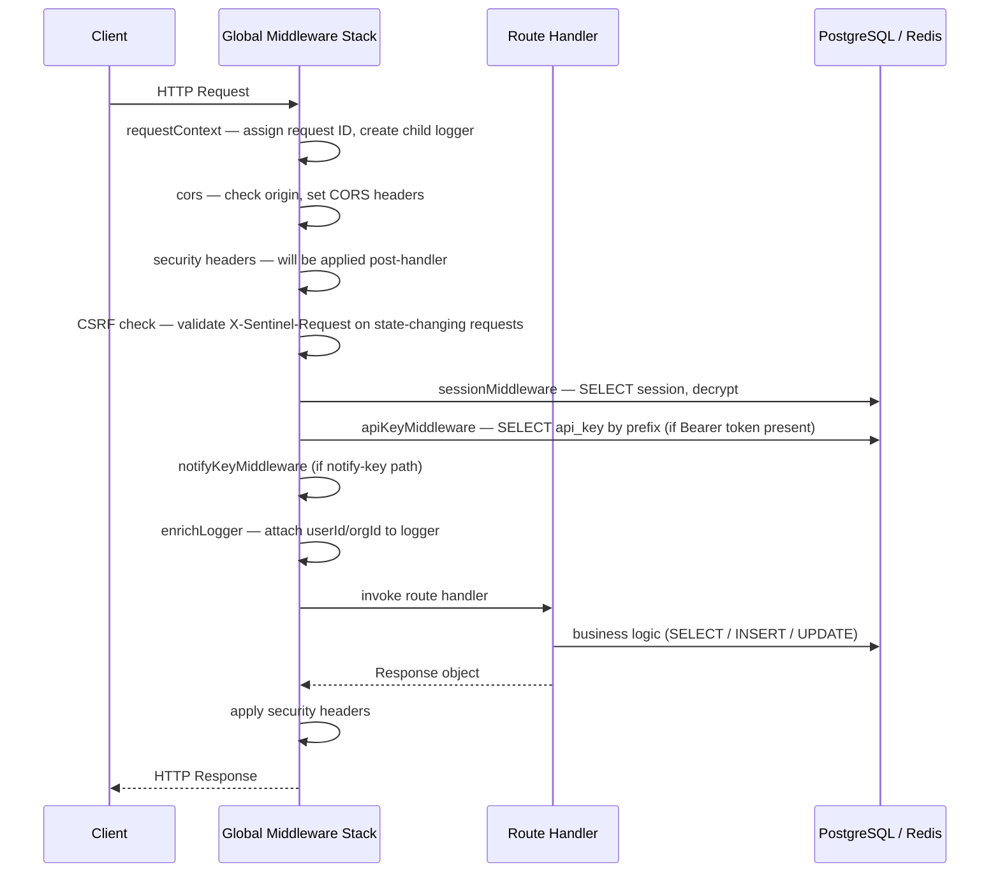

# Backend Architecture

## Application setup

The API server is a Hono 4.7 application running on `@hono/node-server` (Node.js 22). The entry point is `apps/api/src/index.ts`.

Before the Hono application starts, the bootstrap sequence:

1. Validates all environment variables against the Zod schema in `packages/shared/src/env.ts`. Any missing or invalid variable causes an immediate process exit with a descriptive error.
2. Creates a shared ioredis connection and registers it with the BullMQ queue factory via `setSharedConnection()`. The API server uses this connection only to enqueue jobs — it does not consume jobs.
3. Initializes the Sentry SDK (`initSentry()`) and registers `process.on('uncaughtException')` and `process.on('unhandledRejection')` handlers (`setupGlobalHandlers()`).
4. Patches `BigInt.prototype.toJSON` to serialize BigInt values as strings in JSON responses. This is required because EVM transaction hashes and block numbers are represented as BigInts in several module payloads.

## Middleware registration order

Middleware is registered globally on the `*` pattern and executes in the order it is registered. The exact stack is:

```
Request
   │
   ▼
1. requestContext(log)         Assigns a unique request ID (crypto.randomUUID()),
                               attaches a child Pino logger, records start time.

2. cors(config)                Sets Access-Control-Allow-* headers.
                               Allowed origins: ALLOWED_ORIGINS env var (comma-separated).
                               Exposed headers: X-RateLimit-Limit, X-RateLimit-Remaining, X-RateLimit-Reset.
                               Credentials: true (required for session cookie forwarding).
                               Preflight max-age: 86400 seconds.

3. Security headers             Inline middleware that sets headers after the handler returns:
                                  HSTS (production only): max-age=63072000; includeSubDomains; preload
                                  X-Content-Type-Options: nosniff
                                  X-Frame-Options: DENY
                                  Referrer-Policy: strict-origin-when-cross-origin
                                  X-XSS-Protection: 0
                                  Permissions-Policy: camera=(), microphone=(), geolocation=()

4. CSRF defense                 Checks state-changing requests (POST/PUT/PATCH/DELETE).
                                Skipped for:
                                  - Requests to paths containing /webhooks/, /callback, or /ci/notify
                                  - Requests with Authorization: Bearer ... header
                                  - Requests without a sentinel.sid cookie
                                Enforces X-Sentinel-Request header; returns 403 if missing.

5. sessionMiddleware            Reads sentinel.sid cookie, queries sessions table,
                               decrypts JSONB session data (AES-256-GCM),
                               sets userId, orgId, role on context.

6. apiKeyMiddleware             Reads Authorization: Bearer sk_... header,
                               looks up key by prefix, compares SHA-256 hash (timing-safe),
                               checks expiry and org membership,
                               sets userId, orgId, apiKeyId, scopes, role on context.

7. notifyKeyMiddleware          Validates notify-key tokens used by infrastructure agents
                               posting to /modules/infra/ci/notify. Sets orgId on context.

8. enrichLogger                 Adds userId and orgId from context variables to the
                               request-scoped Pino child logger.
   │
   ▼
Route handler
   │
   ▼
Response
```

After the global middleware, rate limiting is applied to all `/api/*` routes:

```
GET /api/*   → apiReadLimiter   (100 req/min per org/key/IP, sliding window in Redis)
POST/PUT/PATCH/DELETE /api/* → apiWriteLimiter  (30 req/min per org/key/IP)
```

Module routes under `/modules/*` have an additional auth guard that verifies both `userId` and `orgId` are set, returning `401` or `403` otherwise. This guard skips webhook, callback, and CI notify paths.

## Route structure

| Mount point | Router | Auth required | Notes |
|---|---|---|---|
| `/health` | Inline handler | None | Returns `{ status, db, redis, timestamp }`. Returns 503 if any dependency is unreachable. |
| `/auth` | `authRouter` | None (login/register/logout routes manage their own session state) | Registration, login, password reset, session termination. |
| `/integrations` | `integrationsRouter` | Callback paths are public; all other paths require auth | GitHub OAuth flow callback. Slack OAuth flow callback. |
| `/api/detections` | `detectionsRouter` | Session or API key | CRUD for detection rules. |
| `/api/alerts` | `alertsRouter` | Session or API key | List, acknowledge, and dismiss alerts. |
| `/api/channels` | `channelsRouter` | Session or API key | Manage notification channels (Slack, email). |
| `/api/events` | `eventsRouter` | Session or API key | Query normalized event log. |
| `/api/audit-log` | `auditLogRouter` | Session or API key | Query audit log. |
| `/api/correlation-rules` | `correlationRulesRouter` | Session or API key | CRUD for correlation rules. |
| `/api/modules/metadata` | `modulesMetadataRouter` | Session or API key | Returns metadata for all registered modules (ID, name, supported event types, rule types). |
| `/api/notification-deliveries` | `notificationDeliveriesRouter` | Session or API key | Query notification delivery status and history. |
| `/api/infra` | `infraAnalyticsRouter` | Session or API key | Infrastructure module analytics and aggregations. |
| `/api/aws` | `awsAnalyticsRouter` | Session or API key | AWS module analytics and aggregations. |
| `/api/chain` | `chainAnalyticsRouter` | Session or API key | Chain module analytics and aggregations. |
| `/api/registry` | `registryAnalyticsRouter` | Session or API key | Registry module analytics and aggregations. |
| `/api/github` | `githubAnalyticsRouter` | Session or API key | GitHub module analytics and aggregations. |
| `/modules/github/*` | `GitHubModule.router` | Webhook paths public; others require auth | GitHub webhook receiver, integration settings. |
| `/modules/chain/*` | `ChainModule.router` | All paths require auth | EVM network configuration, monitored address management. |
| `/modules/infra/*` | `InfraModule.router` | `/ci/notify` uses notify-key auth; others require session/key | Agent event ingestion, integration settings. |
| `/modules/registry/*` | `RegistryModule.router` | All paths require auth | Package registry integration settings, monitored packages. |
| `/modules/aws/*` | `AwsModule.router` | All paths require auth | AWS integration settings, SQS configuration. |

## Authentication flow

The API supports three parallel authentication mechanisms. The middleware stack resolves identity in order: session → API key → notify key. Only one mechanism needs to succeed per request.

### Session authentication

1. The `sessionMiddleware` reads the `sentinel.sid` cookie from the request.
2. It queries `SELECT * FROM sessions WHERE sid = $1 LIMIT 1`.
3. If the row exists and `expire > now()`, it decrypts the `sess` JSONB column using AES-256-GCM (`decrypt()` from `packages/shared/src/crypto.ts`).
4. The decrypted JSON payload contains `{ userId, orgId, role }`. These are set on the Hono context via `c.set()`.
5. If decryption fails (for example, because the session was encrypted with an old key and `ENCRYPTION_KEY_PREV` is not set), the cookie is silently ignored and the request proceeds as unauthenticated.

Sessions expire after 7 days. A scheduled worker job (`platform.session.cleanup`, every hour) deletes expired rows from the `sessions` table.

### API key authentication

1. The `apiKeyMiddleware` reads the `Authorization: Bearer sk_<key>` header.
2. It extracts the key prefix (the first `len('sk_') + 8` characters) and uses it to look up candidate rows in `api_keys` by prefix — avoiding a full table scan while preventing full key exposure in query parameters.
3. It computes `SHA-256(rawKey)` and compares it to `api_keys.key_hash` using `crypto.timingSafeEqual` to prevent timing attacks.
4. It checks that the key has not been revoked and has not expired.
5. It verifies that the key owner is still an active member of the key's org by querying `org_memberships`. This prevents keys from remaining valid after a user is removed from an org.
6. It sets `userId`, `orgId`, `apiKeyId`, `scopes`, and `role` on context.
7. It updates `api_keys.last_used_at` asynchronously (fire-and-forget) to avoid adding latency to every API request.

### Notify key authentication

Infrastructure agents use short-lived notify keys to post events to `/modules/infra/ci/notify`. The `notifyKeyMiddleware` validates the key against the database and sets `orgId` on context. Notify-key requests are exempt from the CSRF check.

## Request lifecycle



Total database round-trips for a typical authenticated request: 1 (session lookup) + N (business logic). API key requests add a second pre-handler query (key lookup) and an async fire-and-forget write (last_used_at).

## Error handling

The global error handler is registered via `app.onError()`:

```typescript
app.onError((err, c) => {
  if (err instanceof HTTPException) {
    return c.json({ error: err.message }, err.status);
  }
  const reqLogger = c.get('logger') ?? log;
  reqLogger.error({ err }, 'Unhandled error');
  captureException(err, { requestId: c.get('requestId') });
  return c.json({ error: 'Internal server error' }, 500);
});
```

`HTTPException` instances (used by middleware and route handlers for client errors) are serialized as `{ error: message }` with the exception's HTTP status code. All other errors are logged via the request-scoped Pino logger, reported to Sentry with the request ID for correlation, and returned to the client as a generic `500 Internal Server Error`.

The `notFound` handler returns `{ error: 'Not found' }` with status `404`.

## Logging

Sentinel uses [Pino](https://getpino.io/) for structured JSON logging. The logger is created by `createLogger()` from `packages/shared/src/logger.ts`.

Each incoming request gets a child logger with a unique `requestId` (UUID v4), attached during the `requestContext` middleware. After authentication runs, `enrichLogger` adds `userId` and `orgId` to the child logger's bindings so that every log line emitted by the route handler is correlated to the authenticated identity.

The `LOG_LEVEL` environment variable controls the minimum log level. Default is `info`. Set to `debug` during development to see per-query SQL logs and session decryption traces.

## Sentry integration

`initSentry()` from `packages/shared/src/sentry.ts` wraps `@sentry/node` initialization. It is called once at startup with the `SENTRY_DSN`, service name (`sentinel-api`), and environment. Unhandled exceptions and promise rejections are captured by `setupGlobalHandlers()`. Route-level errors are captured explicitly in `app.onError()` with the request ID attached as context.
