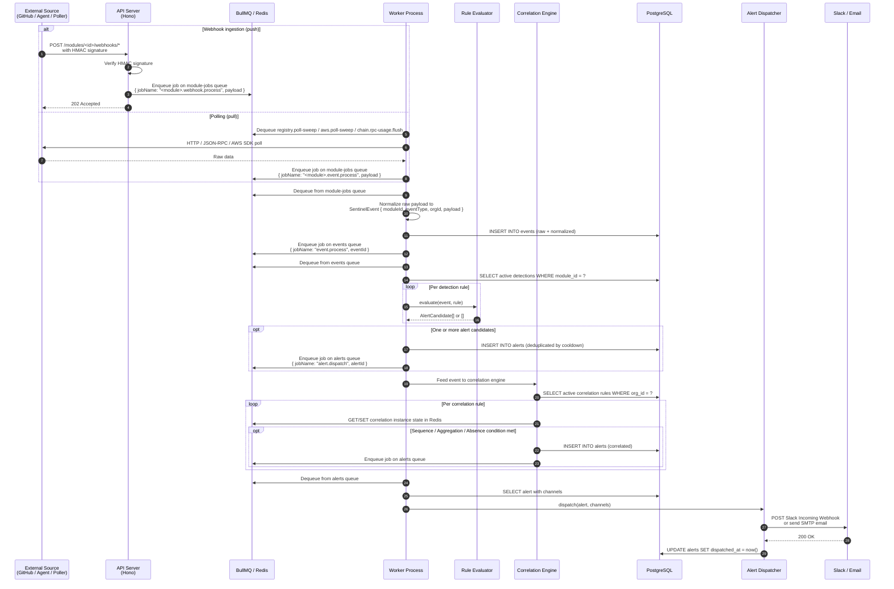
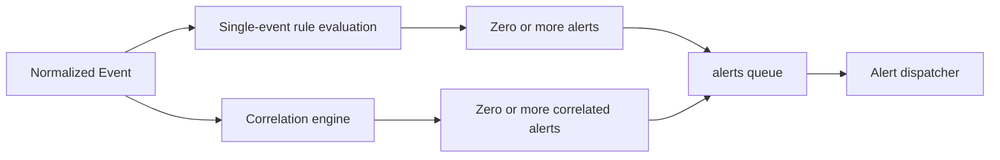

# Data Flow

## Event ingestion to alert dispatch

The diagram below shows the complete path from an incoming event to an alert notification, covering both the webhook-driven path (GitHub, infrastructure agents) and the polling path (EVM chains, package registries, AWS SQS).



## Stage-by-stage explanation

### Stage 1: Ingestion

**Webhook ingestion (GitHub, infrastructure agents)**

The API server receives an HTTP POST at `/modules/<module-id>/webhooks/<integration-id>`. The module router verifies the HMAC-SHA256 signature of the request body using the stored webhook secret. If verification succeeds, the raw payload is enqueued on the `module-jobs` BullMQ queue as a job named `<module>.webhook.process`. The API returns `202 Accepted` immediately; no rule evaluation happens on the API server.

This design is intentional. Webhook sources such as GitHub enforce a delivery timeout (typically 10 seconds). By responding immediately and deferring work to the queue, Sentinel avoids timeout-related redeliveries even when rule evaluation or database writes are slow.

**Polling (EVM chains, package registries, AWS SQS)**

The worker runs scheduled sweep jobs (every 60 seconds for registry and AWS; every 5 minutes for chain RPC usage). Each sweep job fetches data from the external source and enqueues individual `<module>.event.process` jobs on the `module-jobs` queue for each item discovered.

### Stage 2: Normalization

The module job handler deserializes the raw payload and translates it into a `SentinelEvent` — a typed, module-agnostic event envelope:

```typescript
interface SentinelEvent {
  id: string;
  orgId: string;
  moduleId: string;       // "github" | "chain" | "infra" | "registry" | "aws"
  eventType: string;      // Module-specific event type, e.g. "push", "member.added"
  source: string;         // Integration identifier (repo name, chain ID, etc.)
  occurredAt: Date;
  payload: Record<string, unknown>;  // Normalized, module-specific fields
  raw: unknown;           // Original payload for audit purposes
}
```

The normalized event is inserted into the `events` table in PostgreSQL, then enqueued on the `events` queue for rule evaluation.

### Stage 3: Rule evaluation

The event processing handler dequeues from the `events` queue and loads all active detection rules for the organization and module. It passes the event and each rule to the appropriate `RuleEvaluator.evaluate()` method.

Each evaluator returns zero or more `AlertCandidate` objects. Candidates are compared against the rule's cooldown period — if the rule has already fired an alert within the cooldown window (stored as `last_triggered_at` on the detection), the candidate is dropped to prevent alert storms.

Candidates that survive the cooldown check are inserted into the `alerts` table and enqueued on the `alerts` queue for dispatch.

### Stage 4: Correlation evaluation

After single-event rule evaluation, the same normalized event is fed to the correlation engine. The engine loads all active correlation rules for the organization and processes the event against each one.

Correlation state (in-flight instances) is stored in Redis, not PostgreSQL, because it is short-lived (each correlation instance expires after its configured `windowMinutes`) and requires atomic read-modify-write operations. The correlation instance key is a hash of the rule ID and the event's correlation key field values.

The correlation engine supports three rule types:

- **Sequence** — fires when a defined sequence of event types occurs within the time window, in order, on the same correlation key (for example, the same repository or the same actor).
- **Aggregation** — fires when the count of matching events exceeds a threshold within the time window.
- **Absence** — fires when a trigger event occurs but an expected follow-up event does not arrive within the grace period.

When a correlation condition is met, the engine inserts a correlated alert into the `alerts` table and enqueues it on the `alerts` queue.

### Stage 5: Alert dispatch

The alert dispatcher dequeues from the `alerts` queue (concurrency: 15 per worker replica — higher than DEFERRED because dispatch is primarily I/O-bound). It loads the alert record and its associated notification channels, then calls each channel's delivery function:

- **Slack** — sends a formatted Block Kit message to the configured Incoming Webhook URL. Each module provides its own Slack formatter for module-specific context.
- **Email** — sends a plain-text or HTML email via the configured SMTP server.

After successful delivery, the dispatcher updates `alerts.dispatched_at`.

## Error handling and retries

BullMQ applies the following retry policy to all queues unless overridden:

| Attribute | Value |
|---|---|
| Attempts | 3 |
| Backoff strategy | Exponential |
| Initial delay | 2 seconds |
| Failed job retention | 500 entries |
| Completed job retention | 200 entries |

**HMAC verification failures** — the API returns `401` immediately. The webhook source is responsible for retrying with the correct secret.

**Normalization failures** — if the module handler cannot parse a raw payload, the job fails. After three attempts the job moves to the failed state and is logged with the full error. The raw payload is preserved in Redis for inspection.

**Database write failures** — transient PostgreSQL connection errors cause the job to retry with backoff. Permanent errors (for example, constraint violations) fail the job after the retry limit.

**Correlation state conflicts** — the correlation engine uses atomic Redis operations (Lua scripts) to read and update instance state. If Redis is unavailable, the correlation job retries with backoff. In-flight correlation instances that expire in Redis while Redis is unavailable are lost — they do not fire a false positive.

**Alert dispatch failures** — if the Slack webhook returns a non-2xx status or the SMTP connection times out, the dispatch job retries. If delivery fails after all retries, the alert remains in the `alerts` table with a null `dispatched_at`, allowing a future manual re-dispatch or audit.

### Dead-letter queue

After exhausting all retry attempts, a failed job is moved to the `sentinel-dead-letter` BullMQ queue with metadata including the original queue name, job name, payload, error message, and failure timestamp. Dead-letter entries are retained indefinitely (`removeOnComplete: false`, `removeOnFail: false`) for manual inspection and replay.

If the dead-letter enqueue itself fails (for example, Redis is unreachable), the worker falls back to appending the job payload as a newline-delimited JSON entry to `/tmp/sentinel-dead-letter.ndjson`. This file is capped at 10 MB; payloads that would exceed the cap are dropped with an error log.

## Scheduled maintenance jobs

The worker registers the following repeatable jobs on startup using `upsertJobScheduler` (atomic create-or-update to avoid races during rolling deploys):

| Job name | Queue | Interval | Purpose |
|---|---|---|---|
| `platform.data.retention` | `deferred` | 24 hours | Deletes events, alerts, and audit log entries older than the configured retention period. |
| `platform.session.cleanup` | `deferred` | 1 hour | Deletes expired session rows from PostgreSQL. |
| `platform.key.rotation` | `deferred` | 5 minutes | Re-encrypts data still encrypted with `ENCRYPTION_KEY_PREV`. |
| `correlation.expiry` | `deferred` | 5 minutes | Sweeps expired correlation instances from Redis. |
| `chain.rpc-usage.flush` | `module-jobs` | 5 minutes | Flushes in-memory RPC usage counters to the database. |
| `registry.poll-sweep` | `module-jobs` | 60 seconds | Polls package registries for new artifact versions. |
| `aws.poll-sweep` | `module-jobs` | 60 seconds | Polls AWS SQS queues for CloudTrail events. |
| `infra.schedule.load` | `module-jobs` | 60 seconds | Loads infrastructure scan/probe schedules. |

## Correlation evaluation path vs single-event path

The two evaluation paths share the same normalized event as input but are otherwise independent:



Single-event evaluation is synchronous within the `event.process` job — it runs to completion before the job is marked done. Correlation evaluation is also synchronous within the same job, but the correlation engine only enqueues a dispatch job when a rule fires; it does not block waiting for future events.

The two paths can generate alerts for the same event independently. A single `push` event might trigger a single-event detection rule (for example, "push to main without a PR") and also advance a correlation sequence (for example, "repository protection disabled, then push to main within 10 minutes").
