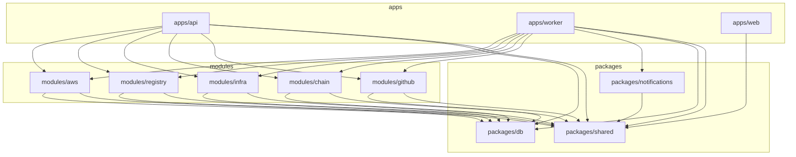

# Monorepo Structure

## Directory tree

```
sentinel/                          Repository root
├── apps/
│   ├── api/                       Hono REST API server (port 4000)
│   │   ├── src/
│   │   │   ├── index.ts           Application entry point, middleware registration, server startup
│   │   │   ├── middleware/        Per-concern middleware (session, api-key, notify-key, rbac, rate-limit, request-context)
│   │   │   ├── redis.ts           Shared Redis singleton for rate limiter and health checks
│   │   │   ├── routes/            Route handlers (auth, detections, alerts, channels, events, audit-log, correlations, modules-metadata, integrations, notification-deliveries, per-module analytics)
│   │   │   └── handlers/          (none — handlers are inline in routes)
│   │   ├── Dockerfile
│   │   └── package.json
│   ├── worker/                    BullMQ background worker
│   │   ├── src/
│   │   │   ├── index.ts           Worker entry point, handler registration, scheduled job setup
│   │   │   └── handlers/          Job handler implementations (event-processing, alert-dispatch, data-retention, correlation-evaluate, correlation-expiry, poll-sweep, session-cleanup, key-rotation)
│   │   ├── Dockerfile
│   │   └── package.json
│   └── web/                       Next.js 15 dashboard (port 3000)
│       ├── src/
│       │   ├── app/               Next.js App Router
│       │   │   ├── (auth)/        Route group: login, register, join-org
│       │   │   ├── (dashboard)/   Route group: dashboard, detections, alerts, events, correlations, channels, settings, modules
│       │   │   ├── layout.tsx     Root layout — JetBrains Mono font, dark mode, JSON-LD
│       │   │   └── globals.css    Global Tailwind base styles
│       │   ├── components/
│       │   │   ├── ui/            Reusable UI primitives (button, input, badge, combobox, etc.)
│       │   │   └── *.tsx          Page-level components (correlation-rule-form, world-map, etc.)
│       │   └── lib/
│       │       └── api.ts         Typed fetch wrappers (apiGet, apiPost, apiPut, apiPatch, apiDelete)
│       └── package.json
├── packages/
│   ├── db/                        Drizzle ORM schema and migration runner
│   │   ├── src/
│   │   │   ├── index.ts           Re-exports getDb, closeDb, sql, eq, and, or, … (Drizzle operators)
│   │   │   └── schema/            Table definitions (core.ts — users, orgs, sessions, api_keys, detections, events, alerts, channels, …)
│   │   ├── migrations/            SQL migration files generated by drizzle-kit
│   │   └── package.json
│   ├── shared/                    Cross-workspace utilities and types
│   │   ├── src/
│   │   │   ├── env.ts             Zod-validated environment variable schema
│   │   │   ├── logger.ts          Pino logger factory
│   │   │   ├── sentry.ts          Sentry SDK initialisation helpers
│   │   │   ├── crypto.ts          AES-256-GCM encrypt/decrypt utilities
│   │   │   ├── queue.ts           BullMQ queue factory, JobHandler interface, QUEUE_NAMES
│   │   │   ├── module.ts          SentinelModule interface
│   │   │   ├── rules.ts           RuleEvaluator interface and base types
│   │   │   ├── rule-engine.ts     Rule evaluation orchestration
│   │   │   ├── conditions.ts      Condition types and evaluator
│   │   │   ├── concurrency.ts     Concurrency control utilities
│   │   │   ├── fan-out.ts         Fan-out job helpers
│   │   │   ├── escalation.ts      Alert escalation logic
│   │   │   ├── hono-types.ts      AppEnv, AuthContext Hono type extensions
│   │   │   ├── auto-rules.ts      Auto-rule generation helpers
│   │   │   ├── correlation-types.ts  CorrelationRuleConfig, CorrelationInstance, and related types
│   │   │   ├── correlation-engine.ts Correlation rule evaluation engine
│   │   │   ├── ip.ts              Client IP extraction (TRUSTED_PROXY_COUNT aware)
│   │   │   └── evaluators/
│   │   │       └── compound.ts    Platform-level compound (cross-module) rule evaluator
│   │   └── package.json
│   └── notifications/             Email and Slack delivery
│       ├── src/
│       │   ├── slack.ts           Slack Incoming Webhook and Block Kit helpers
│       │   └── email.ts           Nodemailer-based email delivery
│       └── package.json
├── modules/
│   ├── github/                    GitHub module
│   │   ├── src/
│   │   │   ├── index.ts           GitHubModule export
│   │   │   ├── router.ts          /modules/github/* HTTP routes (webhook receiver, settings)
│   │   │   ├── evaluators/        GitHub-specific rule evaluators
│   │   │   └── handlers/          GitHub job handlers (webhook processing)
│   │   └── package.json
│   ├── chain/                     EVM blockchain module
│   │   ├── src/
│   │   │   ├── index.ts           ChainModule export
│   │   │   ├── router.ts          /modules/chain/* HTTP routes
│   │   │   ├── evaluators/        On-chain rule evaluators
│   │   │   └── handlers/          Chain job handlers (RPC polling, usage flush)
│   │   └── package.json
│   ├── infra/                     Infrastructure and host monitoring module
│   │   ├── src/
│   │   │   ├── index.ts           InfraModule export
│   │   │   ├── router.ts          /modules/infra/* HTTP routes (agent notify endpoint)
│   │   │   ├── evaluators/        Host security rule evaluators
│   │   │   └── handlers/          Infra job handlers
│   │   └── package.json
│   ├── registry/                  Package registry module
│   │   ├── src/
│   │   │   ├── index.ts           RegistryModule export + initVerification()
│   │   │   ├── router.ts          /modules/registry/* HTTP routes
│   │   │   ├── templates/         Detection rule templates for registry events
│   │   │   ├── evaluators/        Package registry rule evaluators
│   │   │   └── handlers/          Registry job handlers (artifact poll sweep)
│   │   └── package.json
│   └── aws/                       AWS module
│       ├── src/
│       │   ├── index.ts           AwsModule export
│       │   ├── router.ts          /modules/aws/* HTTP routes
│       │   ├── evaluators/        CloudTrail rule evaluators
│       │   └── handlers/          AWS job handlers (SQS poll sweep)
│       └── package.json
├── test/                          Top-level integration test helpers and fixtures
│   ├── helpers.ts                 Test HTTP client with session cookie and CSRF header
│   └── factories.ts               Database row factories
├── scripts/                       Miscellaneous build and ops scripts
├── docker-compose.yml             Production-like compose file (postgres, redis, api, worker, web)
├── docker-compose.dev.yml         Development compose file (remaps ports to avoid conflicts)
├── docker-compose.prod.yml        Production compose file (adds resource limits, restart policies)
├── pnpm-workspace.yaml            Workspace roots: apps/*, packages/*, modules/*
├── package.json                   Root scripts (dev:*, build, db:*, test, lint, typecheck)
├── tsconfig.base.json             Shared TypeScript compiler options
└── vitest.config.ts               Root Vitest configuration with path aliases
```

## pnpm workspace configuration

`pnpm-workspace.yaml` declares three glob patterns as workspace roots:

```yaml
packages:
  - "apps/*"
  - "packages/*"
  - "modules/*"
```

pnpm resolves internal dependencies (for example, `@sentinel/shared` listed as a dependency of `@sentinel/api`) as symlinks inside each workspace's `node_modules`. This means all TypeScript source is resolved from disk at the path configured in `tsconfig.base.json`, not from a compiled `.js` bundle. There is no build step required for local development.

## Dependency graph

The arrows indicate "depends on" (consumes types or runtime code from).



Key constraints:

- `packages/db` and `packages/shared` have no internal dependencies. They are the foundation of the graph and must build first.
- `packages/notifications` depends on `packages/shared` for the logger and environment configuration.
- All five modules depend on both `packages/shared` and `packages/db`. They do not depend on each other — this prevents cross-module coupling.
- `apps/api` and `apps/worker` are the only consumers of the module packages.
- `apps/web` depends only on `packages/shared` for shared TypeScript types. It does not import `packages/db` or any module — all data access goes through the REST API.

## Build order

When running `pnpm build` from the root, pnpm respects the dependency graph and builds workspaces in the correct order:

1. `packages/shared` and `packages/db` (in parallel — no interdependency)
2. `packages/notifications` and all five `modules/*` workspaces (in parallel — depend only on step 1)
3. `apps/api`, `apps/worker`, and `apps/web` (in parallel — depend on steps 1 and 2)

## Shared types and why they live in packages/shared

`packages/shared` contains types and utilities that must be consistent across more than one deployment boundary:

- **`hono-types.ts`** — `AppEnv` and `AuthContext` are Hono generic type parameters. Both `apps/api` and every module router must agree on these types for the `c.get()` / `c.set()` context accessors to be type-safe.
- **`queue.ts`** — `QUEUE_NAMES` and the `JobHandler` interface define the contract between the API (which enqueues jobs) and the worker (which processes them). A mismatch in queue names or job payload shapes would cause silent processing failures.
- **`correlation-types.ts`** — `CorrelationRuleConfig` and `CorrelationInstance` are stored as JSONB in PostgreSQL and as JSON in Redis. All code that reads or writes them (the API routes, the worker correlation handler, and the correlation engine) must use the same Zod schema.
- **`rules.ts`** — The `RuleEvaluator` interface is the plug point for all five detection modules. It lives in `shared` so that the worker can accept evaluators from any module without depending on the modules directly.
- **`env.ts`** — The Zod schema for environment variables is shared between `apps/api` and `apps/worker` so both services validate the same variables at startup, preventing configuration drift.

Locating these types in a dedicated package (rather than in `apps/api` and re-exporting) avoids circular dependencies and keeps `apps/api` from becoming an implicit type provider for the worker.
