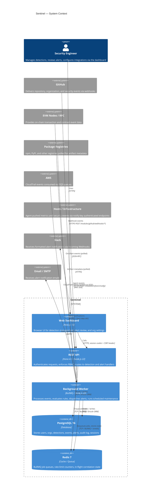

# Architecture Overview

## System context

The diagram below shows Sentinel's major components and all external systems they communicate with.

## Key design decisions

### Monorepo with pnpm workspaces

All application code, shared packages, and detection modules live in a single repository managed with pnpm 9 workspaces. This makes cross-package refactors safe (TypeScript compiler catches type errors across workspace boundaries at the root level), keeps CI configuration simple, and ensures that `packages/shared` is the single source of truth for types that cross service boundaries.

### Pluggable detection modules

Each data source is encapsulated in a self-contained module (`modules/github`, `modules/chain`, `modules/infra`, `modules/registry`, `modules/aws`). A module exports a standardized interface (`SentinelModule`) that includes:

- An HTTP router mounted at `/modules/<id>/` on the API server.
- One or more `RuleEvaluator` implementations that assess normalized events against user-defined rules.
- One or more `JobHandler` implementations consumed by the worker.
- Optional data retention policies.
- Optional Slack message formatters for alert dispatch.

Adding a new data source requires only implementing this interface; no changes to the API server or worker bootstrap are required beyond importing the module.

### Asynchronous job processing

Sentinel deliberately decouples event ingestion from rule evaluation. The API server receives webhook payloads and enqueues them to BullMQ immediately, returning a `202 Accepted` response to the source system. The worker evaluates rules against the normalized event asynchronously. This keeps webhook delivery latency low and makes the event processing pipeline independently scalable.

BullMQ provides automatic retries (three attempts with exponential backoff starting at 2 seconds) and job history (200 completed, 500 failed entries per queue).

### Session-based authentication with database-backed sessions

Rather than using stateless JWTs, Sentinel stores sessions in PostgreSQL. This makes it straightforward to revoke all sessions for a user or org instantly (by deleting rows), audit session activity, and inspect session state during debugging. Session data is stored as AES-256-GCM encrypted JSONB so that the session table does not expose user identity in plaintext.

### PostgreSQL schema per concern, not per tenant

Sentinel is a single-tenant platform per deployment. All tables carry an `org_id` column and every query filters by it, but there is no row-level security at the database level — enforcement happens in the application layer. This keeps the schema simple and avoids the operational complexity of per-tenant schemas while still isolating each organization's data within a single deployment.

## Technology choices and rationale

| Choice | Rationale |
|---|---|
| Hono over Express | Hono is middleware-compatible with the WinterCG standard, ships with first-class TypeScript types, and runs without modification on both Node.js and edge runtimes if Sentinel is ever deployed to Cloudflare Workers or similar. |
| Drizzle ORM over Prisma | Drizzle generates SQL that is transparent and predictable, has no runtime code generation step, and has a smaller bundle size. It also produces TypeScript types that flow from the schema definition without a separate `generate` command during development. |
| BullMQ over a simpler queue | BullMQ provides durable, Redis-backed queues with retries, delays, repeatable jobs, and worker concurrency controls. The repeatable job feature powers all of Sentinel's scheduled maintenance tasks without requiring an external cron system. |
| Next.js App Router | The App Router allows per-page data fetching at the route segment level without a global state manager, which reduces complexity for a dashboard application where most pages display independent server-fetched data. |
| No Radix UI component library | Sentinel's terminal aesthetic requires tight control over DOM structure and styling. Most UI components are implemented directly with Tailwind CSS. The only Radix dependency is `@radix-ui/react-slot` for composable component primitives. |

## Scalability characteristics

The worker service is configured with two replicas in the Docker Compose production file (`deploy.replicas: 2`). Additional replicas can be added without code changes because BullMQ handles distributed job claiming via atomic Redis operations. Queue concurrency per worker replica: EVENTS and ALERTS at 15, MODULE_JOBS at 10, and DEFERRED at 5.

The API server is stateless (session state lives in PostgreSQL) and can be scaled horizontally behind a load balancer. The rate-limit middleware uses Redis counters keyed by `userId` (or API key prefix, or client IP for unauthenticated requests) so that limits are shared correctly across API server instances.

PostgreSQL is the primary scaling constraint. For very high event volumes, the `events` and `audit_log` tables are the most write-intensive and are candidates for partitioning by `created_at`.

## Observability

Both the API server and worker emit structured JSON logs via Pino. Each API request receives a unique `requestId` (UUID v4) that is attached to the response as `X-Request-Id` and included in every log line for request-level tracing.

The API server exposes a `/metrics` endpoint in Prometheus text format. The worker reports queue depth gauges every 15 seconds. Both services integrate with Sentry for exception tracking and can be configured via `SENTRY_DSN` and `SENTRY_ENVIRONMENT` environment variables.

Worker health is tracked via a heartbeat file (`/tmp/.worker-heartbeat`) that is touched every 15 seconds. The Docker healthcheck verifies the file's `mtime` is less than 60 seconds old.
