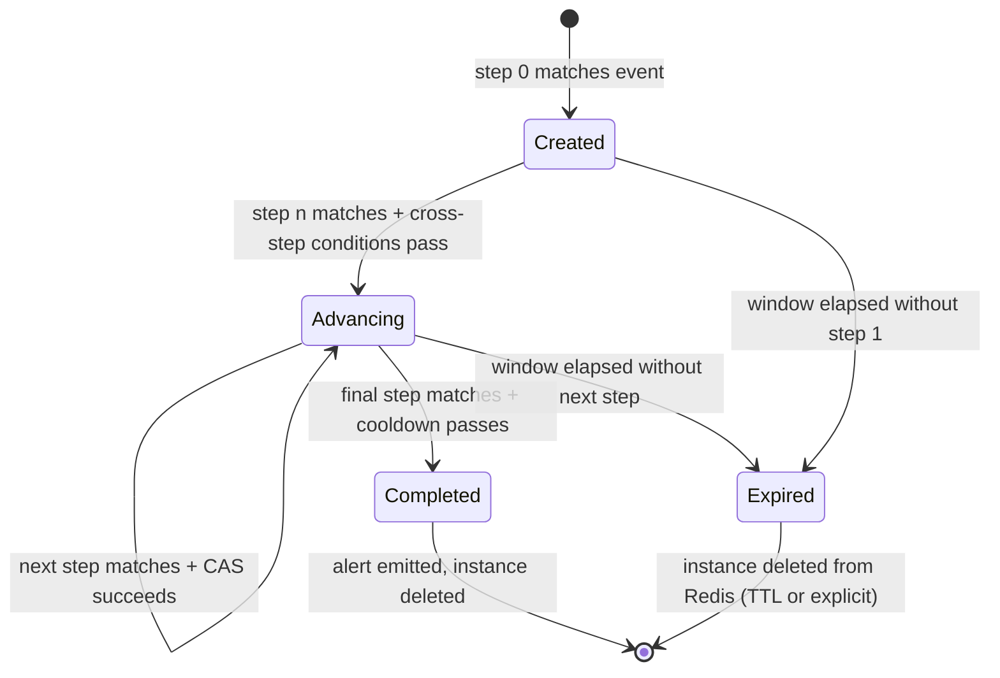
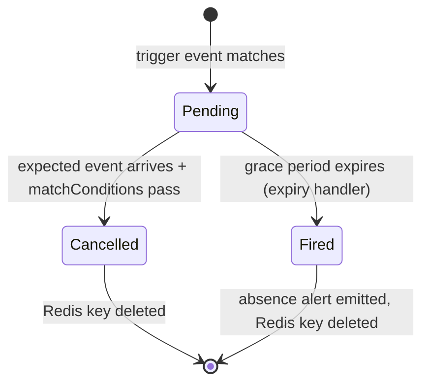

# Correlation Engine Overview

The correlation engine detects multi-step attack patterns that span multiple events, multiple modules, and multiple points in time. A single-event rule engine cannot detect these patterns because the individual events are individually benign -- it is their combination, sequence, and temporal proximity that constitutes the threat signal.

**Source**: `packages/shared/src/correlation-engine.ts`, `packages/shared/src/correlation-types.ts`

## What cross-domain correlation solves

Consider these attack patterns:

- A GitHub branch protection rule is disabled, followed within 10 minutes by a force push to `main`. Either event alone could be routine, but together they indicate deliberate bypass of code review controls.
- An AWS root account signs in, followed by IAM privilege escalation, followed by a new access key creation -- all within 30 minutes, all correlated to the same account.
- Fifty failed authentication attempts against a contract function in one minute, from the same address.
- A Docker image digest changes, but no corresponding CI build event arrives within the expected window.

The rule engine handles each event in isolation. The correlation engine maintains state across events, linking them through shared field values (correlation keys) and checking that they arrive in the right sequence within a configurable time window.

## Architecture

The `CorrelationEngine` class is instantiated by the `correlation-evaluate` BullMQ handler (`apps/worker/src/handlers/correlation-evaluate.ts`), which runs after every event is processed by the rule engine:

```
event stored --> event.evaluate job --> RuleEngine.evaluate()
                                     |
                                     +--> check for active correlation rules
                                     |       (COUNT query, skip if zero)
                                     |
                                     +--> correlation.evaluate job
                                              --> CorrelationEngine.evaluate()
```

The engine has three dependencies:

```typescript
export interface CorrelationEngineConfig {
  redis: Redis;
  db: Db;
  logger?: Logger;
}
```

Redis stores all in-flight correlation state. The database stores correlation rule definitions and `lastTriggeredAt` for the DB-based cooldown fallback. The engine does not write to the events or alerts tables directly -- it returns `CorrelatedAlertCandidate` objects and the caller handles persistence.

### In-memory rule cache

The engine maintains a module-level in-memory cache of correlation rules per organization:

```typescript
const RULE_CACHE_TTL_MS = 30_000; // 30 seconds
```

The cache is module-level (not instance-level) so all `CorrelationEngine` instances within the same worker process share a single cache. This ensures that a cache invalidation triggered by a CRUD operation is visible to every engine instance. The cache is invalidated by calling `engine.invalidateCache(orgId)` after any correlation rule create, update, or delete operation.

Rules are loaded from the `correlation_rules` table, filtered by `orgId` and `status = 'active'`, and ordered by name.

To handle cross-process cache invalidation (e.g., when an API process updates a rule while worker processes hold cached copies), the engine uses a Redis version counter at `sentinel:corr:version:{orgId}`. The API increments this counter on every correlation rule CRUD operation. Before using cached rules, the worker checks the counter; if it differs from the cached version, the cache is refreshed immediately rather than waiting for the 30-second TTL to expire.

## Correlation rule types

The engine supports three correlation modes, selected by `config.type`:

| Type | Description | Redis state |
|---|---|---|
| `sequence` | Requires events to arrive in a specific ordered sequence within a time window. Each step must match before the next is checked. | JSON instance per correlation key |
| `aggregation` | Counts events (or distinct field values) per correlation key within a time window. Fires when the count reaches a threshold. | INCR counter or SADD set per key |
| `absence` | Fires when a trigger event arrives but an expected follow-up event does not arrive within a grace period. | JSON instance per correlation key + sorted set index |

## Correlation rule config schema

The correlation rule config is validated with a Zod schema (`correlationRuleConfigSchema`) that enforces type-specific requirements using a `.refine()` discriminator:

```typescript
export const correlationRuleConfigSchema = z.object({
  type: z.enum(['sequence', 'aggregation', 'absence']),
  correlationKey: z.array(correlationKeyFieldSchema).min(1),
  windowMinutes: z.number().positive(),
  steps: z.array(correlationStepSchema).min(2).optional(),
  aggregation: aggregationConfigSchema.optional(),
  absence: absenceConfigSchema.optional(),
}).refine(/* type-specific validation */);
```

- `sequence` rules require `steps` with at least 2 entries.
- `aggregation` rules require the `aggregation` object.
- `absence` rules require the `absence` object.

## Correlation key derivation

The correlation key identifies which events belong to the same "chain" of activity. It is defined as an array of `correlationKeyField` objects:

```typescript
interface CorrelationKeyField {
  field: string;      // JSON path in event payload (e.g., "repository.full_name")
  alias?: string;     // Optional alias for the key component
}
```

At evaluation time, the engine extracts each field from the event payload using the dotted-path resolver (`getField`), constructs a string of `"alias=value"` pairs joined by `|`, and hashes it with SHA-256 (truncated to 16 hex characters):

```
correlationKey: [{ field: "repository.full_name", alias: "repo" }]
event payload:  { repository: { full_name: "acme/app" } }
parts:          ["repo=acme/app"]
hash:           sha256("repo=acme/app").slice(0, 16)
```

If any required correlation key field is missing from the event payload, the engine skips the rule for that event. This prevents partial-key state pollution where unrelated events could be incorrectly grouped.

## Correlation instance lifecycle

A **correlation instance** is the in-flight state for one sequence in progress. For `sequence` rules, an instance is created when step 0 matches and is advanced as subsequent steps match. For `absence` rules, an instance is the pending timer.

### Sequence instances



Key behaviors:

- **Step 0 start**: When an event matches step 0 of a rule and no existing instance exists for that correlation key, a new instance is created in Redis.
- **Step advancement**: When an event matches the next expected step (`currentStepIndex + 1`), the engine verifies per-step time constraints (`withinMinutes`) and cross-step match conditions before advancing.
- **Atomic CAS**: Step advancement uses a Lua compare-and-swap script to prevent lost updates when two workers process events for the same correlation key concurrently.
- **Completion**: When the final step matches, the engine checks cooldown and emits a `CorrelatedAlertCandidate` if the cooldown passes.
- **TTL anchoring**: The Redis TTL is anchored to the original window start time (`expiresAt - now`), not reset to a fresh full-window duration on each advance.
- **Restart on step 0**: If an event matches step 0 and the prior instance was deleted (expired or completed), a new instance starts.

### Absence instances



Key behaviors:

- **Trigger**: When a trigger event matches, the engine creates a Redis key with a TTL of `graceMinutes + 1 minute` buffer. The instance's `expiresAt` is set to `now + graceMinutes`.
- **Expected event**: When the expected event arrives, the engine checks `absenceMatchConditions` to verify the expected event corresponds to the trigger. If conditions pass, the Redis key is deleted (timer cancelled).
- **Expiry**: The background `correlation.expiry` handler checks for instances past their `expiresAt` and creates absence alerts.
- **Sorted set index**: Absence keys are indexed in a Redis sorted set (`sentinel:corr:absence:index`) scored by `expiresAt` for efficient `ZRANGEBYSCORE` lookups by the expiry handler.

## CorrelatedAlertCandidate

Completed correlations produce a `CorrelatedAlertCandidate`:

```typescript
export interface CorrelatedAlertCandidate {
  orgId: string;
  correlationRuleId: string;
  severity: string;
  title: string;
  description: string;
  triggerType: 'correlated';
  triggerData: {
    correlationType: 'sequence' | 'aggregation' | 'absence';
    correlationKey: Record<string, string>;
    windowMinutes: number;
    matchedSteps: MatchedStep[];
    sameActor: boolean;
    actors: string[];
    timeSpanMinutes: number;
    modules: string[];
  };
}
```

The `triggerData` includes forensic context: which steps matched, which actors were involved, whether the same actor performed all steps, the time span between the first and last matched events, and which modules the events came from.

## Evaluation result

`CorrelationEngine.evaluate()` returns:

```typescript
export interface CorrelationEvaluationResult {
  candidates: CorrelatedAlertCandidate[];
  advancedRuleIds: Set<string>;
  startedRuleIds: Set<string>;
}
```

| Field | Description |
|---|---|
| `candidates` | Completed sequences/aggregations that produced alert candidates. |
| `advancedRuleIds` | Rule IDs where an existing instance was advanced (step matched, sequence not yet complete). For absence rules, set when the expected event cancels a timer. |
| `startedRuleIds` | Rule IDs where a new instance was started (step 0 matched, or a trigger event started an absence timer). |

## Cooldown

Cooldowns prevent the same correlation rule from firing repeatedly within a configured interval. The correlation engine uses the same two-layer strategy as the rule engine:

**Primary: Redis SET NX PX**

```
sentinel:corr:cooldown:{ruleId}
```

The `SET NX` operation is atomic. If the key already exists, the alert is suppressed.

**Fallback: atomic DB update**

When Redis is unavailable, the engine falls back to an atomic `UPDATE correlation_rules SET last_triggered_at = now WHERE id = ? AND (last_triggered_at IS NULL OR last_triggered_at < ?)` query with `RETURNING`.

**Fail-open behavior**: If both Redis and the database are unavailable, the cooldown check returns `true` (allow the alert). This prevents silent data loss during outages at the cost of potential duplicate alerts.

## Correlation evaluation handler

The `correlation-evaluate` handler (`apps/worker/src/handlers/correlation-evaluate.ts`) orchestrates the lifecycle after the engine returns:

1. Loads the event from the database by `eventId`.
2. Calls `engine.evaluate(normalizedEvent)`.
3. For each candidate, inserts an alert row using `ON CONFLICT DO NOTHING` for idempotent deduplication.
4. Updates `correlationRules.lastTriggeredAt` for each newly created alert.
5. Enqueues `alert.dispatch` for notification delivery.
6. For duplicate alerts (caught by the unique constraint), re-enqueues dispatch in case the previous attempt failed after the insert but before the dispatch enqueue.
