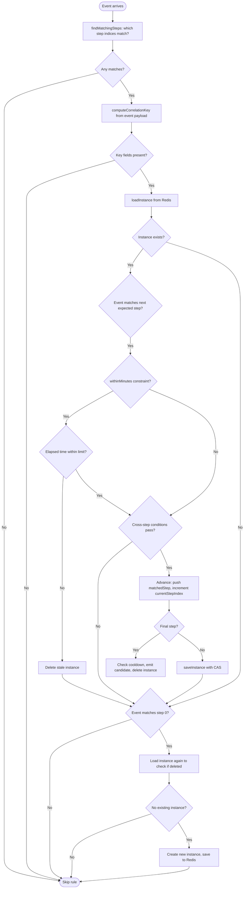

# Windowing and Time Management

This document covers time window configuration, step advancement logic, the expiry sweep mechanism, and cooldown behavior for the correlation engine. For the chain module's windowed evaluators (`windowed_count`, `windowed_spike`, `windowed_sum`), which operate within the rule engine rather than the correlation engine, see the evaluator-specific sections below.

**Source**: `packages/shared/src/correlation-engine.ts`, `apps/worker/src/handlers/correlation-expiry.ts`

## Time window configuration

Every correlation rule specifies a `windowMinutes` value that defines how long the engine waits for the complete pattern to emerge. The meaning varies by correlation type:

| Correlation type | `windowMinutes` meaning |
|---|---|
| `sequence` | Maximum elapsed time from step 0 to the final step. |
| `aggregation` | Sliding window duration for counting events. |
| `absence` | Not used directly. The `absence.graceMinutes` field defines the wait period. `windowMinutes` is stored for metadata/display. |

### Per-step time constraints

Sequence rules support an optional `withinMinutes` constraint on individual steps:

```typescript
interface CorrelationStep {
  name: string;
  eventFilter: EventFilter;
  withinMinutes?: number;     // max time since the previous step
  matchConditions: CrossStepCondition[];
}
```

When `withinMinutes` is set, the engine checks the elapsed time between the current event and the previous matched step. If the elapsed time exceeds `withinMinutes`, the instance is deleted (treated as timed out between steps), and the engine falls through to check whether the event can start a new sequence from step 0.

## Window types and behavior

### Sequence windows

A sequence window starts when step 0 matches and has a fixed end time:

```
expiresAt = startedAt + windowMinutes * 60_000
```

The window is never extended by step advancement. The Redis TTL is recalculated on each save as:

```typescript
const ttlMs = Math.max(1, instance.expiresAt - Date.now());
```

This anchoring prevents a pathological case where a 29-minute-old instance advancing to the next step would receive another full window, allowing multi-step sequences to be matched far beyond the intended time boundary.

If the window expires before the sequence completes:
- The `loadInstance()` method checks `Date.now() > instance.expiresAt` on every load and deletes expired instances.
- The evaluation loop also checks `Date.now() > existing.expiresAt` after attempting advancement, cleaning up instances that expired during the evaluation.

### Aggregation windows

Aggregation windows use sliding TTL behavior:

- **Simple-count (INCR)**: The TTL is refreshed on every increment. The `AGG_INCR_LUA` script calls `PEXPIRE` after every `INCR`, creating a sliding window that extends with each matching event.
- **Distinct-count (SADD)**: The TTL is refreshed on every `SADD` operation via the `AGG_SADD_LUA` script. This means the window slides forward with each new distinct value.

When the threshold is reached, the key is atomically deleted and the window resets. A new window starts with the next matching event.

### Absence windows

Absence windows use a grace period rather than a standard window:

```
expiresAt = triggerTime + graceMinutes * 60_000
redisTTL  = graceMinutes * 60_000 + 60_000      // +1 min buffer
```

The one-minute buffer ensures the expiry handler can read the instance before Redis evicts it. The expiry handler checks `instance.expiresAt` (not the Redis TTL) to determine whether the grace period has elapsed.

## Step advancement logic

The sequence advancement flow handles several edge cases:



### Cross-step match conditions

Cross-step conditions (`matchConditions`) allow linking fields between events in a sequence:

```typescript
interface CrossStepCondition {
  field: string;       // field on the current event (e.g., "sender.login")
  operator: '==' | '!=';
  ref: string;         // reference to a previous step's field (e.g., "ProtectionDisabled.sender.login")
}
```

The `ref` format is `"stepName.fieldPath"`. The engine resolves the reference by finding the matched step with the given name and extracting the field from its stored `fields` object.

All conditions must pass (AND logic). If the current event's field is `undefined`, the condition fails.

### Absence match conditions

Absence rules support a similar cross-event linking mechanism:

```typescript
interface AbsenceMatchCondition {
  field: string;           // field on the expected event
  operator: '==' | '!=';
  triggerField: string;    // field on the trigger event (stored in matchedSteps[0].fields)
}
```

These conditions verify that the expected event corresponds to the same trigger. For example, ensuring the same actor who disabled a protection is the one who re-enables it.

## Expiry sweep mechanism

The background `correlation.expiry` handler (`apps/worker/src/handlers/correlation-expiry.ts`) runs as a scheduled BullMQ job on the `DEFERRED` queue. It processes expired absence instances and creates alerts when the expected event never arrived.

### Primary path: sorted set index

The handler uses `ZRANGEBYSCORE` on the `sentinel:corr:absence:index` sorted set to efficiently find all absence keys whose `expiresAt <= now`:

```typescript
const expiredKeys = await redis.zrangebyscore(
  ABSENCE_INDEX_KEY,
  '-inf',
  String(now),
  'LIMIT', 0, INDEX_BATCH_SIZE,  // max 500 per invocation
);
```

This is `O(log N + M)` where `M` is the number of results, compared to `O(N)` for a full keyspace scan.

### Per-key processing

For each expired key:

1. **Acquire a processing lock**: `SET {key}:processing-lock 1 PX 30000 NX`. Prevents two sweep invocations from processing the same key concurrently.
2. **Load and validate**: Read the instance JSON, check `expiresAt <= now`, and load the correlation rule from the database.
3. **Skip inactive rules**: If the rule is deleted or paused, clean up the Redis key and index entry.
4. **Insert alert first**: Attempt the DB insert before deleting the Redis key. If the insert fails, the Redis key survives for retry on the next sweep.
5. **Clean up on success**: Delete the instance key, index entry, and processing lock.
6. **Track retries**: On insert failure, increment a `retryCount` field in the serialized instance. Log an error-level warning after 5 consecutive failures.

### SCAN fallback

A periodic SCAN fallback runs every 30 minutes to catch absence keys that were written before the sorted set index was deployed (e.g., during a deploy transition):

```typescript
const SCAN_FALLBACK_INTERVAL_MS = 30 * 60_000;
const SCAN_BATCH_SIZE = 100;
const MAX_SCAN_ITERATIONS = 1_000;
```

The fallback:
1. Scans the keyspace for `sentinel:corr:absence:*` patterns.
2. Re-indexes found keys into the sorted set via `ZADD` (idempotent).
3. Processes expired keys through the same `processAbsenceKey` function.
4. Caps iterations at 1,000 to prevent monopolizing the deferred queue.

### Insert-then-delete safety

The expiry handler uses an insert-then-delete pattern to prevent data loss:

```
1. Attempt DB insert (with ON CONFLICT DO NOTHING for idempotency)
2. On success: delete Redis key + sorted set entry + lock
3. On failure: delete only the lock; leave Redis key alive for next sweep
```

This is a deliberate fix for a prior bug where the Redis key was deleted before the DB insert, meaning a failed insert would permanently lose the trigger data.

## Cooldown per correlation rule

Each correlation rule has an optional `cooldownMinutes` field. When set, the engine acquires a cooldown lock before emitting an alert:

```
Key:  sentinel:corr:cooldown:{ruleId}
TTL:  cooldownMinutes * 60_000
```

The cooldown is rule-scoped (not per-correlation-key). This means a sequence completing for key A will prevent the same rule from firing for key B within the cooldown window. This is by design for rules that monitor global patterns, but may need per-key cooldowns in a future iteration.

The cooldown check follows the same two-layer strategy as the rule engine:

1. **Redis `SET NX PX`**: Atomic, preferred path.
2. **DB fallback**: Atomic `UPDATE ... WHERE lastTriggeredAt IS NULL OR lastTriggeredAt < threshold` on `correlation_rules.lastTriggeredAt`.
3. **Fail-open**: If both Redis and DB are unavailable, the cooldown check returns `true` (allow the alert) to prevent silent data loss.

## Chain module windowed evaluators

The chain module provides three evaluators that use Redis sorted sets to track events across a sliding time window. These operate within the `RuleEngine`, not the `CorrelationEngine`. They are documented here because their windowing behavior is a key part of the overall time-window story.

### windowed_count

Counts matching on-chain log events within a sliding window using `ZADD` + `ZREMRANGEBYSCORE` + `ZCARD`. Triggers when the count reaches or exceeds the threshold.

**Redis key**: `sentinel:wcount:{orgId}:{ruleId}` or `sentinel:wcount:{orgId}:{ruleId}:{groupValue}` (when grouped).

**Algorithm**: Add event, prune stale entries, count remaining, set TTL.

### windowed_spike

Detects rate spikes by comparing a short observation window against a longer baseline. Triggers when the percentage increase exceeds `increasePercent`.

**Redis key**: `sentinel:wspike:{ruleId}` or `sentinel:wspike:{ruleId}:{groupValue}`.

**Algorithm**: Add event, prune entries older than baseline, count entries in observation window vs. baseline, compute spike percentage.

### windowed_sum

Sums a numeric decoded argument field across events within a sliding window. Supports BigInt-scale values. Members use composite encoding (`eventId:valueString`).

**Redis key**: `sentinel:wsum:{orgId}:{ruleId}` or `sentinel:wsum:{orgId}:{ruleId}:{groupValue}`.

**Algorithm**: Add event with encoded value, prune stale entries, fetch all members and sum values, compare against threshold.

### TTL management for windowed evaluators

All windowed sorted set keys have their TTL refreshed on every write via `PEXPIRE`:

| Evaluator | TTL |
|---|---|
| `windowed_count` | `windowMinutes * 60_000` |
| `windowed_spike` | `baselineMinutes * 60_000` (the longer window) |
| `windowed_sum` | `windowMinutes * 60_000` |

If no new matching events arrive within the TTL, Redis evicts the key. The next matching event starts a fresh window. There is no active cleanup -- TTL-based eviction is sufficient. Unlike correlation sequence instances, windowed evaluator keys do not require the background expiry handler.
