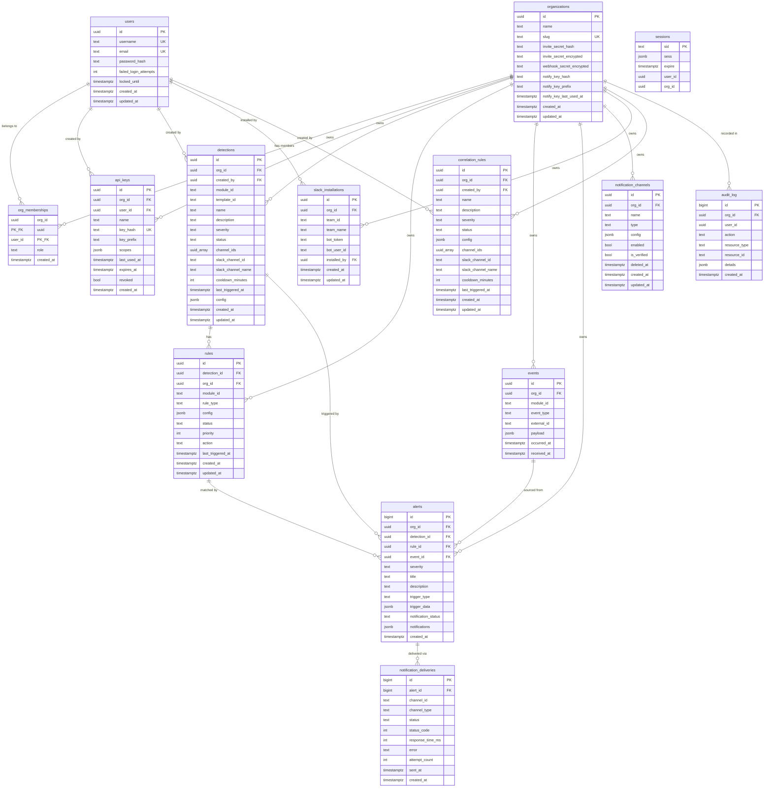
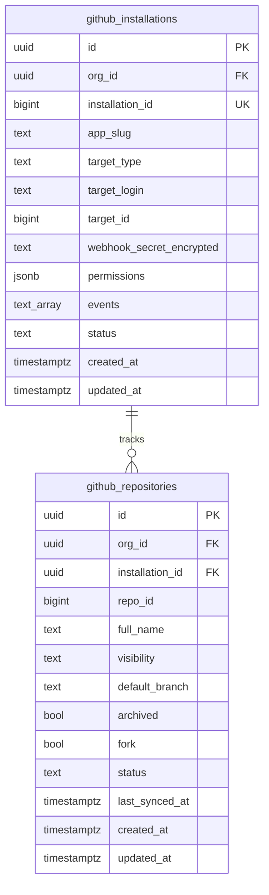
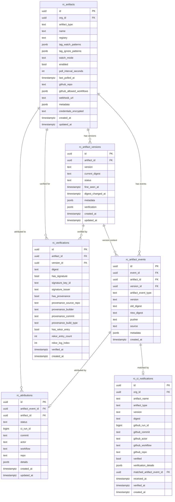
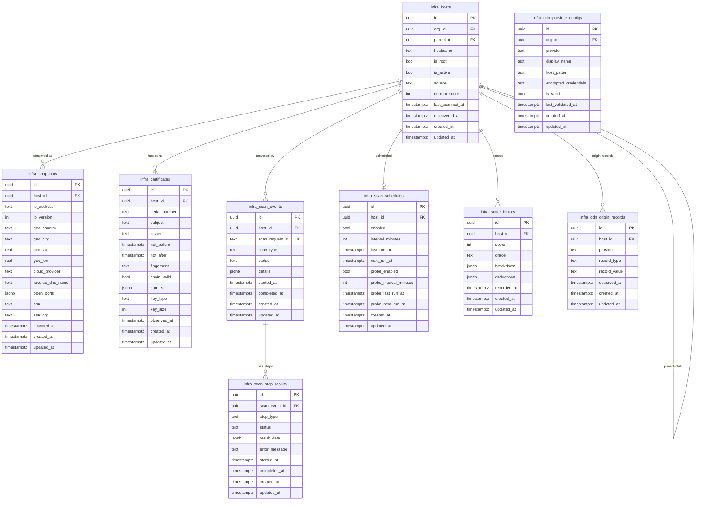
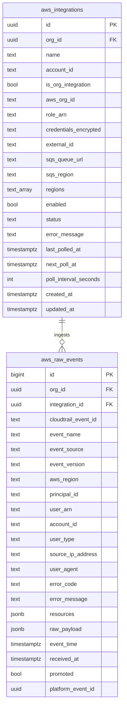

# Schema Overview

Sentinel's PostgreSQL 16 database is managed with Drizzle ORM 0.38 using the
`postgres` driver (the `drizzle-orm/postgres-js` dialect). All schema
definitions live under `packages/db/schema/`, split into seven files by domain.
The combined schema is assembled and exported from `packages/db/index.ts` as
the `schema` constant that is passed to the `drizzle()` constructor.

## Core ER Diagram

The diagram below covers the primary tables that every deployment shares.
Module-specific tables are described in [Module Tables](#module-tables).



---

## Table Reference

### `users`

Stores platform user accounts. Passwords are hashed with Argon2id. Account
lockout state is tracked directly on this row.

| Column | Type | Nullable | Description |
|---|---|---|---|
| `id` | `uuid` | No | Primary key. Generated with `gen_random_uuid()`. |
| `username` | `text` | No | Unique display name. |
| `email` | `text` | No | Unique email address. Used for login. |
| `password_hash` | `text` | No | Argon2id hash of the user's password. |
| `failed_login_attempts` | `integer` | No | Counter incremented on each failed password attempt. Resets on successful login. Default `0`. |
| `locked_until` | `timestamptz` | Yes | When set, login is rejected until this timestamp passes. |
| `created_at` | `timestamptz` | No | Row creation time. Defaults to `now()`. |
| `updated_at` | `timestamptz` | No | Auto-updated on any change via Drizzle's `$onUpdate` hook. |

**Indexes:** implicit B-tree indexes on the `username` and `email` unique constraints.

---

### `organizations`

Represents a tenant. Every data table links back here via `org_id`.

| Column | Type | Nullable | Description |
|---|---|---|---|
| `id` | `uuid` | No | Primary key. |
| `name` | `text` | No | Human-readable display name. |
| `slug` | `text` | No | URL-safe unique identifier. Used in API paths. |
| `invite_secret_hash` | `text` | Yes | Hash of the current invite token. Used for server-side verification. |
| `invite_secret_encrypted` | `text` | Yes | AES-256-GCM ciphertext of the raw invite token. Returned to org admins for distribution. |
| `webhook_secret_encrypted` | `text` | Yes | Encrypted HMAC secret for validating inbound webhooks (e.g. from GitHub App). |
| `notify_key_hash` | `text` | Yes | Hash of the organization's notify API key. Used for inbound CI notification authentication. |
| `notify_key_prefix` | `text` | Yes | First 8 characters of the notify key. Displayed in the UI for identification. |
| `notify_key_last_used_at` | `timestamptz` | Yes | Last time the notify key was used successfully. |
| `created_at` | `timestamptz` | No | Row creation time. |
| `updated_at` | `timestamptz` | No | Auto-updated on any change. |

**Indexes:** implicit unique B-tree index on `slug`.

---

### `org_memberships`

Junction table linking users to organizations. Uses a composite primary key.

| Column | Type | Nullable | Description |
|---|---|---|---|
| `org_id` | `uuid` | No | References `organizations.id`. Cascades deletes. |
| `user_id` | `uuid` | No | References `users.id`. Cascades deletes. |
| `role` | `text` | No | Access level for this member. Known values: `owner`, `admin`, `viewer`. Default `viewer`. |
| `created_at` | `timestamptz` | No | When the membership was created. |

**Primary key:** `(org_id, user_id)` -- composite, enforced as a named constraint.

---

### `sessions`

Express-session store table. Managed by `connect-pg-simple`. The `user_id` and
`org_id` columns enable indexed session deletion by user or organization without
requiring a full-table scan with per-row decryption of the `sess` JSONB payload.

| Column | Type | Nullable | Description |
|---|---|---|---|
| `sid` | `text` | No | Session ID string. Primary key. |
| `sess` | `jsonb` | No | Full serialized session payload (user ID, org context, CSRF token). |
| `expire` | `timestamptz` | No | Session expiry time. Rows past this value are invalid. |
| `user_id` | `uuid` | Yes | Plaintext copy of the user ID from `sess`. Nullable for backward compatibility with pre-migration rows. |
| `org_id` | `uuid` | Yes | Plaintext copy of the org ID from `sess`. Nullable for backward compatibility with pre-migration rows. |

**Indexes:**
- `idx_sessions_expire` on `expire` -- used by the session store's cleanup job.
- `idx_sessions_user_id` on `user_id` -- enables indexed deletion of all sessions for a user.
- `idx_sessions_org_id` on `org_id` -- enables indexed deletion of all sessions for an org.

---

### `api_keys`

Machine-to-machine authentication tokens scoped to an organization. The raw
key is shown once at creation and never stored; only the hash is persisted.

| Column | Type | Nullable | Description |
|---|---|---|---|
| `id` | `uuid` | No | Primary key. |
| `org_id` | `uuid` | No | Owning organization. Cascades deletes. |
| `user_id` | `uuid` | No | User who created the key. Cascades deletes. |
| `name` | `text` | No | Human-readable label. |
| `key_hash` | `text` | No | SHA-256 hash of the full API key. Used for constant-time lookup. |
| `key_prefix` | `text` | No | First 8 characters of the raw key. Displayed in the UI. |
| `scopes` | `jsonb` | No | Array of permission strings granted to this key. Default `["read"]`. |
| `last_used_at` | `timestamptz` | Yes | Updated on each successful authenticated request. |
| `expires_at` | `timestamptz` | Yes | Optional hard expiry. Null means the key does not expire. |
| `revoked` | `boolean` | No | When `true`, the key is permanently rejected regardless of expiry. Default `false`. |
| `created_at` | `timestamptz` | No | Row creation time. |

**Indexes:**
- `uq_api_keys_hash` (unique) on `key_hash` -- enables O(1) key lookup during authentication.
- `idx_api_keys_org` on `org_id` -- list-keys-by-org query.

---

### `detections`

A detection is the top-level user-configured monitoring policy. It groups one
or more rules, specifies severity and notification routing, and controls
cooldown behavior.

| Column | Type | Nullable | Description |
|---|---|---|---|
| `id` | `uuid` | No | Primary key. |
| `org_id` | `uuid` | No | Owning organization. Cascades deletes. |
| `created_by` | `uuid` | Yes | User who created this detection. Nullable (set null on user delete). |
| `module_id` | `text` | No | Module that owns this detection (e.g. `github`, `chain`, `registry`, `infra`, `aws`). |
| `template_id` | `text` | Yes | Slug of the detection template this was created from. Null for custom detections. |
| `name` | `text` | No | Display name shown in the dashboard. |
| `description` | `text` | Yes | Optional prose description of what the detection monitors. |
| `severity` | `text` | No | Alert severity. Values: `critical`, `high`, `medium`, `low`, `info`. Default `high`. |
| `status` | `text` | No | Lifecycle state. Values: `active`, `paused`, `archived`. Default `active`. |
| `channel_ids` | `uuid[]` | No | Array of `notification_channels.id` values. Default empty array. |
| `slack_channel_id` | `text` | Yes | Slack channel ID for direct Slack routing (legacy). |
| `slack_channel_name` | `text` | Yes | Slack channel name for display. |
| `cooldown_minutes` | `integer` | No | Minimum minutes between alerts from this detection. `0` means no cooldown. Default `0`. |
| `last_triggered_at` | `timestamptz` | Yes | Timestamp of the most recent alert fired from this detection. Used for cooldown checks. |
| `config` | `jsonb` | No | Module-specific configuration. See [JSONB Columns](#jsonb-columns). Default `{}`. |
| `created_at` | `timestamptz` | No | Row creation time. |
| `updated_at` | `timestamptz` | No | Auto-updated on any change. |

**Indexes:**
- `idx_detections_org` on `org_id` -- list-detections-by-org query.
- `idx_detections_module` on `module_id` -- module-scoped detection lookup.
- `idx_detections_status` on `status` where `status = 'active'` -- partial index; only indexes active rows.
- `idx_detections_created_by` on `created_by` -- detections-by-creator lookup.

---

### `rules`

A rule is the atomic evaluation unit inside a detection. Each rule has a
`rule_type` interpreted by its module's detection engine, and a `config` JSONB
that carries the specific threshold, target, or pattern to evaluate.

| Column | Type | Nullable | Description |
|---|---|---|---|
| `id` | `uuid` | No | Primary key. |
| `detection_id` | `uuid` | No | Parent detection. Cascades deletes. |
| `org_id` | `uuid` | No | Denormalized org reference for query efficiency. Cascades deletes. |
| `module_id` | `text` | No | Module identifier. Must match `detections.module_id`. |
| `rule_type` | `text` | No | Module-specific rule type string (e.g. `balance_threshold`, `event_match`, `large_transfer`). |
| `config` | `jsonb` | No | Rule evaluation configuration. See [JSONB Columns](#jsonb-columns). |
| `status` | `text` | No | `active` or `paused`. Default `active`. |
| `priority` | `integer` | No | Evaluation order within the detection (lower = higher priority). Default `50`. |
| `action` | `text` | No | What to do when the rule fires. Currently always `alert`. |
| `last_triggered_at` | `timestamptz` | Yes | Timestamp of the most recent alert fired from this rule. |
| `created_at` | `timestamptz` | No | Row creation time. |
| `updated_at` | `timestamptz` | No | Auto-updated on any change. |

**Indexes:**
- `idx_rules_detection` on `detection_id` -- rules-by-detection query.
- `idx_rules_org` on `org_id` -- rules-by-org query.
- `idx_rules_org_module` on `(org_id, module_id)` where `status = 'active'` -- partial index used during event dispatch to find applicable rules.
- `idx_rules_module_type_active` on `(module_id, rule_type)` where `status = 'active'` -- used by module pollers to retrieve rules of a specific type.

---

### `events`

The canonical event log. Every module writes normalized event records here
after receiving raw signals from its data source. The `payload` carries the
full module-specific detail.

| Column | Type | Nullable | Description |
|---|---|---|---|
| `id` | `uuid` | No | Primary key. |
| `org_id` | `uuid` | No | Owning organization. Cascades deletes. |
| `module_id` | `text` | No | Source module (e.g. `github`, `chain`, `aws`). |
| `event_type` | `text` | No | Module-specific event type string (e.g. `pull_request.opened`, `Transfer`, `iam.CreateUser`). |
| `external_id` | `text` | Yes | Opaque ID from the external system (e.g. GitHub delivery ID, transaction hash). Used for deduplication. |
| `payload` | `jsonb` | No | Full normalized event payload. See [JSONB Columns](#jsonb-columns). |
| `occurred_at` | `timestamptz` | No | When the event occurred in the source system. |
| `received_at` | `timestamptz` | No | When Sentinel ingested the event. Defaults to `now()`. |

**Indexes:**
- `idx_events_org_module` on `(org_id, module_id)` -- primary access pattern for event browsing.
- `idx_events_type` on `event_type` -- cross-org event-type queries (analytics).
- `idx_events_external` on `external_id` -- deduplication lookups.
- `idx_events_received_at` on `received_at` -- time-range queries and retention.

---

### `alerts`

Fired when a rule evaluation or correlation rule match meets the alert
threshold. Uses `bigserial` (64-bit auto-increment) as the primary key because
alert volume can be very high and UUID generation overhead adds up at scale.

| Column | Type | Nullable | Description |
|---|---|---|---|
| `id` | `bigint` | No | Primary key. `bigserial` -- auto-incrementing 64-bit integer. |
| `org_id` | `uuid` | No | Owning organization. Cascades deletes. |
| `detection_id` | `uuid` | Yes | Detection that triggered this alert. Set to null if the detection is deleted. |
| `rule_id` | `uuid` | Yes | Specific rule that matched. Set to null if the rule is deleted. |
| `event_id` | `uuid` | Yes | Event that caused the rule to fire. Set to null if the event is deleted. |
| `severity` | `text` | No | Inherited from the detection at alert time. |
| `title` | `text` | No | Short summary rendered in notifications. |
| `description` | `text` | Yes | Longer prose explanation of the alert. |
| `trigger_type` | `text` | No | Category of trigger (e.g. `rule_match`, `correlation`, `threshold`). |
| `trigger_data` | `jsonb` | No | Structured context about what triggered the alert. See [JSONB Columns](#jsonb-columns). |
| `notification_status` | `text` | No | Aggregate delivery status. Values: `pending`, `sent`, `failed`, `partial`. Default `pending`. |
| `notifications` | `jsonb` | No | Array of per-channel delivery summaries. Default `[]`. |
| `created_at` | `timestamptz` | No | Alert creation time. |

**Indexes:**
- `idx_alerts_org` on `org_id` -- list-alerts-by-org query.
- `idx_alerts_detection` on `detection_id` -- alerts-per-detection lookup.
- `idx_alerts_created_at` on `created_at` -- time-range queries and dashboard sorting.
- `uq_alerts_event_detection_rule` (unique) on `(event_id, detection_id, rule_id)` where `event_id IS NOT NULL AND detection_id IS NOT NULL` -- prevents duplicate rule-match alerts for the same event.
- `uq_alerts_event_correlation` (unique expression index) on `(event_id, trigger_data->>'correlationRuleId')` where `trigger_type = 'correlated' AND event_id IS NOT NULL` -- prevents duplicate correlated alerts for the same event and correlation rule.

---

### `notification_channels`

Configures outbound notification destinations for an organization. Soft-delete
via `deleted_at` (channels are never hard-deleted while alert history exists).

| Column | Type | Nullable | Description |
|---|---|---|---|
| `id` | `uuid` | No | Primary key. Referenced by `detections.channel_ids` array. |
| `org_id` | `uuid` | No | Owning organization. Cascades deletes. |
| `name` | `text` | No | Human-readable label shown in the UI. |
| `type` | `text` | No | Delivery mechanism. Values: `slack`, `email`, `webhook`, `pagerduty`. |
| `config` | `jsonb` | No | Channel-type-specific configuration (e.g. webhook URL, email address, Slack channel ID). |
| `enabled` | `boolean` | No | When `false`, deliveries to this channel are skipped. Default `true`. |
| `is_verified` | `boolean` | No | Whether the channel has been successfully tested. Default `false`. |
| `deleted_at` | `timestamptz` | Yes | Soft-delete timestamp. Queries filter on `deleted_at IS NULL`. |
| `created_at` | `timestamptz` | No | Row creation time. |
| `updated_at` | `timestamptz` | No | Auto-updated on any change. |

**Indexes:**
- `idx_notification_channels_org` on `org_id` -- list-channels-by-org query.

---

### `slack_installations`

Stores Slack OAuth bot token data after a workspace installs the Sentinel Slack
app. One installation per organization is enforced by a unique index.

| Column | Type | Nullable | Description |
|---|---|---|---|
| `id` | `uuid` | No | Primary key. |
| `org_id` | `uuid` | No | Owning organization. Cascades deletes. |
| `team_id` | `text` | No | Slack workspace ID (e.g. `T01ABCDEF`). |
| `team_name` | `text` | No | Slack workspace display name. |
| `bot_token` | `text` | No | `xoxb-...` bot access token. Used to post messages. |
| `bot_user_id` | `text` | No | Slack user ID of the installed bot. |
| `installed_by` | `uuid` | No | References `users.id`. User who performed the OAuth installation. |
| `created_at` | `timestamptz` | No | Row creation time. |
| `updated_at` | `timestamptz` | No | Auto-updated on any change. |

**Indexes:**
- `uq_slack_org` (unique) on `org_id` -- enforces one Slack installation per org.
- `idx_slack_installations_installed_by` on `installed_by` -- lookup installations by user.

---

### `notification_deliveries`

Append-only delivery attempt log for each alert-to-channel pair. Uses
`bigserial` due to the high insert rate (one row per delivery attempt per
channel per alert).

| Column | Type | Nullable | Description |
|---|---|---|---|
| `id` | `bigint` | No | Primary key. `bigserial`. |
| `alert_id` | `bigint` | No | References `alerts.id`. Cascades deletes. |
| `channel_id` | `text` | No | Identifier of the target channel (UUID string or Slack channel ID). |
| `channel_type` | `text` | No | Matches `notification_channels.type`. |
| `status` | `text` | No | Delivery outcome. Values: `pending`, `sent`, `failed`. Default `pending`. |
| `status_code` | `integer` | Yes | HTTP response code from the notification endpoint (if applicable). |
| `response_time_ms` | `integer` | Yes | Delivery round-trip time in milliseconds. |
| `error` | `text` | Yes | Error message if `status = 'failed'`. |
| `attempt_count` | `integer` | No | Number of delivery attempts made. Default `1`. |
| `sent_at` | `timestamptz` | Yes | Timestamp of the successful delivery. |
| `created_at` | `timestamptz` | No | Row creation time. |

**Indexes:**
- `idx_notif_deliveries_alert` on `alert_id` -- deliveries-by-alert query.
- `idx_notif_deliveries_status` on `status` -- pending-deliveries scan.
- `idx_notif_deliveries_created` on `created_at` -- time-range queries and retention cleanup.

---

### `correlation_rules`

A correlation rule spans multiple events or alerts and fires when a temporal
pattern is detected across them (sequence, aggregation, or absence). Defined
entirely by the `config` JSONB column.

| Column | Type | Nullable | Description |
|---|---|---|---|
| `id` | `uuid` | No | Primary key. |
| `org_id` | `uuid` | No | Owning organization. Cascades deletes. |
| `created_by` | `uuid` | Yes | User who created the rule. Set null on user delete. |
| `name` | `text` | No | Display name. |
| `description` | `text` | Yes | Optional prose description. |
| `severity` | `text` | No | Alert severity when this rule fires. Default `high`. |
| `status` | `text` | No | `active` or `paused`. Default `active`. |
| `config` | `jsonb` | No | Full rule definition. See [JSONB Columns](#jsonb-columns). |
| `channel_ids` | `uuid[]` | No | Notification channel references. Default empty array. |
| `slack_channel_id` | `text` | Yes | Direct Slack channel routing. |
| `slack_channel_name` | `text` | Yes | Display name for Slack channel. |
| `cooldown_minutes` | `integer` | No | Minimum time between successive fires. Default `0`. |
| `last_triggered_at` | `timestamptz` | Yes | Last fire time; used for cooldown enforcement. |
| `created_at` | `timestamptz` | No | Row creation time. |
| `updated_at` | `timestamptz` | No | Auto-updated on any change. |

**Indexes:**
- `idx_correlation_rules_org` on `org_id`.
- `idx_correlation_rules_status` on `status` where `status = 'active'` -- partial index; only active rules are evaluated at runtime.

---

### `audit_log`

Immutable append-only record of all significant actions performed in the
platform. Uses `bigserial` for the same reason as `alerts`.

| Column | Type | Nullable | Description |
|---|---|---|---|
| `id` | `bigint` | No | Primary key. `bigserial`. |
| `org_id` | `uuid` | Yes | Organization in whose context the action was taken. Set null on org delete. |
| `user_id` | `uuid` | Yes | Actor. Null for system-generated actions. No FK constraint. |
| `action` | `text` | No | Verb describing the action (e.g. `detection.created`, `api_key.revoked`). |
| `resource_type` | `text` | No | Type of the affected resource (e.g. `detection`, `channel`, `api_key`). |
| `resource_id` | `text` | No | String ID of the affected resource. |
| `details` | `jsonb` | Yes | Freeform before/after or context data. |
| `created_at` | `timestamptz` | No | When the action occurred. |

**Indexes:**
- `idx_audit_log_org` on `org_id`.
- `idx_audit_log_user` on `user_id`.

---

## JSONB Columns

### `detections.config`

Stores module-specific detection parameters. The structure varies by
`module_id`. The object is passed directly to the module's detection engine
and merged with the rule's own `config` during evaluation.

Example for `module_id = 'chain'`:
```json
{
  "networkId": 1,
  "contractAddress": "0xabc...",
  "threshold": "1000000000000000000"
}
```

Example for `module_id = 'github'`:
```json
{
  "installationId": "uuid-...",
  "repositoryIds": ["uuid-..."],
  "branchPattern": "main"
}
```

---

### `rules.config`

Contains the rule's evaluation parameters. The schema is determined by
`rules.rule_type`. Examples:

`rule_type = 'balance_threshold'`:
```json
{
  "address": "0xabc...",
  "slot": null,
  "threshold": "500000000000000000",
  "direction": "below"
}
```

`rule_type = 'event_match'`:
```json
{
  "eventType": "pull_request.opened",
  "filters": {
    "base": "main",
    "draft": false
  }
}
```

---

### `events.payload`

The full normalized event body. Structure is module-defined. The payload is
what detection rules match against and what populates alert descriptions.

Example for `module_id = 'aws'`, `event_type = 'iam.CreateUser'`:
```json
{
  "eventName": "CreateUser",
  "eventSource": "iam.amazonaws.com",
  "awsRegion": "us-east-1",
  "principalId": "AIDAEXAMPLE",
  "userArn": "arn:aws:iam::123456789012:user/operator",
  "requestParameters": { "userName": "new-service-account" },
  "responseElements": { "user": { "userId": "AIDANEW..." } }
}
```

---

### `alerts.trigger_data`

Contains the evaluation context at the moment the alert was fired. This data
is embedded in notification messages and shown in the alert detail view.

```json
{
  "ruleType": "balance_threshold",
  "evaluatedValue": "490000000000000000",
  "threshold": "500000000000000000",
  "direction": "below",
  "address": "0xabc...",
  "blockNumber": 19500000,
  "networkSlug": "ethereum"
}
```

---

### `correlation_rules.config`

Encodes the full correlation logic. Three supported types:

**Sequence** -- events must occur in order within the time window:
```json
{
  "type": "sequence",
  "correlationKey": "$.payload.principalId",
  "windowMinutes": 10,
  "steps": [
    { "eventType": "iam.CreateAccessKey" },
    { "eventType": "iam.AttachUserPolicy" }
  ]
}
```

**Aggregation** -- fire when count exceeds a threshold:
```json
{
  "type": "aggregation",
  "correlationKey": "$.payload.sourceIpAddress",
  "windowMinutes": 5,
  "aggregation": {
    "eventType": "ConsoleLogin",
    "countThreshold": 5,
    "filterExpr": "$.payload.errorCode == 'Failed authentication'"
  }
}
```

**Absence** -- fire when an expected event does not arrive:
```json
{
  "type": "absence",
  "correlationKey": "$.payload.instanceId",
  "windowMinutes": 30,
  "absence": {
    "triggerEventType": "EC2.StopInstances",
    "expectedEventType": "EC2.TerminateInstances"
  }
}
```

---

## Key Relationships

### FK chains

- `org_memberships.org_id` -> `organizations.id` (cascade delete)
- `org_memberships.user_id` -> `users.id` (cascade delete)
- `api_keys.org_id` -> `organizations.id` (cascade delete)
- `api_keys.user_id` -> `users.id` (cascade delete)
- `detections.org_id` -> `organizations.id` (cascade delete)
- `detections.created_by` -> `users.id` (set null on delete)
- `rules.detection_id` -> `detections.id` (cascade delete)
- `rules.org_id` -> `organizations.id` (cascade delete)
- `events.org_id` -> `organizations.id` (cascade delete)
- `alerts.org_id` -> `organizations.id` (cascade delete)
- `alerts.detection_id` -> `detections.id` (set null on delete)
- `alerts.rule_id` -> `rules.id` (set null on delete)
- `alerts.event_id` -> `events.id` (set null on delete)
- `notification_channels.org_id` -> `organizations.id` (cascade delete)
- `slack_installations.org_id` -> `organizations.id` (cascade delete)
- `slack_installations.installed_by` -> `users.id` (no action specified)
- `notification_deliveries.alert_id` -> `alerts.id` (cascade delete)
- `correlation_rules.org_id` -> `organizations.id` (cascade delete)
- `correlation_rules.created_by` -> `users.id` (set null on delete)
- `audit_log.org_id` -> `organizations.id` (set null on delete)

### Composite primary keys

- `org_memberships`: `(org_id, user_id)` -- exactly one membership record per user per org.
- `chain_rpc_usage_hourly`: `(bucket, org_id, network_slug, template_slug, detection_id, rpc_method, status)` -- each combination forms a unique hourly usage bucket.
- `chain_block_cursors`: `network_id` alone is the PK -- one cursor per chain network.

### Array foreign keys

`detections.channel_ids` and `correlation_rules.channel_ids` store UUID arrays
that reference `notification_channels.id`. Drizzle ORM does not enforce FK
constraints on array elements; application code must validate these references
on write. When a channel is soft-deleted (`deleted_at` set), the delivery
dispatcher skips any channel ID it cannot resolve to an active, enabled channel.

---

## Module Tables

The following tables are defined in domain-specific schema files. Each group
is isolated to its module and always includes `org_id` for multi-tenant
isolation (except where noted for global reference tables).

### GitHub (`schema/github.ts`)



| Table | Description |
|---|---|
| `github_installations` | GitHub App installation records. Each row links a GitHub organization or user account to a Sentinel org via the GitHub installation ID. Unique on `installation_id`. |
| `github_repositories` | Repositories synced from a GitHub installation. Uniquely identified by `(installation_id, repo_id)`. |

**Key indexes:**
- `idx_gh_install_org` on `github_installations.org_id`
- `uq_gh_repo` (unique) on `github_repositories(installation_id, repo_id)`
- `idx_gh_repo_org` on `github_repositories.org_id`

---

### Blockchain (`schema/chain.ts`)

```mermaid
erDiagram
    chain_networks {
        serial id PK
        text name
        text slug UK
        text chain_key UK
        int chain_id
        text rpc_url
        int block_time_ms
        text explorer_url
        text explorer_api
        bool is_active
    }

    chain_contracts {
        serial id PK
        int network_id FK
        text address
        text name
        jsonb abi
        bool is_proxy
        text implementation
        timestamptz fetched_at
        jsonb storage_layout
        text layout_status
        jsonb traits
    }

    chain_org_contracts {
        serial id PK
        uuid org_id FK
        int contract_id FK
        text label
        text_array tags
        text notes
        uuid added_by FK
        timestamptz created_at
        timestamptz updated_at
    }

    chain_org_rpc_configs {
        serial id PK
        uuid org_id FK
        int network_id FK
        text rpc_url
        bool is_active
        timestamptz created_at
        timestamptz updated_at
    }

    chain_detection_templates {
        serial id PK
        text slug UK
        text name
        text description
        text category
        text icon
        text severity_default
        text tier
        jsonb inputs
        jsonb rule_templates
        bool is_active
        timestamptz created_at
    }

    chain_block_cursors {
        int network_id PK_FK
        bigint last_block
        timestamptz updated_at
    }

    chain_state_snapshots {
        bigint id PK
        uuid rule_id FK
        uuid detection_id FK
        int network_id FK
        text address
        text snapshot_type
        text slot
        text value
        bigint block_number
        timestamptz polled_at
        bool triggered
        jsonb trigger_context
    }

    chain_rpc_usage_hourly {
        timestamptz bucket PK
        text org_id PK
        text network_slug PK
        text template_slug PK
        text detection_id PK
        text rpc_method PK
        text status PK
        int call_count
    }

    chain_container_metrics {
        bigint id PK
        text container_name
        real cpu_percent
        real memory_usage_mb
        real memory_limit_mb
        real memory_percent
        timestamptz recorded_at
    }

    chain_networks ||--o{ chain_contracts : "hosts"
    chain_networks ||--o{ chain_org_rpc_configs : "custom rpc"
    chain_networks ||--o{ chain_block_cursors : "cursor"
    chain_networks ||--o{ chain_state_snapshots : "snapshots"
    chain_contracts ||--o{ chain_org_contracts : "org view"
```

| Table | Description |
|---|---|
| `chain_networks` | Global registry of supported EVM-compatible networks. Not org-scoped. |
| `chain_contracts` | Global contract registry keyed by `(network_id, address)`. Stores ABI and storage layout. Not org-scoped. |
| `chain_org_contracts` | Org-scoped view of contracts. Adds labels, tags, and notes. |
| `chain_org_rpc_configs` | Custom RPC endpoint overrides per org per network. |
| `chain_detection_templates` | Reusable detection template definitions. Not org-scoped. |
| `chain_block_cursors` | Per-network polling cursor (last processed block number). |
| `chain_state_snapshots` | Per-rule time-series snapshots of on-chain state (balances, storage slots, view call results). Uses `bigserial`. |
| `chain_rpc_usage_hourly` | Hourly bucketed RPC call counts. Composite PK covering all grouping dimensions. |
| `chain_container_metrics` | Docker container CPU/memory metrics. Uses `bigserial`. Not org-scoped. |

---

### Registry (`schema/registry.ts`)



| Table | Description |
|---|---|
| `rc_artifacts` | Monitored Docker images and npm packages. Uniquely identified by `(org_id, name, registry)`. |
| `rc_artifact_versions` | Per-tag or per-version state (digest, status, metadata). |
| `rc_artifact_events` | Registry change events linked to the platform `events` table via `event_id`. |
| `rc_verifications` | Historical supply chain verification results (signature, provenance, Rekor). |
| `rc_attributions` | Links artifact changes back to the CI/CD pipeline that produced them. One attribution per artifact event (unique on `artifact_event_id`). |
| `rc_ci_notifications` | Inbound CI pipeline notifications used for attribution matching. |

---

### Infrastructure (`schema/infra.ts`)



The infrastructure module has the largest number of tables. For brevity, the
following tables that also reference `infra_hosts.host_id` are omitted from
the ER diagram but follow the same pattern:

| Table | Description |
|---|---|
| `infra_hosts` | Root domains and subdomains under monitoring. Supports self-referential hierarchy via `parent_id`. |
| `infra_snapshots` | IP address, geolocation, cloud provider, ASN, and open-ports data per host. |
| `infra_certificates` | TLS certificate observations. Uniquely identified by `(host_id, fingerprint)`. |
| `infra_ct_log_entries` | Certificate Transparency log entries from crt.sh. Uniquely identified by `(host_id, crt_sh_id)`. |
| `infra_tls_analyses` | TLS protocol version and cipher suite analysis results. |
| `infra_dns_records` | Current observed DNS records per host. |
| `infra_dns_changes` | Detected mutations in DNS records (added, modified, removed). |
| `infra_dns_health_checks` | DNSSEC, CAA, DMARC, SPF, and dangling CNAME health results. |
| `infra_whois_records` | Domain registration (WHOIS) data per host. |
| `infra_whois_changes` | Detected mutations in WHOIS fields. |
| `infra_scan_events` | Record of each scan run. Tracks status and timing. |
| `infra_scan_step_results` | Per-step outcomes within a scan. Uniquely identified by `(scan_event_id, step_type)`. |
| `infra_score_history` | Historical security scores and grade breakdown per host. |
| `infra_finding_suppressions` | User-defined suppression rules to exclude specific findings from scoring. Uniquely identified by `(host_id, category, issue)`. |
| `infra_scan_schedules` | Periodic and lightweight probe scheduling per host. One schedule per host (unique on `host_id`). |
| `infra_reachability_checks` | Lightweight DNS resolution and HTTP reachability probe results. |
| `infra_http_header_checks` | Security header analysis (HSTS, CSP, X-Frame-Options, etc.). |
| `infra_cdn_provider_configs` | Org CDN API credentials (Cloudflare, CloudFront). Credentials are AES-GCM encrypted. Uniquely identified by `(org_id, provider, host_pattern)`. |
| `infra_cdn_origin_records` | Real origin IPs fetched via CDN provider APIs, stored per host. Uniquely identified by `(host_id, record_type, record_value)`. |

---

### AWS (`schema/aws.ts`)



| Table | Description |
|---|---|
| `aws_integrations` | AWS account or organization integrations. Supports cross-account assume-role and SQS-based CloudTrail ingestion. Uniquely identified by `(org_id, account_id)`. |
| `aws_raw_events` | Short-retention (7-day) buffer of all ingested CloudTrail events. Events matching active rules are promoted to the platform `events` table. Uses `bigserial`. Uniquely identified by `(integration_id, cloudtrail_event_id)`. |

---

## Table Count Summary

| Domain | Schema file | Table count |
|---|---|---|
| Core | `schema/core.ts` | 9 |
| Correlation | `schema/correlation.ts` | 1 |
| GitHub | `schema/github.ts` | 2 |
| Blockchain | `schema/chain.ts` | 9 |
| Registry | `schema/registry.ts` | 6 |
| Infrastructure | `schema/infra.ts` | 19 |
| AWS | `schema/aws.ts` | 2 |
| **Total** | | **48** |
