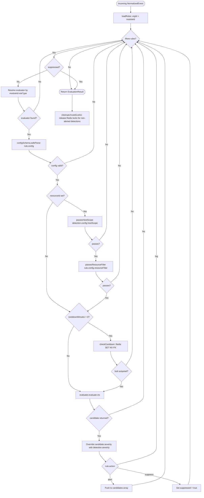

# Rule Engine

The rule engine is the core evaluation subsystem of Sentinel. It evaluates incoming normalized events against all active detection rules for an organization and module, returning `AlertCandidate` objects. The caller -- the `event-processing` BullMQ handler in `apps/worker/src/handlers/event-processing.ts` -- is responsible for persisting alerts to the database and enqueueing notification dispatch. This separation keeps the engine fully testable without I/O side effects.

**Source**: `packages/shared/src/rule-engine.ts`

## Architecture

The `RuleEngine` class receives three dependencies at construction time: a pre-built evaluator registry, a Redis client, and a database handle.

```typescript
export interface RuleEngineConfig {
  evaluators: Map<string, RuleEvaluator>;
  redis: Redis;
  db: Db;
  logger?: Logger;
}

export class RuleEngine {
  constructor(config: RuleEngineConfig) { ... }
}
```

The evaluator registry is a `Map<string, RuleEvaluator>` whose keys follow the pattern `"moduleId:ruleType"`, for example `"github:github.repo_visibility"`. The worker process builds this map at startup by collecting `evaluators` arrays from every registered `DetectionModule`.

### Evaluator registry construction

At worker startup (`apps/worker/src/index.ts`), all module evaluators are registered into a single map along with the platform-level compound evaluator:

```typescript
const modules = [GitHubModule, RegistryModule, ChainModule, InfraModule, AwsModule];

const evaluators = new Map<string, RuleEvaluator>();
for (const mod of modules) {
  for (const evaluator of mod.evaluators) {
    const key = `${evaluator.moduleId}:${evaluator.ruleType}`;
    evaluators.set(key, evaluator);
  }
}

// Platform-level compound evaluator
evaluators.set(`${compoundEvaluator.moduleId}:${compoundEvaluator.ruleType}`, compoundEvaluator);

const engine = new RuleEngine({ evaluators, redis, db });
```

## Loading active rules

`RuleEngine.loadRules(orgId, moduleId)` queries the database for all rules where:

- `rules.orgId = orgId`
- `rules.moduleId = moduleId`
- `rules.status = 'active'`
- The joined `detections.status = 'active'`

Results are ordered by `rules.priority ASC` (lowest number evaluated first). This ordering is significant: a `suppress` action on a lower-priority rule stops all further evaluation within the same event pass.

```typescript
async loadRules(
  orgId: string,
  moduleId: string,
): Promise<Array<{ rule: RuleRow; detection: DetectionRow }>>
```

## Evaluation context

Each call to an evaluator receives an `EvalContext` object:

```typescript
export interface EvalContext {
  event: NormalizedEvent;
  rule: RuleRow;
  redis: Redis;
  resourceId?: string;
  evaluators?: Map<string, RuleEvaluator>;
}
```

| Field | Description |
|---|---|
| `event` | The normalized event being evaluated. |
| `rule` | The rule row from the database, with `config` cast to `Record<string, unknown>`. |
| `redis` | Redis client for evaluators that maintain windowed state (sorted sets, counters). |
| `resourceId` | Resource identifier extracted from `event.payload.resourceId` before the evaluation loop. Used for host scoping and resource filtering. |
| `evaluators` | The full evaluator registry. Passed so compound evaluators can delegate to sub-evaluators. |

## AlertCandidate structure

A successful evaluation returns an `AlertCandidate`:

```typescript
export interface AlertCandidate {
  orgId: string;
  detectionId: string;
  ruleId: string;
  eventId: string;
  severity: string;
  title: string;
  description?: string;
  triggerType: 'immediate' | 'windowed' | 'deferred';
  triggerData: Record<string, unknown>;
}
```

The `severity` field returned by the evaluator is overwritten by the detection's configured severity (`detection.severity`) after `evaluate()` returns. The evaluator's default severity is a fallback for display purposes during rule authoring only.

## Evaluation pipeline

The following diagram shows the complete flow for a single event:



### Step-by-step evaluation sequence

For each rule in priority order, the engine performs these checks:

1. **Suppression gate**: If a prior rule set `suppressed = true`, the loop exits immediately.
2. **Evaluator resolution**: Look up the evaluator by `"{rule.moduleId}:{rule.ruleType}"` in the registry. If no evaluator is found, skip the rule silently.
3. **Config validation**: Call `evaluator.configSchema.safeParse(rule.config)`. If parsing fails, skip the rule.
4. **Host scope check**: If `resourceId` is present and `detection.config.hostScope` is a non-empty array, verify that `resourceId` matches at least one glob pattern using `minimatch`. Otherwise, skip.
5. **Resource filter check**: If `resourceId` is present and `rule.config.resourceFilter` exists, apply exclude patterns first (any match skips the rule), then include patterns (at least one must match if the array is non-empty).
6. **Cooldown check**: If `detection.cooldownMinutes > 0`, attempt to acquire a cooldown lock. If the lock cannot be acquired, skip the rule.
7. **Evaluation**: Call `evaluator.evaluate(ctx)`. Catch and log any exceptions.
8. **Action dispatch**: If the evaluator returns a candidate, override its severity with `detection.severity`, then route based on `rule.action`:
   - `alert`: Push the candidate to the results array.
   - `suppress`: Set `suppressed = true` to halt further evaluation.
   - `log`: No additional action; the event is already stored.

### Suppression

When a rule with `action = 'suppress'` matches, the `suppressed` flag is set and the loop exits immediately. No further rules are evaluated for this event pass. Suppress rules are useful to silence noisy patterns before they reach alert rules. Because rules are evaluated in ascending priority order, a suppress rule at priority `0` runs before alert rules at priority `10` or higher.

### Resource filtering

Two independent filtering mechanisms operate before evaluation:

**Detection-level host scope** (`detection.config.hostScope`): An array of glob patterns matched with `minimatch`. If the array is non-empty, the event's `resourceId` must match at least one pattern. This scopes a detection to specific hosts or repositories at the detection level.

**Rule-level resource filter** (`rule.config.resourceFilter`): A `ResourceFilter` object with optional `include` and `exclude` arrays:

```typescript
export const resourceFilterSchema = z.object({
  include: z.array(z.string()).optional(),
  exclude: z.array(z.string()).optional(),
}).optional();
```

Exclude patterns take precedence. If any exclude pattern matches, the rule is skipped regardless of include patterns.

## Cooldown enforcement

Cooldowns prevent an alert from firing more than once per `detection.cooldownMinutes` interval. The engine uses a two-layer strategy.

### Primary: Redis SET NX PX

```typescript
const acquired = await redis.set(redisKey, '1', 'PX', cooldownMs, 'NX');
```

The Redis key follows this schema:

```
sentinel:cooldown:{detectionId}:{ruleId}
sentinel:cooldown:{detectionId}:{ruleId}:{resourceId}   // per-resource cooldown
```

The `SET NX` (set-if-not-exists) operation is atomic. If it returns `null`, another worker process has already acquired the lock for this detection within the cooldown window. The cooldown key includes the `ruleId` to scope cooldowns per rule rather than per detection, so rule A firing does not block rule B under the same detection.

### Fallback: atomic DB update

If Redis is unavailable, the engine falls back to an atomic `UPDATE rules SET last_triggered_at = now WHERE id = ? AND (last_triggered_at IS NULL OR last_triggered_at < ?)` query using `RETURNING`. The update targets `rules.lastTriggeredAt` (not `detections.lastTriggeredAt`), which is scoped to the specific rule. This prevents rule A's firing from blocking rule B's independent cooldown.

### Lock cleanup

The engine acquires cooldown locks optimistically, before the evaluator runs. If the evaluator does not produce a candidate, the lock must be released. After the evaluation loop completes, `cleanupUnusedLocks` performs targeted `DEL` commands on the exact Redis keys that were acquired during this evaluation cycle. The engine records each acquired key in a `Map<string, string>` (detectionId to redisKey) at acquisition time, avoiding a `SCAN` operation that would be non-atomic and could inadvertently delete keys acquired by a concurrent request.

## EvaluationResult

```typescript
export interface EvaluationResult {
  /** Alert candidates from rules with action='alert'. */
  candidates: AlertCandidate[];

  /** True if a suppress rule fired and halted evaluation. */
  suppressed: boolean;

  /** Detection IDs for which a cooldown lock was acquired. */
  acquiredCooldownLocks: Set<string>;

  /** Detection IDs that produced at least one alert candidate. */
  alertedDetectionIds: Set<string>;
}
```

## Dry-run evaluation

`RuleEngine.evaluateDryRun(event, detectionId)` evaluates a single detection without acquiring cooldown locks or writing any state. It loads only the rules belonging to the specified detection (not all rules for the org+module) and runs them through the same evaluation loop. The dry-run mode skips the cooldown check entirely, so results reflect what would trigger if no cooldown were in effect. Use this for the test-rule API endpoint to preview what an event would trigger.

## Event processing handler

The `event-processing` handler (`apps/worker/src/handlers/event-processing.ts`) orchestrates the full lifecycle:

1. Loads the event from the database by `eventId`.
2. Constructs a `NormalizedEvent` from the stored event row.
3. Calls `engine.evaluate(normalizedEvent)`.
4. Wraps all alert inserts and `lastTriggeredAt` updates in a single database transaction. Uses `ON CONFLICT DO NOTHING` backed by a unique constraint for idempotent deduplication.
5. Enqueues `alert.dispatch` jobs for each created alert outside the transaction boundary.
6. Conditionally enqueues a `correlation.evaluate` job if the organization has at least one active correlation rule, avoiding unnecessary queue churn for orgs without correlation rules.

## Rule priority

The `rules.priority` column is an integer. Rules are evaluated in ascending order by convention:

- Priority `0` rules run first.
- A suppress rule at priority `0` halts all evaluation for the event.
- If no suppress rule fires, all remaining rules are evaluated. Multiple alert rules can produce multiple `AlertCandidate` objects from a single event.
- The default priority is `50` when not specified by a template.

Priority is set per-rule when a detection template is instantiated. The `github-full-security` template assigns priority `10` to visibility and secret scanning rules, `20` to force push, `30` to branch protection and deploy keys, `40` to member changes, and `50` to org settings. This ensures the highest-severity detections are evaluated and can potentially suppress lower-priority rules.

## Bug audit

The following issues were identified during source code review for the documentation effort.

- **[MEDIUM]** `modules/chain/src/evaluators/windowed-count.ts:49-76` -- **Race condition (non-atomic window check)**: The `checkWindowThreshold` function performs ZADD, ZREMRANGEBYSCORE, ZCARD, and PEXPIRE as four separate Redis commands. Two concurrent workers processing events for the same rule can both observe `count >= threshold` before either's ZADD is visible to the other's ZCARD. This can produce duplicate alerts for the same windowed-count threshold crossing. The correlation engine's aggregation counters solve this with atomic Lua scripts (`AGG_INCR_LUA`), but the chain module's windowed evaluators do not use the same pattern. Impact: duplicate windowed-count alerts under concurrent load.

- **[MEDIUM]** `modules/chain/src/evaluators/windowed-spike.ts:62-111` -- **Same non-atomic race as windowed-count**: The `checkWindowSpikeThreshold` function uses the same multi-command pattern (ZADD, ZREMRANGEBYSCORE, ZCOUNT, ZCOUNT, PEXPIRE). Two workers can both compute `spikePercent >= increasePercent` simultaneously. Impact: duplicate spike alerts under concurrent load.

- **[MEDIUM]** `modules/chain/src/evaluators/windowed-sum.ts:64-110` -- **Same non-atomic race as windowed-count**: The `checkWindowedSum` function uses ZADD, ZREMRANGEBYSCORE, ZRANGEBYSCORE, PEXPIRE. Additionally, it fetches all members with `ZRANGEBYSCORE` and sums them in Node.js, which can be expensive if the sorted set is large. Impact: duplicate sum-threshold alerts under concurrent load; potential latency for high-volume contracts.

- **[LOW]** `modules/aws/src/evaluators/event-match.ts:159` -- **Type unsafety in severity extraction**: The severity is extracted as `rule.config?.severity as 'low' | 'medium' | 'high' | 'critical' ?? 'medium'`, reading from the raw config object. However, the `configSchema` does not include a `severity` field, so this always falls through to `'medium'`. The `?? 'medium'` fallback is correct but the `as` cast is misleading -- the field never exists on the validated config. Impact: cosmetic; the detection-level severity override in the rule engine corrects this regardless.

- **[LOW]** `modules/chain/src/evaluators/windowed-count.ts:58` -- **Unused parameter**: The `_timestamp` parameter (event's occurred-at time) is accepted but never used. Wall-clock `Date.now()` is used instead. The comment explains the rationale (avoiding mismatch between block timestamps and wall-clock pruning), but the parameter should be removed to avoid confusion. Impact: none; cosmetic.

- **[LOW]** `packages/shared/src/correlation-engine.ts:118-126` -- **Aggregation INCR TTL is sliding, not fixed**: The `AGG_INCR_LUA` script calls `PEXPIRE` on every increment, creating a sliding window rather than an anchored one. For aggregation rules with a threshold of (say) 10 events, if events trickle in slowly (one every 55 minutes with a 60-minute window), the window keeps sliding forward and the counter can eventually reach 10 over many hours rather than requiring 10 events within a single 60-minute window. This differs from the sequence window behavior (which is anchored). Impact: aggregation rules may fire later than expected for slow-drip event streams. Whether this is intentional or a bug depends on the desired semantics.

- **[LOW]** `packages/shared/src/correlation-engine.ts:766` -- **Redundant guard**: After `if (!triggerFields) return conditions.length === 0`, the function proceeds to `conditions.every(...)`. But the code already returned when `conditions.length === 0` on line 762. The guard on line 766 is only reachable when `conditions.length > 0`, so `conditions.length === 0` always returns false, which is equivalent to the correct behavior (no trigger fields means conditions fail). Impact: none; readability could be improved.
