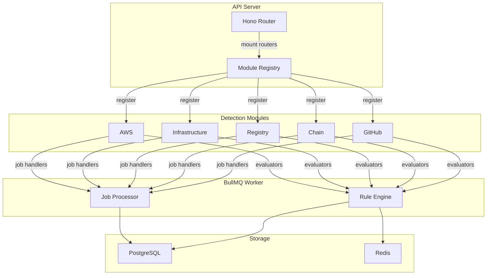
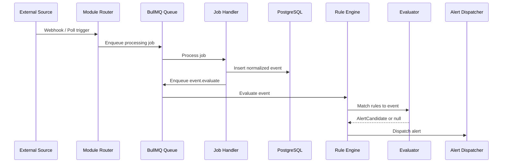

# Module system overview

Sentinel uses a pluggable module architecture. Each module encapsulates all detection logic, HTTP routes, background jobs, event type definitions, and alert templates for a specific data source. Modules are first-class citizens: the core platform provides the evaluation engine, dispatcher, and persistence layer; modules supply the domain knowledge.

## Architecture



## The DetectionModule interface

Every module exports a single object that satisfies the `DetectionModule` interface defined in `packages/shared/src/module.ts`:

```typescript
export interface DetectionModule {
  readonly id: string;
  readonly name: string;
  readonly router: Hono<AppEnv>;
  readonly evaluators: RuleEvaluator[];
  readonly jobHandlers: JobHandler[];
  readonly eventTypes: EventTypeDefinition[];
  readonly templates: DetectionTemplate[];
  readonly retentionPolicies?: RetentionPolicy[];
  readonly defaultTemplates?: string[];
  formatSlackBlocks?: (alert: AlertFormatInput) => object[];
}
```

See [module-interface.md](./module-interface.md) for complete field-by-field documentation.

## Module registration

Modules register themselves at API startup. The API entrypoint imports each module object and passes it to the module registry. The registry performs the following steps for each module:

1. **Mount the router** at `/modules/{id}/` on the Hono application.
2. **Register evaluators** with the rule engine so the evaluation worker knows which evaluator to invoke for each `ruleType`.
3. **Register job handlers** with the BullMQ worker so background jobs dispatched under the module's queue names are routed to the correct handler function.
4. **Register event types** in the platform event-type catalog, which the UI uses to populate detection-creation forms.
5. **Register detection templates** so users can create detections from pre-built, parameterizable configurations.
6. **Apply retention policies** so the retention janitor knows which tables to prune and on what schedule.

Modules do not need to perform any self-registration. Importing the module object and passing it to the registry is sufficient.

## Module lifecycle

A module progresses through four lifecycle stages from initialization through runtime:

1. **Import.** The API entrypoint imports the module's default export (the `DetectionModule` object). All evaluators, handlers, event types, and templates are resolved at import time as static arrays.

2. **Registration.** The module registry iterates over the arrays, mounts the Hono sub-router, registers evaluators by `ruleType` in an in-memory lookup table, and registers job handlers by `jobName` in the BullMQ worker dispatcher.

3. **Active operation.** During runtime, the module's router receives HTTP requests (webhooks, API calls). Job handlers execute background tasks enqueued by routes or by scheduled repeatable jobs (block polling, artifact polling, host scanning). Evaluators are invoked by the rule engine whenever an event matching the module's event types enters the evaluation pipeline.

4. **Teardown.** On graceful shutdown, the BullMQ worker drains in-flight jobs before exiting. No module-specific teardown hook exists; modules must not hold resources that require explicit cleanup beyond what BullMQ manages.

### Event flow through a module



## Module-provided capabilities

| Capability | Description |
|---|---|
| **Evaluators** | TypeScript functions that receive a normalized event and a rule config, and return an `AlertCandidate` when the rule conditions are met. One module can provide many evaluators, each bound to a distinct `ruleType` string. |
| **Job handlers** | BullMQ job processor functions. Modules use these for work that cannot happen synchronously in the HTTP request path: webhook normalization, block polling, package registry polling, host scanning, and so on. |
| **Event types** | A catalog of the event type strings this module can produce (for example, `github.push`, `chain.log`, `infra.cert.expiring`). The UI uses this catalog to constrain rule creation to applicable event types. |
| **Detection templates** | Pre-built detection configurations that users instantiate through the UI. Templates define the rule type, default config values, and the user-visible input fields that override those defaults. |
| **HTTP routes** | A Hono sub-router mounted under `/modules/{id}/`. Routes handle webhook ingestion, OAuth callbacks, installation management, and any module-specific API operations. |
| **Retention policies** | Optional declarations of which database tables the module owns and how long raw data should be retained before the janitor prunes it. |
| **Slack formatter** | An optional `formatSlackBlocks` function. When provided, the alert dispatcher calls this function instead of the generic block builder to produce richer, module-specific Slack notifications. |

## Built-in modules

Sentinel ships with five built-in modules:

| Module ID | Name | Primary data source | Evaluator count | Template count |
|---|---|---|---|---|
| `github` | GitHub | GitHub App webhooks | 7 | 8 |
| `chain` | Chain | EVM-compatible blockchain RPC | 8 | 21 |
| `registry` | Registry | Docker Hub and npm package registries | 5 | 26 |
| `infra` | Infrastructure | Host scanning, TLS probing, DNS | 10 | 7 |
| `aws` | AWS | CloudTrail events via SQS | 4 | 17 |

For detailed documentation on each module, see:

- [github.md](./github.md)
- [chain.md](./chain.md)
- [registry.md](./registry.md)
- [infra.md](./infra.md)
- [aws.md](./aws.md)

## Adding a new module

To add a new detection source to Sentinel, create a new module that satisfies the `DetectionModule` interface. The process involves seven steps:

1. Create a module directory under `modules/{your-module-id}/src/`.
2. Define evaluators with Zod config schemas and `evaluate()` implementations.
3. Define job handlers for background processing.
4. Declare event types in an `event-types.ts` file.
5. Create detection templates in `templates/index.ts`.
6. Wire a Hono sub-router in `router.ts`.
7. Assemble the `DetectionModule` object in `index.ts` and register it in the API entrypoint.

See [module-interface.md](./module-interface.md) for a complete step-by-step guide with code examples.
