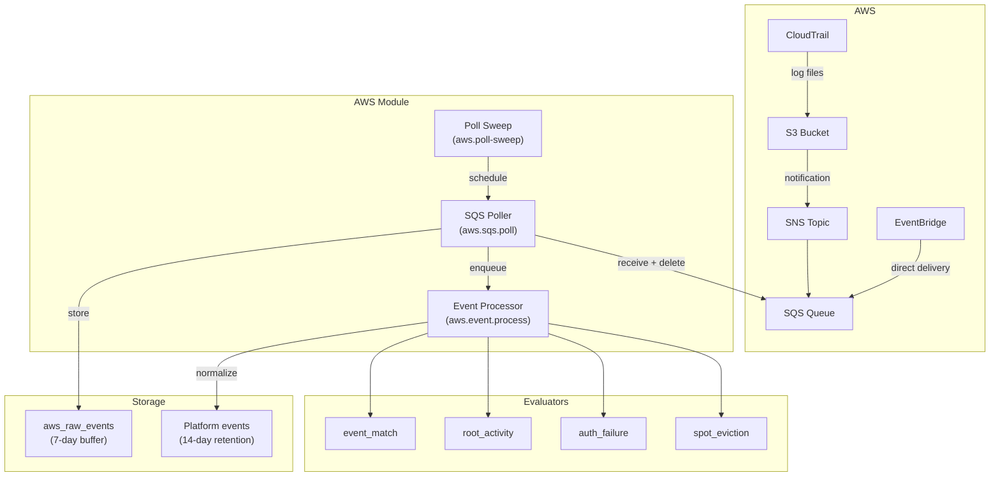

# AWS module

Module ID: `aws`

The AWS module ingests AWS CloudTrail events from an SQS queue and evaluates them against detection rules to surface security-relevant activity in your AWS environment. It detects patterns such as root account usage, console authentication failures, suspicious IAM activity, and EC2 spot instance interruptions. CloudTrail events that do not trigger any rule are buffered briefly and discarded; events that match rules are promoted to Sentinel's platform events table for long-term retention.

## What the module monitors

- Any CloudTrail API event, filterable by event name, service source, user type, principal ARN, error code, and region
- AWS root account API usage
- AWS Management Console login failures and root console logins
- Login events without MFA
- EC2 spot instance interruption warnings

## Architecture

The AWS module does not receive events via a push webhook. Instead, it polls an SQS queue that you configure to receive CloudTrail event notifications. This polling model allows Sentinel to process CloudTrail events at scale without requiring an inbound network path from AWS.



**Data flow:**

1. AWS CloudTrail delivers log files to an S3 bucket on a configurable interval (default: approximately every 5 minutes for management events).
2. An S3 event notification triggers an SNS message, which fans out to an SQS queue.
3. Sentinel's `sqsPollHandler` polls the SQS queue and dequeues message batches (up to 10 batches of 10 messages per poll cycle).
4. Each SQS message is parsed for CloudTrail records. The module handles three message formats: direct CloudTrail events, SNS notification wrappers, and native EventBridge events.
5. Raw events are stored in `aws_raw_events` and enqueued for normalization.
6. The `eventProcessHandler` normalizes each record into a Sentinel event, writes it to the platform `events` table, and enqueues rule evaluation.
7. Events that do not trigger any rule age out of `aws_raw_events` after 7 days.

A secondary path supports EventBridge event forwarding for near-real-time events (such as EC2 spot instance interruption warnings), which are not available through CloudTrail.

### Authentication methods

The SQS poller supports three authentication methods, evaluated in order:

| Method | Configuration | Use case |
|---|---|---|
| **IAM role assumption** | Set `roleArn` (and optionally `externalId`) on the integration. | Cross-account monitoring. Sentinel assumes the role via STS `AssumeRole` with a 1-hour session. |
| **Encrypted static credentials** | Provide `accessKeyId` and `secretAccessKey`, which Sentinel encrypts at rest. | Single-account monitoring without role-based access. |
| **Environment / instance profile** | No explicit credentials configured. | Running Sentinel on EC2/ECS with an attached IAM role. |

### Organization-level monitoring

To monitor multiple AWS accounts from a single Sentinel deployment, create one integration per account. Each integration can use a different SQS queue URL and IAM role ARN. Configure a CloudTrail organization trail that delivers events from all member accounts to a central S3 bucket and SQS queue, or create per-account trails that fan out to individual SQS queues.

### CloudTrail event normalization

The normalizer maps CloudTrail event sources to Sentinel event type namespaces. The event type format is `aws.{service}.{eventName}`.

| CloudTrail event source | Sentinel namespace |
|---|---|
| `iam.amazonaws.com` | `aws.iam` |
| `signin.amazonaws.com` | `aws.signin` |
| `ec2.amazonaws.com` | `aws.ec2` |
| `s3.amazonaws.com` | `aws.s3` |
| `cloudtrail.amazonaws.com` | `aws.cloudtrail` |
| `kms.amazonaws.com` | `aws.kms` |
| `secretsmanager.amazonaws.com` | `aws.secretsmanager` |
| `sts.amazonaws.com` | `aws.sts` |
| `lambda.amazonaws.com` | `aws.lambda` |
| `rds.amazonaws.com` | `aws.rds` |
| `eks.amazonaws.com` | `aws.eks` |
| `ecs.amazonaws.com` | `aws.ecs` |
| Other `*.amazonaws.com` | `aws.{service}` (derived from source) |

Native EventBridge events (not CloudTrail API calls) are mapped to fixed event types:

| EventBridge detail-type | Sentinel event type |
|---|---|
| `EC2 Spot Instance Interruption Warning` | `aws.ec2.SpotInstanceInterruption` |
| `EC2 Instance State-change Notification` | `aws.ec2.InstanceStateChange` |
| `EC2 Instance Rebalance Recommendation` | `aws.ec2.SpotRebalanceRecommendation` |

---

## Evaluators

### event_match

**Rule type:** `aws.event_match`

The general-purpose CloudTrail event filter. Matches events based on any combination of event name, AWS service source, user identity type, principal ARN, error code, and region.

| Config field | Type | Default | Description |
|---|---|---|---|
| `eventNames` | `string[]` | `[]` | CloudTrail `eventName` values to match (for example, `CreateUser`, `PutBucketAcl`). Supports glob patterns (`Delete*`) and substring matching. Leave empty to match all event names. |
| `eventSources` | `string[]` | `[]` | CloudTrail `eventSource` values (AWS service endpoints, for example, `iam.amazonaws.com`, `s3.amazonaws.com`). Leave empty to match all services. |
| `userTypes` | `string[]` | `[]` | CloudTrail `userIdentity.type` values to match. Common values: `Root`, `IAMUser`, `AssumedRole`, `FederatedUser`, `AWSService`. Leave empty to match all user types. |
| `principalArnPatterns` | `string[]` | `[]` | Patterns for the caller's IAM ARN (`userIdentity.arn`). Supports glob (`arn:aws:iam::*:user/admin-*`) and substring matching. Leave empty to match all principals. |
| `errorEventsOnly` | `boolean` | `false` | When `true`, only match events where `errorCode` is non-empty (access denied, throttled, not authorized, and so on). |
| `errorCodes` | `string[]` | `[]` | Match only specific CloudTrail error codes (for example, `AccessDenied`, `UnauthorizedOperation`). Can be used with or without `errorEventsOnly`. |
| `regions` | `string[]` | `[]` | AWS region identifiers to restrict matching to (for example, `us-east-1`, `eu-west-1`). Leave empty to match all regions. |
| `alertTitle` | `string` | `'AWS CloudTrail: {{eventName}} by {{principalId}}'` | Alert title template. Supports `{{eventName}}`, `{{principalId}}`, `{{awsRegion}}`, and `{{accountId}}` placeholder substitution. |

The severity for `event_match` alerts is taken from the detection rule's configured `severity` field (set when the rule is created in the UI), defaulting to `medium`.

**Example trigger:** An `IAMUser` calls `PutBucketPolicy` on `s3.amazonaws.com` from an unusual region, potentially modifying a bucket's access policy to expose data publicly.

**Example config — alert on all IAM delete operations:**
```json
{
  "eventNames": ["Delete*"],
  "eventSources": ["iam.amazonaws.com"],
  "regions": []
}
```

**Example config — alert on access-denied errors from a specific role:**
```json
{
  "errorEventsOnly": true,
  "errorCodes": ["AccessDenied"],
  "principalArnPatterns": ["arn:aws:iam::*:role/ReadOnlyRole"],
  "alertTitle": "Access denied for ReadOnlyRole: {{eventName}} in {{awsRegion}}"
}
```

---

### root_activity

**Rule type:** `aws.root_activity`

Fires whenever the AWS root account performs any API action. Root account usage is a high-risk signal regardless of the specific operation because the root account has unrestricted access and bypasses IAM policies. AWS best practices recommend that the root account never be used for routine operations.

| Config field | Type | Default | Description |
|---|---|---|---|
| `excludeEventNames` | `string[]` | `[]` | CloudTrail event names to suppress for root account activity. Use this to quiet expected, low-risk root-account actions such as billing console access (for example, `GetBillingDetails`, `ViewBillingStatement`). |
| `includeFailedActions` | `boolean` | `true` | When `true`, also alert on root account events where `errorCode` is non-empty (failed actions). Failed root actions may indicate someone is testing root credentials. |

All `root_activity` alerts are `critical` severity.

**Example trigger:** The root account makes a `ConsoleLogin` followed by a `CreateAccessKey` call, suggesting someone is creating long-lived credentials using the most privileged account.

**Example config:**
```json
{
  "excludeEventNames": ["GetBillingDetails"],
  "includeFailedActions": true
}
```

---

### auth_failure

**Rule type:** `aws.auth_failure`

Detects AWS Management Console authentication anomalies: login failures, root account console logins, and logins that did not use MFA. The evaluator only processes `aws.signin.ConsoleLogin` events.

| Config field | Type | Default | Description |
|---|---|---|---|
| `alertOnLoginFailure` | `boolean` | `true` | Alert when a `ConsoleLogin` event has a `Failure` result in `responseElements.ConsoleLogin`. Root account failures produce `critical` severity; other account failures produce `high`. |
| `alertOnRootLogin` | `boolean` | `true` | Alert when the root account successfully logs in to the console (`critical` severity). |
| `alertOnNoMfa` | `boolean` | `false` | Alert when any user successfully logs in to the console without MFA (`medium` severity). This is disabled by default because some service accounts may not use MFA by design. |

**Example trigger:** The root account successfully signs in to the AWS Management Console at 03:00 from an unfamiliar IP address.

**Example config:**
```json
{
  "alertOnLoginFailure": true,
  "alertOnRootLogin": true,
  "alertOnNoMfa": true
}
```

---

### spot_eviction

**Rule type:** `aws.spot_eviction`

Fires when AWS issues an EC2 spot instance interruption warning. The 2-minute warning arrives as an EventBridge event (`EC2 Spot Instance Interruption Warning`) before AWS reclaims the instance.

This evaluator is useful for:
- Alerting on unexpected evictions during critical workloads.
- Correlating repeated evictions to identify bid price or capacity issues.
- Security signal: evictions of unrecognized instance IDs may indicate unauthorized workloads (for example, cryptocurrency mining) being cleaned up by cost controls.

| Config field | Type | Default | Description |
|---|---|---|---|
| `watchInstanceIds` | `string[]` | `[]` | Specific EC2 instance IDs to monitor. Leave empty to alert on all spot instance evictions. |
| `regions` | `string[]` | `[]` | AWS regions to restrict monitoring to. Leave empty to monitor all regions. |
| `severity` | `'low' \| 'medium' \| 'high' \| 'critical'` | `'medium'` | Alert severity to use for eviction events. Increase to `high` or `critical` if the monitored instances run critical workloads. |

**Example trigger:** A spot instance running a batch machine learning job is interrupted unexpectedly, with the instance ID not matching any known workload.

**Example config:**
```json
{
  "watchInstanceIds": [],
  "regions": ["us-east-1", "us-west-2"],
  "severity": "high"
}
```

---

## Job handlers

| Job name | Queue | Description |
|---|---|---|
| `aws.poll.sweep` (`pollSweepHandler`) | `MODULE_JOBS` | Orchestrates the CloudTrail polling cycle. Checks for new SQS messages, manages poll scheduling, and handles backpressure when the queue depth is high. |
| `aws.sqs.poll` (`sqsPollHandler`) | `MODULE_JOBS` | Polls the configured SQS queue, dequeues batches of CloudTrail notifications, fetches the referenced S3 objects (CloudTrail JSON log files), and enqueues individual event-processing jobs. Deletes SQS messages after successful processing. |
| `aws.event.process` (`eventProcessHandler`) | `MODULE_JOBS` | Parses a batch of CloudTrail records from a single log file. Normalizes each record into a Sentinel event, writes it to `aws_raw_events`, and enqueues it for rule evaluation. |

---

## HTTP routes

Routes are mounted under `/modules/aws/`.

| Method | Path | Auth | Description |
|---|---|---|---|
| `GET` | `/integrations` | Session | Lists configured AWS integrations with SQS queue URL, region, polling status, last poll time, and connected account IDs. Sensitive fields (role ARN, credentials) are returned as boolean indicators, not raw values. |
| `POST` | `/integrations` | Session + Admin | Creates a new AWS integration. Requires an AWS account ID (12 digits), and either a `roleArn` or `accessKeyId` + `secretAccessKey` pair. Optionally accepts `sqsQueueUrl`, `sqsRegion`, `regions`, and `pollIntervalSeconds`. Triggers an initial SQS poll on creation. |
| `GET` | `/integrations/:id` | Session | Returns detailed information about a specific AWS integration, including configuration and status. |
| `PATCH` | `/integrations/:id` | Session + Admin/Editor | Updates integration configuration (name, SQS queue, regions, credentials, poll interval, enable/disable). Triggers an immediate poll after update. |
| `DELETE` | `/integrations/:id` | Session + Admin | Permanently deletes an AWS integration and its associated repeatable poll jobs. Pauses all AWS detections if this was the last active integration. |
| `POST` | `/integrations/:id/poll` | Session + Admin/Editor | Manually triggers an SQS poll for the specified integration. Requires the integration to have an SQS queue URL configured. |
| `GET` | `/events` | Session | Lists raw CloudTrail events from the short-retention buffer. Supports pagination (`?page=`, `?limit=`) and filtering by `integrationId` and `eventName`. |
| `GET` | `/overview` | Session | Returns aggregated dashboard statistics: integration count, total events, error events, and recent integration statuses. |
| `GET` | `/templates` | Session | Lists detection templates provided by this module. |

---

## Templates

The AWS module provides 17 pre-built detection templates:

| Template slug | Name | Category | Default severity |
|---|---|---|---|
| `aws-root-account-usage` | Root Account Usage | identity | critical |
| `aws-console-login-anomaly` | Console Login Anomaly | identity | high |
| `aws-iam-user-changes` | IAM User Changes | identity | high |
| `aws-iam-privilege-escalation` | IAM Privilege Escalation | identity | critical |
| `aws-federated-identity-abuse` | Federated Identity Abuse | identity | high |
| `aws-mfa-deactivated` | MFA Deactivated | identity | critical |
| `aws-cloudtrail-disabled` | CloudTrail Disabled | defense-evasion | critical |
| `aws-config-evasion` | Config Service Evasion | defense-evasion | critical |
| `aws-security-group-opened` | Security Group Opened | network | high |
| `aws-ec2-ssh-access` | EC2 SSH Key Access | network | high |
| `aws-ec2-unusual-launch` | EC2 Unusual Launch | compute | medium |
| `aws-spot-eviction` | Spot Instance Eviction | compute | medium |
| `aws-s3-public-access` | S3 Public Access Change | data | critical |
| `aws-kms-key-action` | KMS Key Action | data | high |
| `aws-secrets-access` | Secrets Manager Access | data | high |
| `aws-access-denied` | Access Denied Spike | anomaly | medium |
| `aws-full-security` | Full AWS Security Suite | comprehensive | high |

---

## Required AWS IAM permissions

Create a dedicated IAM role for Sentinel with the following minimum permissions. Use the principle of least privilege: Sentinel only needs to read from SQS and S3, not to modify any resources.

### SQS permissions

```json
{
  "Version": "2012-10-17",
  "Statement": [
    {
      "Effect": "Allow",
      "Action": [
        "sqs:ReceiveMessage",
        "sqs:DeleteMessage",
        "sqs:GetQueueAttributes"
      ],
      "Resource": "arn:aws:sqs:REGION:ACCOUNT_ID:YOUR_CLOUDTRAIL_QUEUE"
    }
  ]
}
```

### S3 permissions

```json
{
  "Effect": "Allow",
  "Action": [
    "s3:GetObject"
  ],
  "Resource": "arn:aws:s3:::YOUR_CLOUDTRAIL_BUCKET/AWSLogs/*"
}
```

### SNS permissions (if using SNS→SQS fan-out)

No additional Sentinel IAM permissions are required. The SQS queue's resource-based policy must allow `SNS:SendMessage` from the CloudTrail SNS topic ARN.

### Cross-account access

For monitoring multiple AWS accounts from a single Sentinel deployment, create the IAM role in each monitored account and configure the trust policy to allow Sentinel's IAM principal (user or role) to assume it:

```json
{
  "Version": "2012-10-17",
  "Statement": [
    {
      "Effect": "Allow",
      "Principal": {
        "AWS": "arn:aws:iam::SENTINEL_ACCOUNT_ID:role/SentinelRole"
      },
      "Action": "sts:AssumeRole"
    }
  ]
}
```

Register the role ARN in Sentinel's AWS integration settings instead of providing static access keys.

---

## Retention policies

The AWS module declares two custom retention policies to manage the high event volume typical of CloudTrail:

| Table | Timestamp column | Retention | Notes |
|---|---|---|---|
| `aws_raw_events` | `received_at` | 7 days | Short-term buffer for all CloudTrail records. Only events that triggered detections are promoted to the platform `events` table. |
| `events` (AWS rows only) | `received_at` | 14 days | Platform events scoped to `module_id = 'aws'`. Shorter than the 90-day platform default to manage storage at high CloudTrail ingestion volumes. Alert records retain full incident context for 365 days regardless of this policy. |

Adjust these values if your compliance requirements demand longer retention. Override the policies in the module's `retentionPolicies` array before deployment.

---

## CloudTrail configuration recommendations

For comprehensive coverage, enable the following CloudTrail settings in each monitored AWS account:

- **Management events**: Read and write. These cover IAM, S3 bucket policy changes, EC2 operations, and all control-plane activity.
- **Data events** (optional): Enable for S3 data events (`GetObject`, `PutObject`, `DeleteObject`) if you need fine-grained data access monitoring. Note that data events produce very high volume and will significantly increase `aws_raw_events` storage requirements.
- **Multi-region trail**: Enable a trail that applies to all regions to ensure cross-region activity (such as a resource created in `eu-west-1` by a principal that normally operates in `us-east-1`) is captured.
- **Log file validation**: Enable CloudTrail log file integrity validation. Sentinel does not currently verify the SHA-256 digest files, but enabling this setting creates a verifiable audit record.
- **S3 server-side encryption**: Encrypt CloudTrail log files using a KMS key. If you use a customer-managed KMS key, add `kms:Decrypt` to Sentinel's IAM policy for that key ARN.
