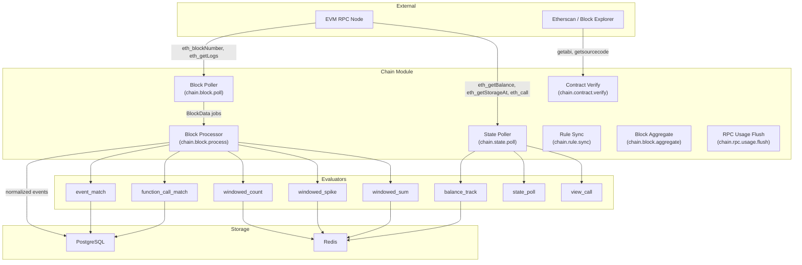

# Chain module

Module ID: `chain`

The Chain module provides real-time monitoring for EVM-compatible blockchain networks. It subscribes to new blocks, decodes transaction inputs and event logs, and evaluates detection rules against decoded on-chain activity. The module supports immediate event matching, windowed statistical analysis, balance tracking, contract state polling, and read-only view call monitoring.

## Architecture



## What the module monitors

- Smart contract event logs decoded against known ABIs
- Transaction function calls matched by 4-byte selector
- Windowed event counts exceeding a threshold
- Windowed event rate spikes above a baseline
- Windowed token transfer volume (sum of a numeric field)
- Native and ERC-20 token balance thresholds and changes
- Contract storage slot values via direct state polling
- Read-only (`view`) function return values

## Setup

### RPC URL configuration

Each monitored network requires a JSON-RPC endpoint. Sentinel supports any EVM-compatible chain that exposes a standard `eth_` API. Supported providers include Alchemy, Infura, QuickNode, self-hosted nodes, and any provider offering a WebSocket or HTTP JSON-RPC endpoint.

Configure RPC endpoints in the Sentinel UI under **Settings > Networks** or via the Chain module API at `POST /modules/chain/networks`.

**RPC URL resolution precedence:**

1. Organization-specific RPC override (stored in `chain_org_rpc_configs`).
2. Environment variable `RPC_{CHAIN_KEY}` (comma-separated list of URLs).
3. Default URL stored in the `chain_networks` database table.

**Multiple RPC URLs and failover:** Sentinel accepts multiple RPC URLs per network (comma-separated). When a call to the primary URL fails, the client transparently retries against the next URL in the list. URLs are rotated on a configurable hourly schedule (`RPC_ROTATION_HOURS` environment variable) to distribute load across providers.

**RPC client options:**

| Option | Default | Description |
|---|---|---|
| `maxRetries` | `3` | Maximum retries per individual RPC call before failing over to the next URL. |
| `retryDelayMs` | `1000` | Base delay in milliseconds for exponential backoff between retries. Actual delay doubles on each attempt. |
| `timeoutMs` | `15000` | Request timeout in milliseconds per individual call. |
| `rotationWindowHours` | (from env) | When set, URLs are rotated round-robin based on the current hour. |

**SSRF protection:** All user-provided RPC URLs are validated before use. The client rejects URLs that target private/internal IP ranges (RFC 1918, link-local, loopback, CGNAT), internal hostnames (`localhost`, `*.internal`, `*.local`, `*.lan`, `*.corp`), and the EC2 metadata endpoint (`169.254.169.254`). Non-HTTPS URLs produce a warning log but are not blocked, to support development environments.

### Etherscan integration

The module fetches contract ABIs and source metadata from Etherscan-compatible block explorer APIs when a contract address is registered without a manually provided ABI.

**Supported endpoints:**

- **Etherscan V2 unified endpoint** (`https://api.etherscan.io/v2/api`): Used when a `chainId` is provided and no custom explorer URL is specified. Supports all Etherscan-indexed chains through a single endpoint.
- **Custom explorer URLs**: When a custom `explorerApi` URL is provided (for example, for Blockscout or a private chain explorer), the module uses that URL directly with standard `module=contract` query parameters.

**Fetched data:**

| Data | Source endpoint | Usage |
|---|---|---|
| Contract ABI | `getabi` | Enables event log decoding and function call argument decoding for evaluators. |
| Contract name | `getsourcecode` | Displayed in the UI and alert titles. |
| Storage layout | `getsourcecode` | When the contract was compiled with `--storage-layout`, enables automatic storage slot resolution for the state poller. |

Both API calls use exponential backoff with up to 3 retry attempts and a 15-second per-attempt timeout. A missing Etherscan API key is not blocking: function call matching and event decoding work if you provide the ABI manually at contract registration time.

### Etherscan API key (optional)

Configure the API key in **Settings > Networks** alongside the RPC URL for the relevant network. Without an API key, automatic ABI fetching is unavailable and evaluators relying on `decodedArgs` cannot process contracts without a manually provided ABI.

---

## Evaluators

### event_match

**Rule type:** `chain.event_match`

Matches decoded smart contract event logs by event signature and optional field-level conditions. The evaluator handles both `chain.event.matched` events (produced by the block processing pipeline after ABI decoding) and raw `chain.log` events (matched by topic0 hash before decoding).

| Config field | Type | Required | Description |
|---|---|---|---|
| `eventSignature` | `string` | Conditional | ABI event signature, for example `Transfer(address,address,uint256)`. Sentinel computes topic0 from this value. Required if `topic0` is not provided. |
| `topic0` | `string` | Conditional | Pre-computed keccak256 hash of the event signature (0x-prefixed). Provide this instead of `eventSignature` for precision. One of `eventSignature` or `topic0` is required. |
| `contractAddress` | `string` | No | Lowercase hex contract address to restrict matching to a single contract. Leave empty to match the event on any contract. |
| `conditions` | `Condition[]` | No | Array of field-level conditions applied to decoded event arguments. All conditions must pass (logical AND). See condition schema below. |

**Condition schema:**

| Field | Type | Description |
|---|---|---|
| `field` | `string` | Decoded argument name (for example, `to`, `value`, `from`). |
| `operator` | `'>' \| '<' \| '>=' \| '<=' \| '==' \| '!='` | Comparison operator. String fields use `==` or `!=` (case-insensitive). Numeric fields coerce to `bigint`. |
| `value` | `unknown` | Value to compare against. |

**Example config:**
```json
{
  "eventSignature": "Transfer(address,address,uint256)",
  "contractAddress": "0xa0b86991c6218b36c1d19d4a2e9eb0ce3606eb48",
  "conditions": [
    { "field": "value", "operator": ">=", "value": "1000000000000" }
  ]
}
```

---

### function_call_match

**Rule type:** `chain.function_call_match`

Matches transactions that call a specific function on a specific contract, with optional conditions on decoded function arguments. The evaluator computes the 4-byte selector from the `functionSignature` when the `selector` field is absent.

| Config field | Type | Required | Description |
|---|---|---|---|
| `functionSignature` | `string` | Yes | ABI function signature, for example `transfer(address,uint256)`. |
| `functionName` | `string` | No | Human-readable name for display in alert titles. Defaults to the name extracted from `functionSignature`. |
| `selector` | `string` | No | Pre-computed 4-byte selector (0x-prefixed, lowercase). Derived from `functionSignature` if not provided. |
| `contractAddress` | `string` | Yes | Hex address of the contract to monitor. Transactions with a different `to` address are skipped. |
| `conditions` | `Condition[]` | No | Field-level conditions on decoded function arguments. All conditions must pass. |

**Example config:**
```json
{
  "functionSignature": "pause()",
  "contractAddress": "0xc02aaa39b223fe8d0a0e5c4f27ead9083c756cc2"
}
```

---

### windowed_count

**Rule type:** `chain.windowed_count`

Counts event log occurrences within a rolling time window and triggers when the count reaches or exceeds a threshold. Uses a Redis sorted set to maintain the sliding window.

Each incoming event is added to the sorted set with a Unix-millisecond timestamp as the score. Entries older than the window are pruned, and the remaining count is compared against the threshold. The Redis key auto-expires after the window duration elapses with no new events.

| Config field | Type | Default | Description |
|---|---|---|---|
| `eventSignature` | `string` | -- | ABI event signature to match. |
| `topic0` | `string` | -- | Pre-computed topic0 hash. One of `eventSignature` or `topic0` required. |
| `contractAddress` | `string` | -- | Optional contract address filter. |
| `windowMinutes` | `number` | `60` | Duration of the sliding window in minutes. Minimum: 1. |
| `threshold` | `number` | `5` | Minimum event count within the window to trigger an alert. Minimum: 1. |
| `groupByField` | `string` | -- | Optional decoded argument name to group counts by. When set, Sentinel maintains a separate counter per distinct value of this field (for example, `to` for per-recipient counts). |

**Example config:**
```json
{
  "eventSignature": "Withdrawal(address,uint256)",
  "contractAddress": "0x...",
  "windowMinutes": 10,
  "threshold": 50
}
```

---

### windowed_spike

**Rule type:** `chain.windowed_spike`

Detects abnormal spikes in event frequency by comparing a short observation window against a longer baseline window. Triggers when the observed rate exceeds the baseline average by more than a configurable percentage.

The spike percentage is calculated as:

```
baseline_avg = baseline_count / (baselineMs / observationMs)
spike%       = ((current_count - baseline_avg) / baseline_avg) * 100
trigger      = spike% >= increasePercent AND baseline_count >= minBaselineCount
```

| Config field | Type | Default | Description |
|---|---|---|---|
| `eventSignature` | `string` | -- | ABI event signature to match. |
| `topic0` | `string` | -- | Pre-computed topic0 hash. |
| `contractAddress` | `string` | -- | Optional contract address filter. |
| `observationMinutes` | `number` | `5` | Duration of the short observation window in minutes. |
| `baselineMinutes` | `number` | `60` | Duration of the historical baseline window in minutes. Must be longer than `observationMinutes`. |
| `increasePercent` | `number` | `200` | Minimum percentage increase over the baseline average to trigger. For example, `200` triggers when the observed rate is 3x the baseline average (200% increase). |
| `minBaselineCount` | `number` | `3` | Minimum number of events in the baseline window before spike detection activates. Prevents false positives when baseline history is sparse. |
| `groupByField` | `string` | -- | Optional decoded argument name to perform per-group spike detection. |

**Example config:**
```json
{
  "eventSignature": "Liquidation(address,address,uint256)",
  "contractAddress": "0x...",
  "observationMinutes": 5,
  "baselineMinutes": 60,
  "increasePercent": 300,
  "minBaselineCount": 5
}
```

---

### balance_track

**Rule type:** `chain.balance_track`

Monitors the native token or ERC-20 token balance of a watched address. Triggers when the balance crosses an absolute threshold, drops below a threshold, or changes by more than a configurable percentage within a rolling window.

Balance values are stored in Redis. For windowed `percent_change` comparisons, Sentinel maintains a sorted set of `{timestamp}:{value}` snapshots and compares the current balance against the peak (for drops) or trough (for rises) within the window.

| Config field | Type | Required | Description |
|---|---|---|---|
| `conditionType` | `'percent_change' \| 'threshold_above' \| 'threshold_below'` | Yes | Type of balance condition to evaluate. |
| `value` | `string` | Yes | For `percent_change`: percentage as an integer string (for example, `"20"` for 20%). For `threshold_above` and `threshold_below`: absolute balance in wei as a string (for example, `"1000000000000000000"` for 1 ETH). |
| `windowMs` | `number` | No | Rolling window duration in milliseconds for `percent_change` comparisons. When provided, Sentinel compares the current balance against the peak (for drops) or trough (for rises) within the window. When absent, compares against the previous single snapshot. |
| `bidirectional` | `boolean` | `false` | For `percent_change` with a window: when `true`, also alert on balance rises above the trough, not just drops from the peak. |

**Example config:**
```json
{
  "conditionType": "percent_change",
  "value": "30",
  "windowMs": 3600000,
  "bidirectional": false
}
```

---

### state_poll

**Rule type:** `chain.state_poll`

Evaluates contract storage slot values obtained via direct `eth_getStorageAt` polling. Supports detecting any change, threshold crossings, and windowed percentage deviation from a rolling mean.

| Config field | Type | Required | Description |
|---|---|---|---|
| `conditionType` | `'changed' \| 'threshold_above' \| 'threshold_below' \| 'windowed_percent_change'` | Yes | Condition type to evaluate against the polled state value. |
| `value` | `string` | Conditional | Absolute threshold as a decimal string. Required for `threshold_above` and `threshold_below`. |
| `percentThreshold` | `number` | Conditional | Maximum allowed percent deviation from the rolling mean. Required for `windowed_percent_change`. |
| `windowSize` | `number` | `100` | Number of historical snapshots used to compute the rolling mean for `windowed_percent_change`. Range: 1--500. |

For `windowed_percent_change`, Sentinel maintains a Redis list of the most recent `windowSize` values. On each poll, the evaluator computes the mean of previous values and checks whether the current value deviates beyond `percentThreshold`.

**Example config:**
```json
{
  "conditionType": "changed"
}
```

---

### view_call

**Rule type:** `chain.view_call`

Calls a read-only (`view` or `pure`) contract function on each poll cycle and evaluates the return value against configurable conditions. Useful for monitoring values not directly exposed as events, such as `totalSupply()`, `paused()`, `owner()`, or custom getter functions.

The evaluator supports dynamic argument tokens in function call arguments:

| Token | Resolved value |
|---|---|
| `$NOW` | Current Unix timestamp in seconds. |
| `$BLOCK_NUMBER` | Latest block number from the RPC endpoint. |
| `$BLOCK_TIMESTAMP` | Timestamp of the latest block. |

User-Defined Value Types (UDVTs) in Solidity function signatures are automatically normalized to `uint256` for ABI encoding.

| Config field | Type | Required | Description |
|---|---|---|---|
| `contractAddress` | `string` | Yes | Hex address of the contract to call. |
| `functionSignature` | `string` | Yes | ABI function signature of the view function, for example `totalSupply()` or `balanceOf(address)`. |
| `functionName` | `string` | No | Human-readable name for display in alert titles. |
| `conditions` | `Condition[]` | No | Conditions applied to the return values. All conditions must pass. |
| `resultField` | `string` | `'result'` | The field name to use when evaluating conditions for single-return-value functions. |

**Example config:**
```json
{
  "contractAddress": "0x...",
  "functionSignature": "paused()",
  "conditions": [
    { "field": "result", "operator": "==", "value": "true" }
  ]
}
```

---

### windowed_sum

**Rule type:** `chain.windowed_sum`

Sums the value of a numeric field across all matching events within a rolling time window and triggers when the sum satisfies a threshold condition. Designed primarily for detecting large token flows in aggregate.

Members in the Redis sorted set use the format `{eventId}:{value}` to store per-event amounts alongside timestamps. On each new event, all members are fetched and their values summed.

| Config field | Type | Required | Description |
|---|---|---|---|
| `eventSignature` | `string` | Conditional | ABI event signature to match. |
| `topic0` | `string` | Conditional | Pre-computed topic0. One of these is required. |
| `contractAddress` | `string` | No | Optional contract address filter. |
| `sumField` | `string` | Yes | Decoded argument name whose values are summed (for example, `value`, `amount`). |
| `windowMinutes` | `number` | `60` | Sliding window duration in minutes. |
| `threshold` | `string` | Yes | BigInt-compatible threshold string (for example, `"1000000000000000000"` for 1 ETH worth of tokens). |
| `operator` | `'gt' \| 'gte' \| 'lt' \| 'lte'` | `'gt'` | Comparison operator applied to `sum` vs `threshold`. |
| `groupByField` | `string` | No | Optional decoded argument name to group sums by. |

**Example config:**
```json
{
  "eventSignature": "Transfer(address,address,uint256)",
  "contractAddress": "0x...",
  "sumField": "value",
  "windowMinutes": 60,
  "threshold": "10000000000000000000000000",
  "operator": "gt"
}
```

---

## Windowed evaluators

The `windowed_count`, `windowed_spike`, and `windowed_sum` evaluators maintain state in Redis using sorted sets with Unix-millisecond timestamps as scores. Wall-clock time (not block timestamp) is used for both adding entries and pruning stale ones, ensuring consistent behavior across chains with variable block intervals.

Each rule's state is isolated by rule ID. When `groupByField` is set, state is further partitioned by the group value. Redis keys are set with a TTL equal to the window duration so they auto-expire when activity ceases.

---

## Block polling mechanism

The Chain module operates two independent polling pipelines:

### Block polling

The `blockPollHandler` (`chain.block.poll`) runs as a BullMQ repeatable job on a per-network cadence. On each tick:

1. Load the network configuration (RPC URLs, chain ID, block time).
2. Fetch the latest block number from the RPC endpoint via `eth_blockNumber`.
3. Compare against the stored cursor in `chain_block_cursors`.
4. Fetch logs for the gap using `eth_getLogs` (one call per block).
5. If active `function_call_match` rules exist, fetch full transactions for blocks containing monitored contract addresses using `eth_getBlockByNumber`.
6. Enqueue a `chain.block.process` job for each block.
7. Advance the cursor only after all jobs are successfully enqueued.

**Safety mechanisms:**

| Mechanism | Description |
|---|---|
| **Max blocks per tick** | Processes at most 50 blocks per poll cycle to bound RPC call volume and job queue depth. |
| **Gap skip** | When the gap exceeds 1,000 blocks (for example, after prolonged downtime), fast-forwards to 10 blocks behind the chain tip to avoid unbounded catch-up. |
| **Cursor-ahead guard** | Resets the cursor to the chain tip if it is ahead (can occur after a brief RPC anomaly reporting an inflated block number). |

### State polling

The `statePollHandler` (`chain.state.poll`) runs on a configurable interval per rule. For each active `balance_track`, `state_poll`, or `view_call` rule:

1. Read the current balance, storage slot value, or view function return value from the RPC endpoint.
2. Store the result as a `chain.balance_snapshot`, `chain.state_snapshot`, or `chain.view_call_result` event.
3. Enqueue rule evaluation.

---

## Event types

| Event type | Description |
|---|---|
| `chain.log` | Raw EVM log entry from a block. |
| `chain.event.matched` | Decoded event log that matched an active rule's topic0 and contract filter. |
| `chain.transaction` | Transaction data with decoded function call arguments. |
| `chain.balance_snapshot` | Balance reading for a monitored address. |
| `chain.state_snapshot` | Storage slot value reading for a monitored contract. |
| `chain.view_call_result` | Return value from a view function call. |

---

## Templates

The Chain module provides 16 pre-built detection templates organized into categories:

| Template slug | Name | Category | Default severity |
|---|---|---|---|
| `chain-large-transfer` | Large Transfer Monitor | token-activity | high |
| `chain-fund-drainage` | Fund Drainage Detection | balance | critical |
| `chain-ownership-monitor` | Contract Ownership Monitor | governance | critical |
| `chain-storage-anomaly` | Storage Anomaly Detector | governance | high |
| `chain-contract-creation` | Contract Creation Watcher | contract-activity | high |
| `chain-balance-low` | Balance Low Alert | balance | medium |
| `chain-custom-function-call` | Custom Function Call Monitor | custom | high |
| `chain-custom-event` | Custom Event Monitor | custom | medium |
| `chain-balance-tracker` | Balance Tracker | balance | medium |
| `chain-activity-spike` | Activity Spike Detector | custom | high |
| `chain-role-change` | Access-Control Role Change | governance | high |
| `chain-proxy-upgrade` | Proxy Upgrade Monitor | governance | critical |
| `chain-proxy-upgrade-slot` | Proxy Upgrade Slot Watcher | governance | critical |
| `chain-multisig-signer` | Multisig Signer Change | governance | high |
| `chain-pause-state` | Pause State Monitor | governance | high |
| `chain-repeated-transfer` | Repeated Transfer Detector | token-activity | high |
| `chain-native-balance-anomaly` | Native Balance Anomaly | balance | high |
| `chain-custom-storage-slot` | Custom Storage Slot Monitor | custom | medium |
| `chain-custom-view-function` | Custom View Function Monitor | custom | medium |
| `chain-custom-windowed-count` | Custom Windowed Event Count | custom | medium |
| `chain-transfer-volume` | Transfer Volume Monitor | token-activity | high |

Each template defines user-configurable inputs (network, contract address, thresholds) that are substituted into rule configs via `{{key}}` placeholder syntax.

---

## Job handlers

| Job name | Queue | Description |
|---|---|---|
| `chain.block.poll` (`blockPollHandler`) | `MODULE_JOBS` | Polls a network for new blocks, fetches logs and transactions, enqueues block-data jobs. |
| `chain.block.process` (`blockProcessHandler`) | `MODULE_JOBS` | Decodes logs and transactions for a block, normalizes into events, enqueues rule evaluation. |
| `chain.state.poll` (`statePollHandler`) | `MODULE_JOBS` | Reads balance, storage slot, and view function values for active poll rules. |
| `chain.rule.sync` (`ruleSyncHandler`) | `MODULE_JOBS` | Reloads the active rule set into the block processor's in-memory filter. |
| `chain.contract.verify` (`contractVerifyHandler`) | `MODULE_JOBS` | Fetches contract ABIs from Etherscan when a new contract is registered without a manual ABI. |
| `chain.rpc.usage.flush` (`rpcUsageFlushHandler`) | `MODULE_JOBS` | Flushes accumulated RPC call counts from Redis to the database for billing and rate limit tracking. |
| `chain.block.aggregate` (`blockAggregateHandler`) | `MODULE_JOBS` | Aggregates processed block metadata into time-series summaries for the chain activity dashboard. |

---

## HTTP routes

Routes are mounted under `/modules/chain/`.

| Method | Path | Description |
|---|---|---|
| `GET` | `/networks` | Lists configured networks and their RPC connection status. |
| `POST` | `/networks` | Adds a new network configuration with RPC URL and optional Etherscan key. |
| `DELETE` | `/networks/:id` | Removes a network. |
| `GET` | `/contracts` | Lists monitored contract addresses and their associated ABIs. |
| `POST` | `/contracts` | Registers a new contract address for monitoring. Triggers ABI lookup if Etherscan is configured. |
| `DELETE` | `/contracts/:id` | Removes a monitored contract. |
| `GET` | `/templates` | Lists detection templates provided by this module. |
| `GET` | `/event-types` | Lists event types this module can produce. |

---

## Supported networks

The Chain module supports any EVM-compatible network. Networks are identified by their chain ID and configured with an RPC URL. Sentinel has been tested against:

- Ethereum Mainnet (chain ID 1)
- Ethereum Sepolia testnet (chain ID 11155111)
- Base (chain ID 8453)
- Arbitrum One (chain ID 42161)
- Optimism (chain ID 10)
- Polygon (chain ID 137)
- BNB Smart Chain (chain ID 56)

Any network that implements the Ethereum JSON-RPC specification is compatible.

### Known limitation: fast block time chains

BullMQ repeatable jobs fire on a fixed interval, not immediately after the previous poll completes. Under Redis load this introduces 100--500ms scheduling jitter. For chains with sub-second block times (Arbitrum ~250ms, Base ~2s at high throughput), this becomes a constraint. The cursor-gap logic handles any missed blocks, but if real-time latency is critical for such chains, the block poller should be converted to a dedicated long-running loop.
