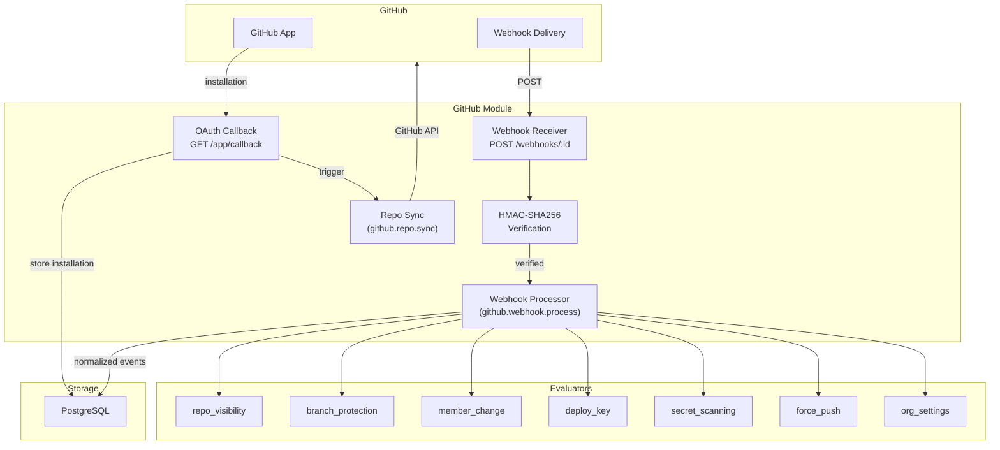

# GitHub module

Module ID: `github`

The GitHub module monitors GitHub organizations and repositories through the GitHub App webhook mechanism. Sentinel receives real-time events from GitHub and evaluates them against user-defined detection rules to surface security-relevant changes: repository visibility changes, branch protection tampering, unauthorized force pushes, member access changes, deploy key creation, secret scanning alerts, and organization-level configuration changes.

## Architecture



## What the module monitors

- Repository visibility changes (public/private transitions)
- Branch protection rule creation, modification, and deletion
- Organization and team membership changes
- Deploy key creation and removal
- GitHub Secret Scanning alert lifecycle
- Force pushes to protected branches
- Organization and team settings changes

## Setup

### GitHub App requirements

The GitHub module requires a registered GitHub App with the following configuration.

**Permissions (repository):**

| Permission | Access level | Required for |
|---|---|---|
| Administration | Read | Branch protection webhooks |
| Contents | Read | Repository metadata sync |
| Members | Read | Member change webhooks |
| Metadata | Read | Required for all App installations |
| Secret scanning alerts | Read | Secret scanning webhooks |

**Permissions (organization):**

| Permission | Access level | Required for |
|---|---|---|
| Members | Read | Organization member change webhooks |

**Webhook events to subscribe:**

- `branch_protection_rule`
- `create`
- `delete`
- `deploy_key`
- `installation`
- `installation_repositories`
- `member`
- `organization`
- `push`
- `repository`
- `secret_scanning_alert`
- `team`
- `team_add`

### Environment variables

| Variable | Description |
|---|---|
| `GITHUB_APP_CLIENT_ID` | GitHub App client ID, used to generate the installation URL. |
| `GITHUB_APP_SLUG` | GitHub App slug (the URL-safe name), used to construct the installation link. |
| `GITHUB_APP_PRIVATE_KEY` | PEM-encoded private key for generating GitHub App installation tokens. |

### Installation flow

1. In the Sentinel UI, navigate to **Settings > GitHub**.
2. Click **Connect GitHub App**. Sentinel constructs an installation URL with an HMAC-signed CSRF state parameter and redirects you to GitHub.
3. On GitHub, select the organization or user account and approve the requested permissions.
4. GitHub redirects back to `/modules/github/app/callback`. Sentinel verifies the state signature, fetches installation details from the GitHub API, generates a unique per-installation webhook secret, stores the encrypted secret, and queues an initial repository sync.
5. Configure the webhook in the GitHub App settings to point at `https://{your-sentinel-host}/modules/github/webhooks/{installationId}`.

For GitHub Enterprise Server or fully self-hosted installations, use the manual setup endpoint `POST /modules/github/app/setup` with an explicit `installationId`, `webhookSecret`, and optional `baseUrl`.

### Webhook security

The webhook endpoint implements multiple security layers:

| Layer | Description |
|---|---|
| **HMAC-SHA256 verification** | Every incoming webhook is verified against the per-installation encrypted webhook secret using `X-Hub-Signature-256`. Timing-safe comparison prevents timing attacks. |
| **Rate limiting** | In-memory per-IP rate limiter at 100 requests per minute per source IP. Prevents webhook flood attacks. |
| **Body size limit** | Hard 5 MB limit enforced via streaming body limit middleware, regardless of `Content-Length` header presence. |
| **Installation enumeration prevention** | When an installation is not found, a dummy HMAC computation runs before returning 401, making the response timing indistinguishable from a bad-signature response. |
| **Webhook deduplication** | The GitHub delivery ID is used as the BullMQ job ID, preventing duplicate processing of retried webhooks. |
| **CSRF-protected OAuth** | The GitHub App installation flow uses HMAC-signed state parameters with a 10-minute expiry window. |

### Repository sync

After a GitHub App installation is registered, Sentinel automatically triggers a repository sync that fetches the full repository list via the GitHub API and upserts repository metadata (visibility, default branch, topics, language) into `github_repositories`. Syncs can also be triggered manually via `POST /modules/github/installations/:id/sync`. Concurrent sync requests for the same installation are deduplicated via BullMQ job IDs.

---

## Evaluators

### repo_visibility

**Rule type:** `github.repo_visibility`

Triggers when a repository's visibility changes. Detects repositories being made public (the highest-risk event) or made private.

| Config field | Type | Default | Description |
|---|---|---|---|
| `alertOn` | `'publicized' \| 'privatized' \| 'any'` | `'publicized'` | Direction of visibility change to alert on. `publicized` alerts only when a repository is made public. `privatized` alerts only when made private. `any` alerts on both directions. |
| `excludeRepos` | `string[]` | `[]` | Glob patterns for repository full names to suppress (for example, `my-org/my-public-repo`, `my-org/archived-*`). Uses minimatch for pattern evaluation. |

**Example trigger:** A developer accidentally changes a private repository containing environment variables to public. Sentinel emits a `critical` alert immediately.

**Example config:**
```json
{
  "alertOn": "publicized",
  "excludeRepos": ["my-org/intentionally-public-*"]
}
```

---

### branch_protection

**Rule type:** `github.branch_protection`

Triggers when a branch protection rule is created, modified, or deleted on any watched repository.

| Config field | Type | Default | Description |
|---|---|---|---|
| `alertOnActions` | `('created' \| 'edited' \| 'deleted')[]` | `['edited', 'deleted']` | Actions to alert on. Deleted rules produce `critical` severity; edited rules produce `high`. |
| `watchBranches` | `string[]` | `[]` | Branch name patterns to scope monitoring to. Leave empty to watch all branches. Values are matched against the protection rule's `pattern` field. |

**Example trigger:** A repository admin removes the branch protection rule on `main`, disabling required reviews and status checks before a release deployment.

**Example config:**
```json
{
  "alertOnActions": ["edited", "deleted"],
  "watchBranches": ["main", "master", "release/*"]
}
```

---

### member_change

**Rule type:** `github.member_change`

Triggers when a user is added to, removed from, or invited to an organization. The evaluator listens for `github.organization.*` events (org-level membership changes), not `github.member.*` events (repo-level collaborator changes).

| Config field | Type | Default | Description |
|---|---|---|---|
| `alertOnActions` | `('member_added' \| 'member_removed' \| 'member_invited')[]` | `['member_added', 'member_removed']` | Organization membership actions to alert on. |
| `watchRoles` | `string[]` | `[]` | Roles to scope alerts to (for example, `admin`, `billing_manager`). Leave empty to alert on any role. |

**Example trigger:** An external contractor account is added to a private repository with write access by someone other than an expected administrator.

**Example config:**
```json
{
  "alertOnActions": ["member_added"],
  "watchRoles": ["admin"]
}
```

---

### deploy_key

**Rule type:** `github.deploy_key`

Triggers when a deploy key is added to or removed from a repository. Deploy keys provide SSH access to a repository and are a persistent, non-expiring credential.

| Config field | Type | Default | Description |
|---|---|---|---|
| `alertOnActions` | `('created' \| 'deleted')[]` | `['created']` | Actions to alert on. |
| `alertOnWriteKeys` | `boolean` | `true` | When `true`, only alert on deploy keys with read-write access. Read-only keys are suppressed. Set to `false` to alert on all deploy keys. |

**Example trigger:** A new read-write deploy key named `ci-prod-deploy` is added to the production repository outside of normal CI automation.

**Example config:**
```json
{
  "alertOnActions": ["created"],
  "alertOnWriteKeys": true
}
```

---

### secret_scanning

**Rule type:** `github.secret_scanning`

Triggers on GitHub Secret Scanning alert lifecycle events: when a secret is first detected, when an alert is resolved, or when a resolved alert is reopened.

| Config field | Type | Default | Description |
|---|---|---|---|
| `alertOnActions` | `('created' \| 'resolved' \| 'reopened')[]` | `['created']` | Secret scanning alert lifecycle actions to alert on. Newly detected secrets produce `critical` severity; other transitions produce `medium`. |
| `secretTypes` | `string[]` | `[]` | GitHub secret type identifiers to filter on (for example, `github_personal_access_token`, `aws_access_key_id`). Leave empty to alert on all detected secret types. |

**Example trigger:** GitHub's secret scanning detects an AWS access key committed to a repository. Sentinel raises a `critical` alert with the repository name and alert number.

**Example config:**
```json
{
  "alertOnActions": ["created"],
  "secretTypes": ["aws_access_key_id", "github_personal_access_token"]
}
```

---

### force_push

**Rule type:** `github.force_push`

Triggers when a force push occurs on a protected branch. Force pushes rewrite commit history and can obscure malicious changes or undo audit trails.

| Config field | Type | Default | Description |
|---|---|---|---|
| `watchBranches` | `string[]` | `['main', 'master', 'release/*', 'production']` | Branch name patterns to monitor. Uses minimatch glob matching against the branch extracted from the `refs/heads/` ref. |
| `alertOnAllForced` | `boolean` | `false` | When `true`, alert on force pushes to any branch regardless of the `watchBranches` list. Overrides branch filtering entirely. |

**Note:** Tag push events (`refs/tags/`) are always ignored by this evaluator.

**Example trigger:** An engineer force-pushes to `main` after a failed merge attempt, rewriting five commits from the production branch history.

**Example config:**
```json
{
  "watchBranches": ["main", "master", "release/*"],
  "alertOnAllForced": false
}
```

---

### org_settings

**Rule type:** `github.org_settings`

Triggers on organization-level and team-level GitHub events, including membership changes, team creation and deletion, and organization settings modifications.

| Config field | Type | Default | Description |
|---|---|---|---|
| `watchActions` | `string[]` | `[]` | GitHub action strings to filter on (for example, `member_added`, `team_created`, `org_setting_changed`). Leave empty to alert on all organization and team events. |

Severity varies by action: member additions, removals, and invitations produce `high`; team deletions produce `high`; team creation with admin permission produces `high`; all other team and organization events produce `medium`.

**Example trigger:** A new team named `emergency-access` is created with admin permission on the organization. Sentinel raises a `high` alert.

**Example config:**
```json
{
  "watchActions": ["member_added", "member_removed", "member_invited"]
}
```

---

## Job handlers

| Job name | Queue | Description |
|---|---|---|
| `github.webhook.process` | `MODULE_JOBS` | Normalizes raw GitHub webhook payloads into Sentinel's `NormalizedEvent` format, stores the event, and enqueues it for rule evaluation. Also handles installation lifecycle events (deleted, suspended, unsuspended) by updating installation status in the database. |
| `github.repo.sync` | `MODULE_JOBS` | Fetches the full repository list for a GitHub App installation via the GitHub API and upserts repository metadata (visibility, default branch, topics, language, and so on) into the `github_repositories` table. Triggered automatically after a new installation is registered and can be triggered manually via `POST /modules/github/installations/:id/sync`. |

---

## HTTP routes

All routes are mounted under `/modules/github/`.

| Method | Path | Auth | Description |
|---|---|---|---|
| `GET` | `/app/callback` | None | GitHub App installation OAuth callback. GitHub redirects here after a user approves the App installation. Verifies the HMAC-signed CSRF state, fetches installation details, stores the encrypted webhook secret, and queues a repository sync. |
| `GET` | `/app/install` | Session | Returns a signed GitHub App installation URL to redirect the user to GitHub. |
| `POST` | `/app/setup` | Session + Admin | Manual installation registration for GitHub Enterprise Server. Accepts `installationId`, `webhookSecret`, and an optional `baseUrl`. |
| `POST` | `/webhooks/:installationId` | HMAC signature | Receives GitHub webhook events. Verifies the `X-Hub-Signature-256` header using the per-installation secret, rate-limits by source IP (100 req/min), rejects payloads over 5 MB, and enqueues the event for background processing. |
| `GET` | `/installations` | Session | Lists GitHub App installations registered to the authenticated organization. |
| `POST` | `/installations` | Session + Admin | Manually registers a GitHub App installation. |
| `DELETE` | `/installations/:id` | Session + Admin | Marks an installation as removed. |
| `GET` | `/repositories` | Session | Lists repositories tracked by the authenticated organization's installations. |
| `POST` | `/installations/:id/sync` | Session + Admin | Triggers an on-demand repository sync for the specified installation. |
| `GET` | `/templates` | Session | Returns the list of detection templates provided by this module. |
| `GET` | `/event-types` | Session | Returns the list of event types this module can produce. |

---

## Event types

| Event type | Description |
|---|---|
| `github.repository.visibility_changed` | A repository's visibility changed between public and private. |
| `github.repository.created` | A new repository was created. |
| `github.repository.deleted` | A repository was deleted. |
| `github.repository.archived` | A repository was archived. |
| `github.repository.unarchived` | A repository was unarchived. |
| `github.repository.transferred` | A repository was transferred to another owner. |
| `github.repository.renamed` | A repository was renamed. |
| `github.member.added` | A collaborator was added to a repository. |
| `github.member.removed` | A collaborator was removed from a repository. |
| `github.member.edited` | A collaborator's permissions on a repository were changed. |
| `github.organization.member_added` | A user was added to the organization. |
| `github.organization.member_removed` | A user was removed from the organization. |
| `github.organization.member_invited` | A user was invited to the organization. |
| `github.team.created` | A new team was created in the organization. |
| `github.team.deleted` | A team was deleted from the organization. |
| `github.team.edited` | A team's settings were modified. |
| `github.team.added_to_repository` | A team was granted access to a repository. |
| `github.team.removed_from_repository` | A team's access to a repository was revoked. |
| `github.branch_protection.created` | A branch protection rule was created. |
| `github.branch_protection.edited` | A branch protection rule was modified. |
| `github.branch_protection.deleted` | A branch protection rule was deleted. |
| `github.deploy_key.created` | A deploy key was added to a repository. |
| `github.deploy_key.deleted` | A deploy key was removed from a repository. |
| `github.secret_scanning.created` | A secret scanning alert was created (secret detected). |
| `github.secret_scanning.resolved` | A secret scanning alert was resolved. |
| `github.push` | A push event occurred on a repository. |
| `github.installation.created` | A GitHub App installation was created. |
| `github.installation.deleted` | A GitHub App installation was deleted. |
| `github.installation.suspended` | A GitHub App installation was suspended. |
| `github.installation.unsuspended` | A GitHub App installation was unsuspended. |

---

## Templates

| Template slug | Name | Category | Default severity |
|---|---|---|---|
| `github-repo-visibility` | Repository Visibility Monitor | access-control | critical |
| `github-member-changes` | Member Change Monitor | access-control | high |
| `github-deploy-keys` | Deploy Key Monitor | access-control | high |
| `github-branch-protection` | Branch Protection Monitor | code-protection | high |
| `github-force-push-protection` | Force Push Protection | code-protection | high |
| `github-secret-scanning` | Secret Scanning Alert | secrets | critical |
| `github-org-changes` | Organization Change Monitor | access-control | high |
| `github-full-security` | Full GitHub Security Suite | comprehensive | high |

---

## Retention policies

The GitHub module does not declare custom retention policies. Repository and installation metadata are retained according to the platform default (90 days for events). Installation records and repository snapshots persist indefinitely until explicitly removed.
