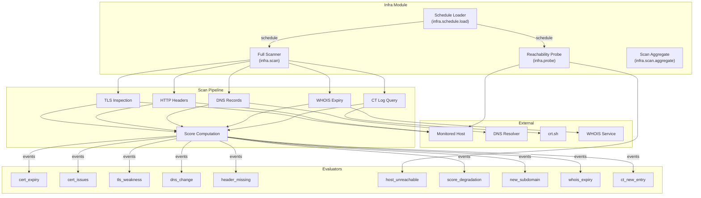

# Infrastructure module

Module ID: `infra`

The Infrastructure module monitors the external security posture of internet-facing hosts. It performs periodic TLS certificate inspection, DNS record monitoring, HTTP security header analysis, host reachability probing, domain registration expiry tracking, Certificate Transparency log watching, and subdomain discovery. Findings are compared against previous scan snapshots to detect changes and degradations.

## Architecture



## What the module monitors

- TLS certificate expiry and validity issues (chain errors, self-signed, weak keys, revoked certificates, SHA-1 signatures)
- TLS version and cipher suite weaknesses
- DNS record changes (A, AAAA, MX, NS, TXT, and others)
- HTTP security header presence (HSTS, CSP, X-Frame-Options, X-Content-Type-Options, Referrer-Policy, Permissions-Policy)
- Host reachability and response time
- Overall security score degradation
- New subdomain discovery
- Domain registration (WHOIS) expiry
- New Certificate Transparency log entries for monitored domains

---

## Host scanning pipeline

The scan handler (`infra.scan`) performs a comprehensive security assessment of each monitored host. The scan comprises the following probes executed in sequence:

1. **TLS certificate inspection.** Connect to the host on port 443, retrieve the certificate chain, and extract validity dates, subject, issuer, key algorithm, key size, and signature algorithm. Detect expired certificates, soon-to-expire certificates, self-signed certificates, weak keys, SHA-1 signatures, and chain validation errors.

2. **TLS version and cipher probing.** Test the server for support of deprecated TLS versions (1.0 and 1.1), weak cipher suites (RC4, DES, 3DES, export ciphers), and TLS 1.3 availability.

3. **HTTP security header analysis.** Issue an HTTP GET request and inspect response headers for the presence of HSTS, CSP, X-Frame-Options, X-Content-Type-Options, Referrer-Policy, and Permissions-Policy.

4. **DNS record lookup.** Query A, AAAA, MX, NS, TXT, and CNAME records and compare against the previous scan snapshot. Emit `infra.dns.change` events for any differences.

5. **WHOIS expiry check.** Query domain registration data and extract the expiry date. Emit `infra.whois.expiring` events when the domain is within the configured threshold.

6. **Certificate Transparency log query.** Query `crt.sh` for recent certificate issuance entries matching the monitored domain. Emit `infra.ct.new_entry` events for previously unseen entries.

7. **Subdomain discovery.** Parse CT log entries and DNS zone data to identify subdomains. Emit `infra.subdomain.discovered` for newly seen subdomains.

## Score computation

Each host scan produces a composite security score on a 0--100 scale. Points are deducted for each finding:

| Finding category | Deduction range | Examples |
|---|---|---|
| Certificate issues | 10--30 points | Expired certificate, self-signed, weak key, SHA-1 |
| TLS weaknesses | 5--20 points | TLS 1.0/1.1 support, weak ciphers, no TLS 1.3 |
| Missing headers | 2--10 points | Missing HSTS, missing CSP, missing X-Frame-Options |
| DNS anomalies | 5--15 points | Unexpected NS changes, missing DNSSEC |

The score maps to a letter grade: A (90--100), B (80--89), C (70--79), D (60--69), F (below 60). The `score_degradation` evaluator fires when the score drops below a threshold or decreases significantly between scans.

---

## Evaluators

### cert_expiry

**Rule type:** `infra.cert_expiry`

Triggers when a TLS certificate is approaching expiration or has already expired. Severity scales with how close the expiration date is.

| Config field | Type | Default | Description |
|---|---|---|---|
| `thresholdDays` | `number` | `30` | Number of days before expiry at which to begin alerting. Certificates with more than `thresholdDays` remaining do not trigger. Minimum: 1. |

**Severity tiers:**

| Days remaining | Severity |
|---|---|
| 0 or negative (expired) | `critical` |
| 1–7 | `critical` |
| 8–14 | `high` |
| 15–`thresholdDays` | `medium` |

Reacts to `infra.cert.expiring` and `infra.cert.expired` events produced by the scan pipeline.

**Example trigger:** A production API subdomain's certificate expires in 5 days because the auto-renewal process silently failed.

**Example config:**
```json
{
  "thresholdDays": 30
}
```

---

### cert_issues

**Rule type:** `infra.cert_issues`

Triggers when a TLS certificate has a structural problem: chain validation failure, self-signed certificate, weak RSA/EC key, SHA-1 signature, or revoked status.

| Config field | Type | Default | Description |
|---|---|---|---|
| `issueTypes` | `string[]` | `[]` | Certificate issue types to alert on. Leave empty to alert on all issue types. Valid values: `chain_error`, `self_signed`, `weak_key`, `sha1_signature`, `revoked`. |

**Severity by issue type:**

| Issue type | Severity |
|---|---|
| `revoked` | `critical` |
| `chain_error` | `critical` |
| `self_signed` | `high` |
| `weak_key` | `high` |
| `sha1_signature` | `medium` |

Reacts to `infra.cert.issue` events.

**Example trigger:** A staging server is discovered to be presenting a self-signed certificate in production traffic because an expired domain certificate was not renewed and a self-signed fallback was deployed.

**Example config:**
```json
{
  "issueTypes": ["chain_error", "self_signed", "revoked"]
}
```

---

### tls_weakness

**Rule type:** `infra.tls_weakness`

Triggers when a host supports deprecated TLS versions (1.0 or 1.1) or weak cipher suites, or when TLS 1.3 is absent.

| Config field | Type | Default | Description |
|---|---|---|---|
| `alertOnLegacyVersions` | `boolean` | `true` | Alert when the server negotiates TLS 1.0 or TLS 1.1. |
| `alertOnWeakCiphers` | `boolean` | `true` | Alert when the server supports known-weak cipher suites (RC4, DES, 3DES, export ciphers, and so on). |
| `alertOnMissingTls13` | `boolean` | `false` | Alert when the server does not support TLS 1.3. This is informational by default; enable it to enforce TLS 1.3 adoption. |

Severity is `critical` when legacy versions or weak ciphers are present; `medium` when only TLS 1.3 absence is detected.

Reacts to `infra.tls.weakness` events.

**Example trigger:** A legacy API endpoint is discovered to still accept TLS 1.0 connections, violating PCI DSS and internal security policy.

**Example config:**
```json
{
  "alertOnLegacyVersions": true,
  "alertOnWeakCiphers": true,
  "alertOnMissingTls13": false
}
```

---

### dns_change

**Rule type:** `infra.dns_change`

Triggers when DNS records for a monitored hostname change. Detects changes to A, AAAA, MX, NS, TXT, CNAME, and other record types. NS record changes are elevated to `critical` severity because they can indicate domain hijacking or nameserver compromise.

| Config field | Type | Default | Description |
|---|---|---|---|
| `watchRecordTypes` | `string[]` | `[]` | DNS record types to monitor (for example, `A`, `AAAA`, `MX`, `NS`, `TXT`). Leave empty to monitor all record types returned by the scanner. |
| `watchChangeTypes` | `('added' \| 'modified' \| 'removed')[]` | `[]` | Types of record changes to alert on. Leave empty to alert on all changes. |

NS record changes or changes with `severity: 'critical'` in the event payload produce a `critical` alert; all others produce `high`.

Reacts to `infra.dns.change` events.

**Example trigger:** The NS records for a monitored domain change to an unfamiliar nameserver, indicating a potential domain hijacking attempt.

**Example config:**
```json
{
  "watchRecordTypes": ["A", "NS", "MX"],
  "watchChangeTypes": ["modified", "removed"]
}
```

---

### header_missing

**Rule type:** `infra.header_missing`

Triggers when one or more required HTTP security response headers are absent from a monitored host. Checks against a configurable list or defaults to all well-known security headers.

**Known headers checked by default (when `requiredHeaders` is empty):**

- `Strict-Transport-Security` (HSTS)
- `Content-Security-Policy` (CSP)
- `X-Frame-Options`
- `X-Content-Type-Options`
- `Referrer-Policy`
- `Permissions-Policy`

| Config field | Type | Default | Description |
|---|---|---|---|
| `requiredHeaders` | `string[]` | `[]` | HTTP response headers that must be present. Leave empty to check all known security headers listed above. |

Severity is `high` when HSTS or CSP is missing (these protect against the most severe attacks); `medium` for all other missing headers.

Reacts to `infra.header.missing` events.

**Example trigger:** A newly deployed microservice endpoint is missing `Strict-Transport-Security` and `Content-Security-Policy` headers.

**Example config:**
```json
{
  "requiredHeaders": [
    "Strict-Transport-Security",
    "Content-Security-Policy",
    "X-Frame-Options"
  ]
}
```

---

### host_unreachable

**Rule type:** `infra.host_unreachable`

Triggers when a monitored host fails multiple consecutive reachability checks or when its response time exceeds a threshold.

| Config field | Type | Default | Description |
|---|---|---|---|
| `thresholdMs` | `number` | `5000` | Response time threshold in milliseconds. When a probe receives a response slower than this, Sentinel emits a slow-response alert (`high` severity). Minimum: 100. |
| `consecutiveFailures` | `number` | `2` | Number of consecutive reachability failures required before raising an `infra.host.unreachable` alert. Requiring more than one failure prevents false positives from transient network blips. |

Severity is `critical` for unreachable hosts; `high` for slow responses.

Reacts to `infra.host.unreachable` and `infra.host.slow` events.

**Example trigger:** A payment API endpoint fails three consecutive probes with connection refused errors after a deployment rolled back incorrectly.

**Example config:**
```json
{
  "thresholdMs": 3000,
  "consecutiveFailures": 3
}
```

---

### score_degradation

**Rule type:** `infra.score_degradation`

Triggers when a host's composite security scan score drops below an absolute threshold or decreases by a significant amount relative to the previous scan.

| Config field | Type | Default | Description |
|---|---|---|---|
| `minScore` | `number` | `70` | Absolute score threshold (0–100). Alert when the current score falls below this value. Only applies in `below` and `both` modes. |
| `minDrop` | `number` | `10` | Minimum point drop since the last scan to trigger an alert. For example, `10` triggers when the score falls from 85 to 74. Only applies in `drop` and `both` modes. |
| `mode` | `'below' \| 'drop' \| 'both'` | `'both'` | `below`: alert only when score is under `minScore`. `drop`: alert only when the score decreased by at least `minDrop`. `both`: alert when either condition is met. |

Severity is `critical` when the score drop is 20 or more points or the current score is below 50; `high` otherwise.

Reacts to `infra.score.degraded` events.

**Example trigger:** A host's security score drops from 92 to 61 after a configuration change that disabled HSTS and introduced a weak cipher suite.

**Example config:**
```json
{
  "minScore": 75,
  "minDrop": 15,
  "mode": "both"
}
```

---

### new_subdomain

**Rule type:** `infra.new_subdomain`

Triggers when a previously unseen subdomain is discovered under a monitored parent domain. Subdomain discovery uses Certificate Transparency log queries (`crt.sh`), DNS zone analysis, and optionally passive DNS data.

| Config field | Type | Default | Description |
|---|---|---|---|
| `ignorePatterns` | `string[]` | `[]` | Glob patterns for subdomain names to suppress. Supports leading and trailing wildcards (for example, `staging-*`, `*.internal`, `*.dev`). Matching is case-sensitive. |

Alerts are always `medium` severity. The source of discovery (`crt_sh`, `dns_zone`, `brute_force`) is included in the alert description.

Reacts to `infra.subdomain.discovered` events.

**Example trigger:** A new subdomain `legacy-api.mycompany.com` is discovered in Certificate Transparency logs, pointing to an old server running outdated software.

**Example config:**
```json
{
  "ignorePatterns": ["staging-*", "dev-*", "*.internal"]
}
```

---

### whois_expiry

**Rule type:** `infra.whois_expiry`

Triggers when a domain registration is approaching its WHOIS expiry date. Expired domains can be registered by third parties and used for phishing, brand impersonation, or to intercept email.

| Config field | Type | Default | Description |
|---|---|---|---|
| `thresholdDays` | `number` | `30` | Number of days before domain expiry to begin alerting. Minimum: 1. |

**Severity tiers:**

| Days remaining | Severity |
|---|---|
| 1–7 | `critical` |
| 8–14 | `high` |
| 15–`thresholdDays` | `medium` |

Reacts to `infra.whois.expiring` events. The registrar name is included in the alert description when available.

**Example trigger:** A secondary company domain used for a legacy product is expiring in 12 days, and the renewal was not captured in the renewal process.

**Example config:**
```json
{
  "thresholdDays": 45
}
```

---

### ct_new_entry

**Rule type:** `infra.ct_new_entry`

Triggers when a new certificate is logged in Certificate Transparency logs for a monitored domain. CT logs are publicly queryable and provide near-real-time visibility into TLS certificate issuance, making them useful for detecting unauthorized certificate requests.

| Config field | Type | Default | Description |
|---|---|---|---|
| `ignorePatterns` | `string[]` | `[]` | Issuer name patterns to suppress (for example, `Let's Encrypt*`, `ZeroSSL*`). Supports leading and trailing wildcards. Use this to suppress noise from expected CAs while still alerting on unexpected issuers. |

All alerts are `medium` severity. The common name, issuer, and log entry timestamp are included in the alert.

Reacts to `infra.ct.new_entry` events.

**Example trigger:** A new certificate is logged in CT for `admin.mycompany.com` issued by an unexpected CA not in the organization's approved CA list, suggesting someone obtained a certificate for a sensitive subdomain.

**Example config:**
```json
{
  "ignorePatterns": ["Let's Encrypt*", "DigiCert*", "Amazon*"]
}
```

---

## Job handlers

| Job name | Queue | Description |
|---|---|---|
| `infra.scan` (`scanHandler`) | `MODULE_JOBS` | Performs a full security scan of a monitored host: TLS certificate inspection, cipher suite probing, HTTP header collection, DNS record lookup, WHOIS query, and security score computation. Produces the set of `infra.*` events consumed by evaluators. |
| `infra.probe` (`probeHandler`) | `MODULE_JOBS` | Performs lightweight reachability probes between full scans. Tracks consecutive failure counts and emits `infra.host.unreachable` or `infra.host.slow` events. |
| `infra.schedule.load` (`scheduleLoaderHandler`) | `MODULE_JOBS` | Reloads the scan schedule from the database into the BullMQ cron queue. Runs on startup and when the host list is modified. |
| `infra.scan.aggregate` (`scanAggregateHandler`) | `MODULE_JOBS` | Aggregates scan results into per-host time-series data for the infrastructure security history dashboard. |

---

## HTTP routes

Routes are mounted under `/modules/infra/`.

| Method | Path | Description |
|---|---|---|
| `GET` | `/hosts` | Lists monitored hosts and their current security scores. |
| `POST` | `/hosts` | Adds a new hostname to the monitoring schedule. |
| `DELETE` | `/hosts/:id` | Removes a host from monitoring. |
| `POST` | `/hosts/:id/scan` | Triggers an immediate full scan of the specified host. |
| `GET` | `/hosts/:id/history` | Returns the scan history and score timeline for a host. |
| `GET` | `/worldview` | Returns the geographic distribution of monitored hosts as a GeoJSON feature collection for the map visualization. Each feature includes the host's current security score, grade, and last scan time. |
| `GET` | `/templates` | Lists detection templates provided by this module. |
| `GET` | `/event-types` | Lists event types this module can produce. |

### The worldview map

The `/modules/infra/worldview` endpoint returns a GeoJSON feature collection that the Sentinel dashboard renders as an interactive world map. Each monitored host with a resolved IP address is plotted as a point feature. Feature properties include:

- `hostname`: The monitored hostname.
- `ip`: The resolved IP address used for geolocation.
- `score`: Current security score (0–100).
- `grade`: Letter grade derived from the score.
- `lat` / `lon`: Coordinates from IP geolocation.
- `lastScannedAt`: ISO 8601 timestamp of the most recent scan.
- `issues`: Count of open security findings.

Hosts without a resolvable IP address or geolocation data are excluded from the worldview response but remain fully monitored and appear in the hosts list.

---

## Event types

| Event type | Description |
|---|---|
| `infra.cert.expiring` | A TLS certificate is approaching its expiration date. |
| `infra.cert.expired` | A TLS certificate has expired. |
| `infra.cert.issue` | A TLS certificate has a structural problem (chain error, self-signed, weak key, SHA-1, revoked). |
| `infra.tls.weakness` | The host supports deprecated TLS versions or weak cipher suites. |
| `infra.dns.change` | DNS records for a monitored host changed since the previous scan. |
| `infra.header.missing` | One or more required HTTP security headers are absent. |
| `infra.host.unreachable` | A monitored host failed consecutive reachability checks. |
| `infra.host.slow` | A monitored host responded slower than the configured threshold. |
| `infra.score.degraded` | The composite security score dropped below a threshold or decreased significantly. |
| `infra.subdomain.discovered` | A previously unseen subdomain was discovered. |
| `infra.whois.expiring` | A domain registration is approaching its WHOIS expiry date. |
| `infra.ct.new_entry` | A new certificate was logged in Certificate Transparency logs for a monitored domain. |
