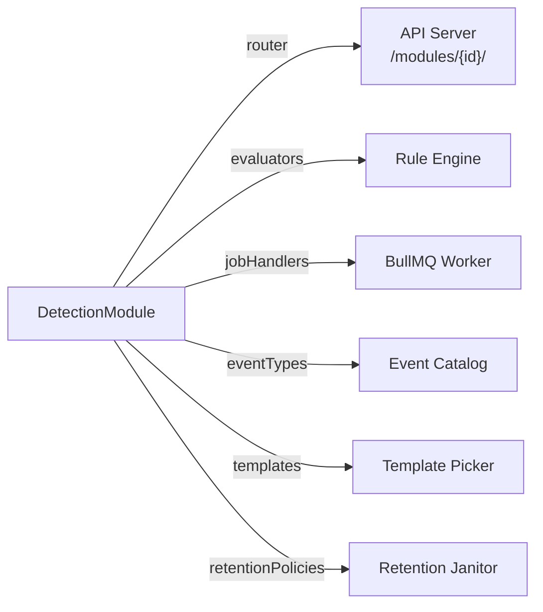

# Module interface reference

This document defines the full TypeScript interface that every Sentinel detection module must implement, describes each field, and provides a step-by-step guide for creating a new module.

## Registration contract

A module communicates with the Sentinel platform exclusively through the `DetectionModule` interface. The platform makes no assumptions about a module's internal architecture. As long as a module exports an object conforming to this interface, the registry mounts its routes, wires its evaluators, and schedules its jobs.



## DetectionModule interface

```typescript
// packages/shared/src/module.ts

export interface DetectionModule {
  readonly id: string;
  readonly name: string;
  readonly router: Hono<AppEnv>;
  readonly evaluators: RuleEvaluator[];
  readonly jobHandlers: JobHandler[];
  readonly eventTypes: EventTypeDefinition[];
  readonly templates: DetectionTemplate[];
  readonly retentionPolicies?: RetentionPolicy[];
  readonly defaultTemplates?: string[];
  formatSlackBlocks?: (alert: AlertFormatInput) => object[];
}
```

### Field documentation

| Field | Type | Required | Description |
|---|---|---|---|
| `id` | `string` | Yes | Unique lowercase identifier for the module. Used as the URL path segment (`/modules/{id}/`), the Redis key namespace prefix, and the `module_id` column in the events table. Choose a stable, short identifier such as `github`, `chain`, or `aws`. |
| `name` | `string` | Yes | Human-readable display name shown in the Sentinel UI. |
| `router` | `Hono<AppEnv>` | Yes | A Hono sub-router instance. The API mounts this at `/modules/{id}/` at startup. |
| `evaluators` | `RuleEvaluator[]` | Yes | The list of rule evaluators this module provides. Each evaluator handles a specific `ruleType` string. See [RuleEvaluator interface](#ruleevaluator-interface). |
| `jobHandlers` | `JobHandler[]` | Yes | The list of BullMQ job handler functions this module registers with the worker. See [JobHandler interface](#jobhandler-interface). |
| `eventTypes` | `EventTypeDefinition[]` | Yes | The catalog of event type strings this module produces. See [EventTypeDefinition interface](#eventtypedefinition-interface). |
| `templates` | `DetectionTemplate[]` | Yes | Pre-built detection templates that users can instantiate from the UI. See [DetectionTemplate interface](#detectiontemplate-interface). |
| `retentionPolicies` | `RetentionPolicy[]` | No | Optional data retention declarations for module-owned database tables. See [RetentionPolicy interface](#retentionpolicy-interface). |
| `defaultTemplates` | `string[]` | No | Template slugs to auto-instantiate when a new monitored resource is registered with this module. |
| `formatSlackBlocks` | `function` | No | Optional custom Slack Block Kit formatter. When provided, the alert dispatcher calls this function instead of the platform's generic block builder. |

---

## RuleEvaluator interface

```typescript
export interface RuleEvaluator {
  moduleId: string;
  ruleType: string;
  configSchema: ZodSchema;
  uiSchema?: TemplateInput[];
  evaluate(ctx: EvalContext): Promise<AlertCandidate | null>;
}
```

| Field | Type | Description |
|---|---|---|
| `moduleId` | `string` | Must match the parent module's `id`. Used by the rule engine to route evaluation to the correct worker. |
| `ruleType` | `string` | Unique rule type identifier, conventionally namespaced with the module id (for example, `github.force_push`, `chain.windowed_count`). This string is stored on each rule row in the database. |
| `configSchema` | `ZodSchema` | A Zod schema that validates and coerces the rule's `config` JSON object. The evaluator calls `configSchema.parse(rule.config)` before accessing any config value. |
| `uiSchema` | `TemplateInput[]` | Optional array of field descriptors that the UI renders as a form when a user creates or edits a rule of this type. |
| `evaluate` | `function` | Async function called by the rule engine for every incoming event. Receives an `EvalContext` and returns an `AlertCandidate` when conditions are met, or `null` to suppress. |

### EvalContext

```typescript
export interface EvalContext {
  event: NormalizedEvent;
  rule: RuleRow;
  redis: Redis;
  db: DrizzleDb;
}
```

The `redis` field provides access to the shared Redis instance, used by windowed evaluators to maintain sliding-window state. Evaluators that do not use windowing typically only access `event` and `rule`.

### AlertCandidate

```typescript
export interface AlertCandidate {
  orgId: string;
  detectionId: string;
  ruleId: string;
  eventId: string;
  severity: 'low' | 'medium' | 'high' | 'critical';
  title: string;
  description: string;
  triggerType: 'immediate' | 'windowed' | 'deferred';
  triggerData: unknown;
}
```

---

## JobHandler interface

```typescript
// packages/shared/src/queue.ts

export interface JobHandler {
  jobName: string;
  queueName: string;
  process(job: Job): Promise<unknown>;
}
```

| Field | Type | Description |
|---|---|---|
| `jobName` | `string` | The BullMQ job name this handler processes. Must be unique across all modules. Convention: `{moduleId}.{noun}.{verb}`, for example `github.webhook.process`. |
| `queueName` | `string` | The BullMQ queue this handler subscribes to. Use the constants from `QUEUE_NAMES` in `@sentinel/shared/queue`. |
| `process` | `function` | The async handler function. Receives a BullMQ `Job` and returns a promise. Throw an error to trigger BullMQ's built-in retry logic. |

---

## EventTypeDefinition interface

```typescript
export interface EventTypeDefinition {
  type: string;
  label: string;
  description: string;
  payloadSchema?: ZodSchema;
}
```

| Field | Type | Description |
|---|---|---|
| `type` | `string` | Fully-qualified event type string, for example `github.repository.visibility_changed` or `chain.log`. Stored in the `event_type` column of the events table. |
| `label` | `string` | Human-readable label for the UI event-type picker. |
| `description` | `string` | One-sentence description of what this event represents. |
| `payloadSchema` | `ZodSchema` | Optional Zod schema for the normalized event payload. Used for validation and to generate documentation. |

---

## DetectionTemplate interface

```typescript
export interface DetectionTemplate {
  slug: string;
  name: string;
  description: string;
  category: string;
  severity: 'low' | 'medium' | 'high' | 'critical';
  rules: Array<{
    ruleType: string;
    config: Record<string, unknown>;
    action: 'alert' | 'log' | 'suppress';
    priority?: number;
  }>;
  inputs?: TemplateInput[];
}
```

| Field | Type | Description |
|---|---|---|
| `slug` | `string` | URL-safe unique identifier for the template, for example `github-force-push`. |
| `name` | `string` | Display name shown in the template picker. |
| `description` | `string` | Short description explaining what the template detects. |
| `category` | `string` | UI grouping category such as `access-control`, `code-protection`, or `secrets`. |
| `severity` | `string` | Default severity applied to detections created from this template. |
| `rules` | `array` | One or more rule definitions. Each rule specifies a `ruleType`, a default `config` object, and the action to take when the rule triggers. |
| `inputs` | `TemplateInput[]` | User-configurable fields. Each input maps to a key in a rule's `config` object. The UI renders a form for these fields when a user instantiates the template. |

### TemplateInput

```typescript
export interface TemplateInput {
  key: string;
  label: string;
  type: TemplateInputType;
  required: boolean;
  default?: string | number | boolean | string[];
  placeholder?: string;
  help?: string;
  options?: Array<{ label: string; value: string }>;
  min?: number;
  max?: number;
  showIf?: string;
}

export type TemplateInputType =
  | 'text'
  | 'number'
  | 'boolean'
  | 'select'
  | 'string-array'
  | 'address'
  | 'contract'
  | 'network';
```

---

## RetentionPolicy interface

```typescript
export interface RetentionPolicy {
  table: string;
  timestampColumn: string;
  retentionDays: number;
  filter?: string;
}
```

| Field | Type | Description |
|---|---|---|
| `table` | `string` | Database table name to apply the retention policy to. |
| `timestampColumn` | `string` | The column containing the row timestamp used for age calculation (for example, `received_at`, `created_at`). |
| `retentionDays` | `number` | Rows older than this many days are eligible for deletion by the retention janitor. |
| `filter` | `string` | Optional SQL fragment appended as an additional `AND` condition. Use this to scope a policy to a module-specific subset of a shared table. For example, `"module_id = 'aws'"` restricts deletion to rows produced by the AWS module. |

---

## HTTP route mounting

The API mounts each module's router at `/modules/{id}/`. For example:

- GitHub module routes: `/modules/github/webhooks/:installationId`, `/modules/github/installations`, and so on.
- Chain module routes: `/modules/chain/networks`, `/modules/chain/contracts`, and so on.

The module's router is a standard Hono application. Handlers access the authenticated `orgId`, `userId`, and `role` from the Hono context via `c.get('orgId')`. The public webhook endpoint for the GitHub module (`/modules/github/webhooks/:installationId`) is intentionally placed before auth middleware so that GitHub can POST without session credentials; HMAC signature verification provides the equivalent authentication guarantee.

---

## Creating a new module

Follow these steps to add a new detection source to Sentinel.

### Step 1: Create the module directory

```
modules/{your-module-id}/
  src/
    index.ts           # exports the DetectionModule object
    router.ts          # Hono sub-router
    handlers.ts        # BullMQ job handlers
    event-types.ts     # EventTypeDefinition array
    evaluators/
      your-evaluator.ts
    templates/
      index.ts
```

### Step 2: Define the config schema for each evaluator

Use Zod to define a config schema. Every field should have a sensible default so that the template system can instantiate rules without requiring all fields to be set:

```typescript
// src/evaluators/my-evaluator.ts
import { z } from 'zod';
import type { RuleEvaluator, EvalContext, AlertCandidate } from '@sentinel/shared/rules';

const configSchema = z.object({
  watchedEntities: z.array(z.string()).default([]),
  threshold: z.coerce.number().default(5),
});

export const myEvaluator: RuleEvaluator = {
  moduleId: 'mymodule',
  ruleType: 'mymodule.my_rule',
  configSchema,
  uiSchema: [
    {
      key: 'watchedEntities',
      label: 'Entities to watch',
      type: 'string-array',
      required: false,
      placeholder: 'entity-one\nentity-two',
    },
    {
      key: 'threshold',
      label: 'Alert threshold',
      type: 'number',
      required: false,
      default: 5,
      min: 1,
    },
  ],

  async evaluate(ctx: EvalContext): Promise<AlertCandidate | null> {
    const { event, rule } = ctx;
    if (event.eventType !== 'mymodule.some_event') return null;

    const config = configSchema.parse(rule.config);
    // ... evaluation logic ...

    return {
      orgId: event.orgId,
      detectionId: rule.detectionId,
      ruleId: rule.id,
      eventId: event.id,
      severity: 'high',
      title: 'My rule triggered',
      description: 'Detail about what happened',
      triggerType: 'immediate',
      triggerData: event.payload,
    };
  },
};
```

### Step 3: Define job handlers

```typescript
// src/handlers.ts
import type { Job } from 'bullmq';
import { QUEUE_NAMES, type JobHandler } from '@sentinel/shared/queue';

export const pollHandler: JobHandler = {
  jobName: 'mymodule.data.poll',
  queueName: QUEUE_NAMES.MODULE_JOBS,

  async process(job: Job) {
    // Fetch data from external source, normalize, store events, enqueue evaluation
  },
};
```

### Step 4: Define event types

```typescript
// src/event-types.ts
import type { EventTypeDefinition } from '@sentinel/shared/module';

export const eventTypes: EventTypeDefinition[] = [
  {
    type: 'mymodule.some_event',
    label: 'Some event',
    description: 'Triggered when a monitored entity changes state.',
  },
];
```

### Step 5: Define detection templates

```typescript
// src/templates/index.ts
import type { DetectionTemplate } from '@sentinel/shared/module';

export const templates: DetectionTemplate[] = [
  {
    slug: 'mymodule-basic-alert',
    name: 'Basic alert',
    description: 'Alert when a monitored entity changes.',
    category: 'change-detection',
    severity: 'high',
    rules: [
      {
        ruleType: 'mymodule.my_rule',
        config: { watchedEntities: [], threshold: 5 },
        action: 'alert',
      },
    ],
    inputs: [
      {
        key: 'watchedEntities',
        label: 'Entities to watch',
        type: 'string-array',
        required: false,
      },
    ],
  },
];
```

### Step 6: Assemble the module

```typescript
// src/index.ts
import type { DetectionModule } from '@sentinel/shared/module';
import { myRouter } from './router.js';
import { myEvaluator } from './evaluators/my-evaluator.js';
import { pollHandler } from './handlers.js';
import { eventTypes } from './event-types.js';
import { templates } from './templates/index.js';

export const MyModule: DetectionModule = {
  id: 'mymodule',
  name: 'My Module',
  router: myRouter,
  evaluators: [myEvaluator],
  jobHandlers: [pollHandler],
  eventTypes,
  templates,
};
```

### Step 7: Register the module

Import and register the module in the API entrypoint:

```typescript
// apps/api/src/index.ts
import { MyModule } from '@sentinel/mymodule';

registerModules([
  GitHubModule,
  ChainModule,
  RegistryModule,
  InfraModule,
  AwsModule,
  MyModule,  // add your module here
]);
```

### Step 8: Add a database migration if needed

If your module requires new tables, create a Drizzle migration under `packages/db/migrations/`. The module system itself does not perform automatic schema changes.
