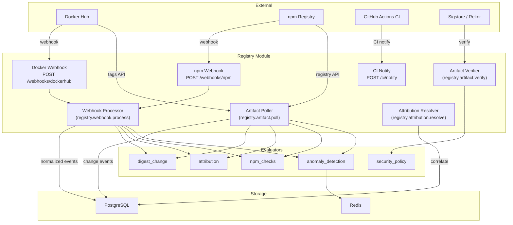

# Registry module

Module ID: `registry`

The Registry module monitors software package registries for supply chain security threats. It detects unauthorized changes to Docker container images and npm packages by tracking digest mutations, maintainer changes, version lifecycle events, and anomalous publish patterns. The module integrates with Sigstore and Rekor to verify cryptographic signatures and SLSA provenance attestations on artifacts, providing a verifiable chain of custody from source code to published package.

## Architecture



## What the module monitors

- Docker image tag and digest changes (Docker Hub and compatible registries)
- npm package version publication, unpublication, and maintainer changes
- Artifact cryptographic signature presence (cosign / Sigstore)
- SLSA provenance attestation presence and source repository verification
- Digest pinning violations
- npm lifecycle scripts in new versions (install-time code execution risk)
- Unexpected major semver version jumps
- Unauthorized pushers (allowlist enforcement)
- Off-hours publish activity
- Excessive publish rate within a time window

## What Sigstore is and why it matters

Sigstore is an open-source project that provides free infrastructure for signing, verifying, and recording software artifacts. It comprises three components:

- **Cosign** — a tool for signing container images and other artifacts using short-lived certificates tied to an OIDC identity (for example, a GitHub Actions workflow).
- **Fulcio** — a certificate authority that issues short-lived signing certificates bound to an OIDC identity, eliminating the need to manage long-lived private keys.
- **Rekor** — an append-only transparency log that records all signing events. Any party can verify that a certificate was issued and used to sign a specific artifact at a specific time.

When a container image is signed via a CI/CD pipeline using cosign, the signing event is recorded in Rekor. Sentinel checks incoming artifacts against the Rekor log and verifies the presence of a valid signature. An artifact published without a Sigstore signature may indicate a compromised build pipeline, a manual push that bypassed CI/CD, or a supply chain attack.

SLSA (Supply-chain Levels for Software Artifacts) provenance is a structured attestation that describes how an artifact was built: which source repository, which build system, which workflow, and at which commit. Sigstore's `cosign attest` command can attach a SLSA provenance document to an artifact and record it in Rekor. Sentinel's `security_policy` evaluator can require provenance and verify that the provenance source repository matches the expected value.

## Supported registries

| Registry type | Detection mechanism | Notes |
|---|---|---|
| Docker Hub | Webhooks (via registry HTTP router) and periodic polling | Public and private repositories. Polling interval is configurable per artifact. |
| GitHub Container Registry (ghcr.io) | Periodic polling | Requires a GitHub token with `read:packages` scope. |
| npm | npm registry webhooks and periodic polling | Covers public and private (authenticated) packages. |
| Generic OCI-compatible registries | Periodic polling | Any registry implementing the OCI Distribution Specification. |

---

## Artifact polling mechanism

The registry polling service checks Docker Hub and npm for changes on a per-artifact configurable interval. The poller compares the current state of each monitored artifact (tags, digests, versions) against stored snapshots and emits change events when differences are detected.

**Docker Hub polling:**

1. Fetch tags from the Docker Hub API (`/v2/repositories/{name}/tags`) ordered by `last_updated`, paginating up to 10 pages of 100 tags each.
2. For incremental polls, stop when encountering tags older than the last poll timestamp.
3. Compare each tag's digest against the stored digest in `rc_artifact_versions`.
4. Emit `docker.digest_change`, `docker.new_tag`, or `docker.tag_removed` events as appropriate.

**npm polling:**

1. Fetch the full packument from the npm registry (`/{package}`) or, in `dist-tags` mode, only the dist-tags document.
2. Compare version lists and dist-tag mappings against stored state.
3. Detect install scripts and major version jumps for `npm_checks` evaluator metadata enrichment.
4. Emit `npm.version_published`, `npm.dist_tag_updated`, `npm.new_tag`, `npm.tag_removed`, or `npm.version_unpublished` events.

**Tag pattern filtering:** Each artifact can define `tagPatterns` (include globs) and `ignorePatterns` (exclude globs) evaluated via minimatch. Only tags matching the include patterns and not matching the ignore patterns are tracked.

**Full scan scheduling:** A full scan (which detects tag removals) runs every 10th poll cycle for Docker artifacts and every 6 hours for npm artifacts in `dist-tags` mode.

## Event normalization

All incoming data (webhooks and poll results) passes through the normalizer before entering the events table. The normalizer produces a uniform `NormalizedEvent` shape with a consistent `eventType`, `payload.resourceId`, and `payload.source` (`webhook` or `poll`) regardless of the original data source.

**Docker Hub webhook normalization:** Maps `push_data` and `repository` fields to the standard `registry.docker.new_tag` event type with `artifact`, `tag`, `pusher`, and `pushedAt` fields.

**npm webhook normalization:** Maps npm hook event strings to Sentinel event types:

| npm event | Sentinel event type |
|---|---|
| `package:publish` | `registry.npm.version_published` |
| `package:unpublish` | `registry.npm.version_unpublished` |
| `package:deprecate` | `registry.npm.version_deprecated` |
| `package:owner-added` | `registry.npm.maintainer_changed` |
| `package:owner-removed` | `registry.npm.maintainer_changed` |

## CI notify endpoint

The CI notify endpoint (`POST /modules/registry/ci/notify`) receives notifications from CI/CD pipelines (typically GitHub Actions) after an artifact is built and pushed. The notification includes the image name, tag, digest, workflow name, run ID, commit SHA, and actor login. This data feeds the attribution resolver, which correlates CI metadata with registry changes to determine whether a push originated from an authorized pipeline.

---

## Evaluators

### digest_change

**Rule type:** `registry.digest_change`

Detects mutations in artifact state: digest changes (the image content changed under an existing tag), new tags, removed tags, new npm versions, unpublished versions, and maintainer roster changes. This is the broadest registry evaluator and forms the foundation for change-notification workflows.

| Config field | Type | Default | Description |
|---|---|---|---|
| `tagPatterns` | `string[]` | `['*']` | Glob patterns for artifact tags or npm dist-tags to watch. Uses minimatch. For example, `v*` to watch only versioned tags. |
| `changeTypes` | `string[]` | `['digest_change', 'new_tag', 'tag_removed']` | Change event types to alert on. Valid values: `digest_change`, `new_tag`, `tag_removed`, `new_version`, `version_unpublished`, `maintainer_changed`. |
| `expectedTagPattern` | `string \| null` | `null` | When set and a new tag appears that does not match this pattern, Sentinel raises an alert regardless of `changeTypes`. Useful for enforcing tag naming conventions (for example, requiring all tags to match `v[0-9]*.[0-9]*.[0-9]*`). |

Severity by change type:

| Change type | Severity |
|---|---|
| `tag_removed`, `version_unpublished`, `maintainer_changed` | `high` |
| `digest_change` | `medium` |
| `new_tag`, `new_version` | `low` |

**Example trigger:** The `latest` tag on a production Docker image now points to a different digest than it did 10 minutes ago, suggesting the image was replaced.

**Example config:**
```json
{
  "tagPatterns": ["latest", "v*"],
  "changeTypes": ["digest_change", "maintainer_changed"],
  "expectedTagPattern": null
}
```

---

### attribution

**Rule type:** `registry.attribution`

Verifies that artifact changes can be traced back to an authorized CI workflow, actor, and source branch. Enforces the principle that production artifacts must originate from automated pipelines, not manual pushes.

The evaluator supports two modes:

- **`must_match`**: Raises an alert if the artifact's attribution does not match the configured workflow, actor, and branch allowlists. If attribution is still `pending` (CI metadata has not yet been correlated), the alert uses `triggerType: 'deferred'` so the platform re-evaluates once attribution resolves.
- **`must_not_match`**: Raises an alert if the artifact's attribution does match the configured criteria. Useful for detecting when a specific CI workflow or actor pushes to a registry it should not.

| Config field | Type | Required | Description |
|---|---|---|---|
| `tagPatterns` | `string[]` | No | Artifact tags to check. Defaults to all tags. |
| `changeTypes` | `string[]` | No | Change types to gate on. Defaults to `['digest_change']`. Valid values: `digest_change`, `new_tag`, `new_version`. |
| `attributionCondition` | `'must_match' \| 'must_not_match'` | Yes | Alert when attribution fails to match (`must_match`) or alert when it does match (`must_not_match`). |
| `workflows` | `string[]` | No | Allowed CI workflow file names (for example, `deploy.yml`, `release.yml`). Matched by exact basename comparison against the workflow path. Leave empty to allow any workflow. |
| `actors` | `string[]` | No | Allowed GitHub actor logins (for example, `github-actions[bot]`, `deploy-bot`). Leave empty to allow any actor. |
| `branches` | `string[]` | No | Allowed source branch patterns (for example, `main`, `release/*`). Uses minimatch. Leave empty to allow any branch. |

**Example trigger:** The `production` tag of a Docker image is updated, but the attribution shows it was pushed by a human user account rather than `github-actions[bot]` from the `deploy.yml` workflow on the `main` branch.

**Example config:**
```json
{
  "tagPatterns": ["production", "latest"],
  "changeTypes": ["digest_change"],
  "attributionCondition": "must_match",
  "workflows": ["deploy.yml"],
  "actors": ["github-actions[bot]"],
  "branches": ["main"]
}
```

---

### security_policy

**Rule type:** `registry.security_policy`

Enforces cryptographic security requirements on artifact changes using Sigstore/cosign signature verification and SLSA provenance checks. Also supports digest pinning for immutable production tags.

| Config field | Type | Default | Description |
|---|---|---|---|
| `tagPatterns` | `string[]` | `['*']` | Tags to enforce policy on. |
| `changeTypes` | `string[]` | `['digest_change', 'new_tag']` | Change types to check. Valid values: `digest_change`, `new_tag`, `new_version`. |
| `requireSignature` | `boolean` | `false` | When `true`, alert if the artifact does not have a valid cosign/Sigstore cryptographic signature. Absence of a signature produces a `high` severity alert. |
| `requireProvenance` | `boolean` | `false` | When `true`, alert if the artifact does not have a SLSA provenance attestation recorded in Rekor. Absence of provenance produces a `high` severity alert. |
| `provenanceSourceRepo` | `string \| null` | `null` | When set along with `requireProvenance`, also verify that the provenance's source repository contains this string (case-insensitive substring match). A mismatch produces a `high` severity alert. Example: `myorg/myrepo`. |
| `pinnedDigest` | `string \| null` | `null` | An exact digest the artifact must match (for example, `sha256:abc123…`). Any deviation produces a `critical` severity alert. Use this to lock a production tag to a known-good image. |

**Example trigger:** A new version of an npm package is published without a cosign signature, suggesting the artifact was not produced by the expected automated pipeline.

**Example config:**
```json
{
  "tagPatterns": ["v*", "latest"],
  "changeTypes": ["digest_change", "new_tag", "new_version"],
  "requireSignature": true,
  "requireProvenance": true,
  "provenanceSourceRepo": "myorg/myservice"
}
```

---

### npm_checks

**Rule type:** `registry.npm_checks`

Performs npm-specific security checks on newly published package versions. Detects the presence of install-time lifecycle scripts and unexpected major semver version jumps.

**Install scripts detection:** The `preinstall`, `install`, and `postinstall` lifecycle scripts execute arbitrary code when a user runs `npm install`. These scripts are a well-known supply chain attack vector — many high-profile npm supply chain compromises have used them to exfiltrate credentials or install malware. Sentinel alerts when a new version introduces these scripts.

**Major version jump detection:** A semver major bump (for example, from `1.x` to `3.0.0`, skipping `2.x`) may indicate package takeover by a new maintainer publishing under a misleading version number, or an attempt to force consumers to upgrade to a compromised version.

| Config field | Type | Default | Description |
|---|---|---|---|
| `tagPatterns` | `string[]` | `['*']` | Dist-tag patterns to check (for example, `latest`, `next`). |
| `changeTypes` | `string[]` | `['version_published']` | Change types to check. Valid values: `digest_change`, `new_tag`, `version_published`. |
| `checkInstallScripts` | `boolean` | `false` | When `true`, alert when a version contains `preinstall`, `install`, or `postinstall` scripts. Produces a `critical` alert. |
| `checkMajorVersionJump` | `boolean` | `false` | When `true`, alert when a new version represents a jump of more than one major semver increment compared to the previous latest. Produces a `high` alert. |

**Example trigger:** A new version of an internal utility package is published with a `postinstall` script that was not present in previous versions.

**Example config:**
```json
{
  "tagPatterns": ["latest"],
  "changeTypes": ["version_published"],
  "checkInstallScripts": true,
  "checkMajorVersionJump": true
}
```

---

### anomaly_detection

**Rule type:** `registry.anomaly_detection`

Detects behavioral anomalies in artifact publishing: unauthorized pushers, source detection method mismatches, off-hours activity, and excessive publish rates within a sliding window.

| Config field | Type | Default | Description |
|---|---|---|---|
| `tagPatterns` | `string[]` | `['*']` | Tags to monitor for anomalies. |
| `changeTypes` | `string[]` | `['digest_change', 'new_tag', 'tag_removed']` | Change types to apply anomaly checks to. |
| `pusherAllowlist` | `string[]` | `[]` | Registry usernames authorized to push. When non-empty, any push from a username not in this list raises a `high` alert. |
| `expectedSource` | `string \| null` | `null` | Expected detection source (for example, `webhook`). When set, Sentinel alerts if a change is detected via a different mechanism (for example, `polling`), which may indicate webhook misconfiguration. |
| `maxChanges` | `number \| null` | `null` | Maximum number of changes allowed within the `windowMinutes` period. Exceeding this limit raises a `high` alert. Implemented with a Redis sliding-window sorted set. |
| `windowMinutes` | `number` | `60` | Rate-limit window duration in minutes. |
| `rateLimitKeyPrefix` | `string \| null` | `null` | Redis key prefix for the rate-limit counter. Defaults to the artifact name. Override only when cross-artifact rate limiting is needed. |
| `allowedHoursStart` | `string \| null` | `null` | Start of the allowed publish window in `HH:MM` 24-hour format (for example, `"09:00"`). Leave null to disable time-window enforcement. |
| `allowedHoursEnd` | `string \| null` | `null` | End of the allowed publish window in `HH:MM` format (for example, `"18:00"`). Midnight-crossing windows are supported (for example, `"22:00"` to `"06:00"`). |
| `timezone` | `string` | `'UTC'` | IANA timezone name for time-window evaluation (for example, `America/New_York`). |
| `allowedDays` | `number[]` | `[1,2,3,4,5]` | ISO weekday numbers on which publishes are permitted. `1` = Monday, `7` = Sunday. Defaults to weekdays only. |

**Example trigger:** An image is pushed to production at 02:30 on a Saturday, outside the configured allowed window of Monday–Friday 09:00–18:00 UTC.

**Example config:**
```json
{
  "tagPatterns": ["production", "latest"],
  "pusherAllowlist": ["ci-deployer", "github-actions[bot]"],
  "allowedHoursStart": "09:00",
  "allowedHoursEnd": "18:00",
  "timezone": "UTC",
  "allowedDays": [1, 2, 3, 4, 5]
}
```

---

## Job handlers

| Job name | Queue | Description |
|---|---|---|
| `registry.webhook.process` | `MODULE_JOBS` | Normalizes incoming registry webhooks (Docker Hub, npm) into Sentinel's normalized event format and enqueues them for rule evaluation. |
| `registry.artifact.poll` | `MODULE_JOBS` | Polls configured Docker and npm artifacts for changes on a configurable interval. Compares the current digest or version list against the last-known state and emits change events. |
| `registry.attribution.resolve` | `MODULE_JOBS` | Attempts to correlate a Docker or npm artifact change with a GitHub Actions run by matching build timestamps, digests, and repository metadata. Updates the event's attribution status from `pending` to `verified`, `inferred`, or `unattributed`. |
| `registry.ci.notify` | `MODULE_JOBS` | Receives CI pipeline completion notifications (typically from GitHub Actions) to assist the attribution pipeline in correlating artifact pushes with specific workflow runs. |
| `registry.artifact.verify` | `MODULE_JOBS` | Runs Sigstore/Rekor verification for an artifact. Checks for a valid cosign signature and SLSA provenance attestation and records the results on the registry event. |
| `registry.verify.aggregate` | `MODULE_JOBS` | Aggregates per-artifact verification results into time-series summaries for the registry security dashboard. |

---

## HTTP routes

Routes are mounted under `/modules/registry/`.

| Method | Path | Description |
|---|---|---|
| `POST` | `/webhooks/dockerhub` | Receives Docker Hub push webhooks. |
| `POST` | `/webhooks/npm` | Receives npm publish hooks. |
| `GET` | `/artifacts` | Lists monitored artifacts for the authenticated organization. |
| `POST` | `/artifacts` | Registers a new artifact (Docker image or npm package) for monitoring. |
| `DELETE` | `/artifacts/:id` | Removes a monitored artifact. |
| `POST` | `/artifacts/:id/poll` | Triggers an immediate poll for the specified artifact. |
| `POST` | `/ci/notify` | Receives CI pipeline notifications for attribution correlation. |
| `GET` | `/templates` | Lists detection templates provided by this module. |
| `GET` | `/event-types` | Lists event types this module can produce. |

---

## Event types

| Event type | Description |
|---|---|
| `registry.docker.digest_change` | A monitored Docker tag now points to a different image digest. |
| `registry.docker.new_tag` | A new tag appeared on a monitored Docker image repository. |
| `registry.docker.tag_removed` | A tag was removed from a monitored Docker image repository. |
| `registry.npm.version_published` | A new version was published to a monitored npm package. |
| `registry.npm.version_deprecated` | A version of a monitored npm package was deprecated. |
| `registry.npm.version_unpublished` | A previously published npm version was unpublished. |
| `registry.npm.maintainer_changed` | Maintainers were added or removed from a monitored npm package. |
| `registry.npm.dist_tag_updated` | A dist-tag (for example, `latest`) now points to a different version. |
| `registry.npm.new_tag` | A new dist-tag appeared on a monitored npm package. |
| `registry.npm.tag_removed` | A dist-tag was removed from a monitored npm package. |
| `registry.verification.signature_missing` | A release artifact does not have a cosign signature. |
| `registry.verification.provenance_missing` | A release artifact does not have a SLSA provenance attestation. |
| `registry.verification.signature_invalid` | A release artifact has a cosign signature that failed verification. |
| `registry.verification.provenance_invalid` | A release artifact has a SLSA provenance attestation that failed verification. |
| `registry.attribution.unattributed_change` | A release artifact changed without any CI attribution metadata. |
| `registry.attribution.attribution_mismatch` | A release artifact has CI attribution that does not match the expected policy. |
