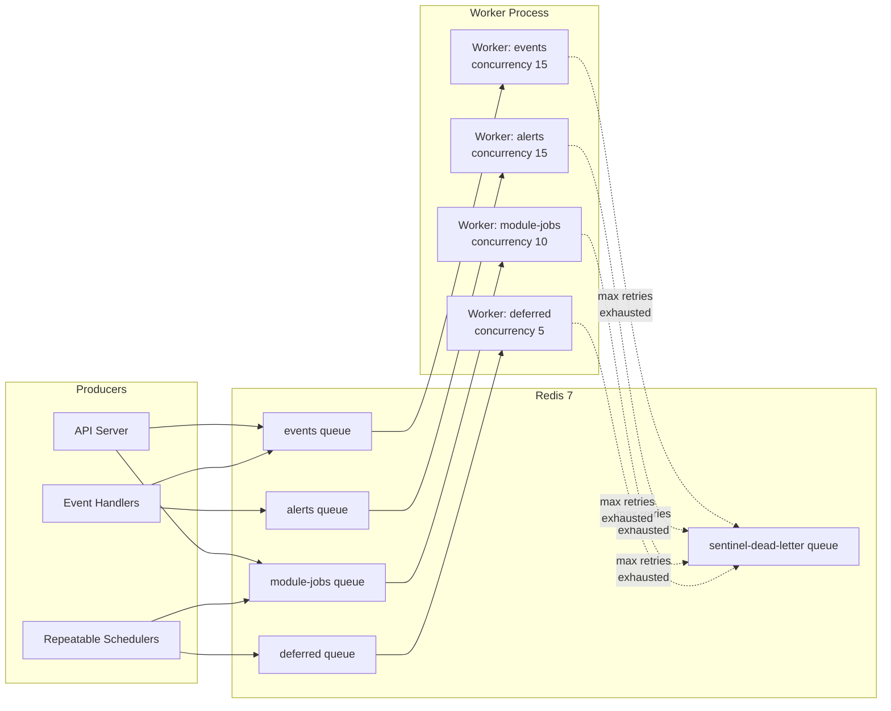
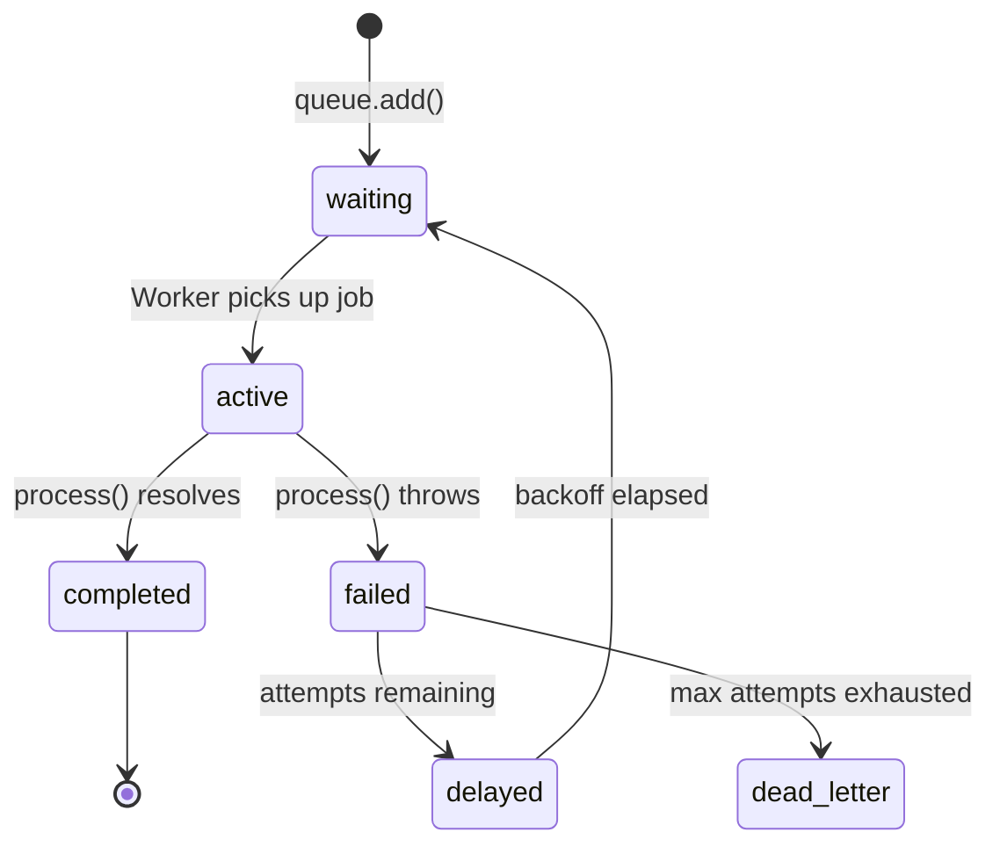
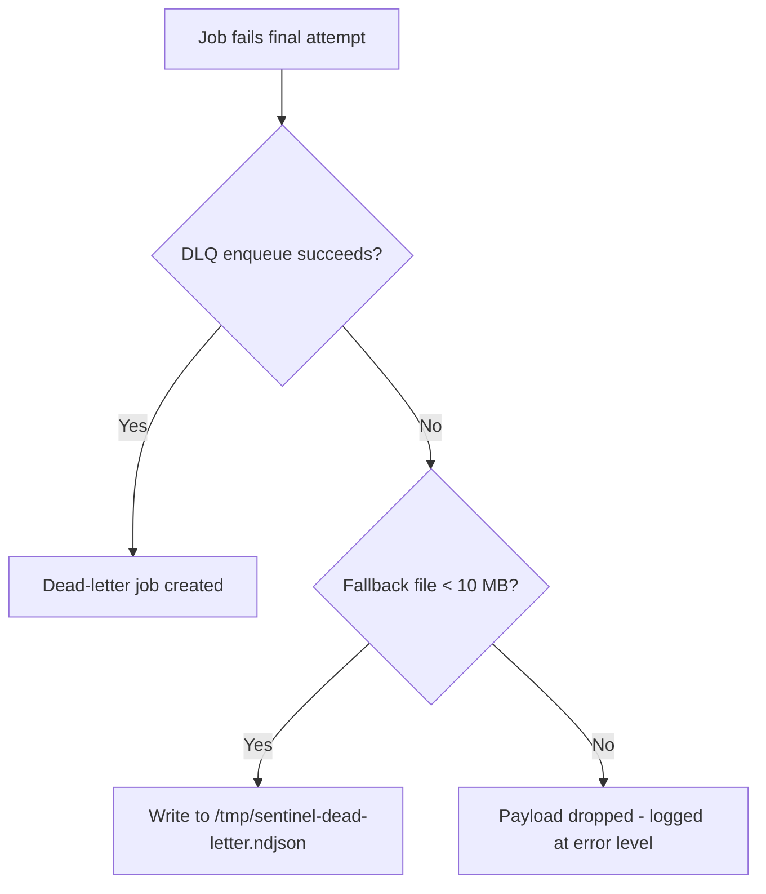

# Queue System

Sentinel uses [BullMQ 5](https://docs.bullmq.io/) as its job queue layer, backed by Redis 7.
All queue and job-type definitions live in `packages/shared/src/queue.ts`, which is the single
source of truth consumed by the API, the worker, and all feature modules.

## Architecture



## Queue names

```typescript
// packages/shared/src/queue.ts
export const QUEUE_NAMES = {
  EVENTS:      'events',       // normalized events -> rule evaluation
  ALERTS:      'alerts',       // alert candidates -> notification dispatch
  MODULE_JOBS: 'module-jobs',  // module-specific work (webhook processing, polling, etc.)
  DEFERRED:    'deferred',     // deferred/scheduled evaluation
} as const;
```

| Queue name    | Constant                  | Purpose                                                                 |
|---------------|---------------------------|-------------------------------------------------------------------------|
| `events`      | `QUEUE_NAMES.EVENTS`      | Accepts normalized platform events for rule evaluation and correlation. |
| `alerts`      | `QUEUE_NAMES.ALERTS`      | Routes triggered alert candidates to notification channels.             |
| `module-jobs` | `QUEUE_NAMES.MODULE_JOBS` | Module-specific processing: blockchain polling, registry polling, AWS SQS polling, webhook handling, infra scanning. |
| `deferred`    | `QUEUE_NAMES.DEFERRED`    | Scheduled platform maintenance: data retention, session cleanup, key rotation, correlation expiry. |

An additional `sentinel-dead-letter` queue is created at runtime to hold jobs that exhaust
all retry attempts. See [Dead-letter queue](#dead-letter-queue) for details.

## Concurrency settings per queue

| Queue         | Concurrency | Rationale                                                                  |
|---------------|-------------|----------------------------------------------------------------------------|
| `events`      | 15          | CPU-bound rule matching with Redis lookups; high throughput required.       |
| `alerts`      | 15          | Network-bound (HTTP to Slack, SMTP); high concurrency amortizes I/O wait.  |
| `module-jobs` | 10          | Parallel polling across multiple integrations (registry, chain, AWS, infra).|
| `deferred`    | 5           | Low-frequency scheduled tasks; bounded to limit DB pressure.               |

Total concurrent job slots: **45**. The PostgreSQL connection pool is sized at 50 to ensure
jobs never block waiting for a database connection.

## Redis connection management

The worker uses two connection strategies to avoid head-of-line blocking.

### Shared connection (Queue instances / producers)

A single `IORedis` connection is created at startup and registered via `setSharedConnection()`.
All `Queue` instances (used for enqueuing jobs) and the `FlowProducer` share this connection.

```typescript
const redis = new IORedis(config.REDIS_URL, {
  maxRetriesPerRequest: null,   // required by BullMQ
  enableReadyCheck: false,      // allows connection before Redis is fully ready
});
setSharedConnection(redis);
```

### Connection factory (Worker instances / consumers)

Each BullMQ `Worker` receives its own dedicated Redis connection, created by the factory
registered via `setConnectionFactory()`. BullMQ workers use the blocking `BRPOPLPUSH` command
to listen for jobs. If all workers shared a single connection, a slow consumer on one queue
would stall job delivery to all other queues.

```typescript
setConnectionFactory(() => new IORedis(config.REDIS_URL, {
  maxRetriesPerRequest: null,
  enableReadyCheck: false,
}));
```

The `maxRetriesPerRequest: null` setting is required by BullMQ. It disables the per-request
retry limit so that blocking commands can wait indefinitely without triggering an error.

### Queue instance caching

The `getQueue()` factory caches `Queue` instances in an in-process `Map`. The first call
for a given queue name creates the `Queue` object synchronously and stores it. Subsequent
calls return the cached instance. Because `new Queue()` is synchronous, there is no
async gap and therefore no TOCTOU race between the existence check and the `Map.set()`.

### Connection tracking for shutdown

All `Worker` instances created through `createWorker()` are tracked in a `Set`. On shutdown,
`closeAllQueues()` iterates this set to close each Worker and release its dedicated Redis
connection. Previously, workers were untracked and their connections leaked on shutdown.

## Job type definitions

All job types implement the `JobHandler` interface:

```typescript
export interface JobHandler {
  /** Job name -- used as queue.add(jobName, data) */
  readonly jobName: string;

  /** Which queue this handler listens on */
  readonly queueName: string;

  /** Process the job */
  process(job: Job): Promise<void>;
}
```

The worker dispatches incoming jobs to handlers by matching `job.name` against the `jobName`
of all handlers registered for that queue. If no handler matches, the job fails immediately
with an `Error`.

### Core job types by queue

**`events` queue**

| Job name               | Payload fields    | Description                                       |
|------------------------|-------------------|---------------------------------------------------|
| `event.evaluate`       | `eventId: string` | Load event, run RuleEngine, create alerts.        |
| `correlation.evaluate` | `eventId: string` | Load event, run CorrelationEngine.                |

**`alerts` queue**

| Job name         | Payload fields    | Description                                           |
|------------------|-------------------|-------------------------------------------------------|
| `alert.dispatch` | `alertId: string` | Load alert, dispatch to Slack/email/webhook channels. |

**`module-jobs` queue**

| Job name                   | Source module | Description                                                     |
|----------------------------|---------------|-----------------------------------------------------------------|
| `registry.poll-sweep`      | Core worker   | Query due registry artifacts and enqueue `registry.poll`.       |
| `registry.poll`            | Registry      | Fetch artifact tags from Docker Hub / npm registry.             |
| `registry.verify`          | Registry      | Verify Sigstore signatures and provenance for an artifact version. |
| `registry.verify.aggregate`| Registry      | Aggregate verification results across versions.                 |
| `registry.attribution`     | Registry      | Resolve package attribution data.                               |
| `registry.ci-notify`       | Registry      | Send CI build notifications.                                    |
| `registry.webhook-process` | Registry      | Process inbound registry webhooks.                              |
| `chain.block-poll`         | Chain         | Fetch new blocks from the EVM RPC node.                         |
| `chain.block-process`      | Chain         | Decode block transactions and emit normalized events.           |
| `chain.state-poll`         | Chain         | Poll contract state variables.                                  |
| `chain.rule.sync`          | Chain         | Sync active chain detection rules.                              |
| `chain.contract-verify`    | Chain         | Verify contract source via Etherscan.                           |
| `chain.rpc-usage.flush`    | Chain         | Flush RPC call usage counters to persistent storage.            |
| `chain.block-aggregate`    | Chain         | Aggregate block-level metrics.                                  |
| `aws.poll-sweep`           | AWS           | Query due AWS integrations and enqueue `aws.sqs.poll`.          |
| `aws.sqs.poll`             | AWS           | Poll an SQS queue for CloudTrail event notifications.           |
| `aws.event.process`        | AWS           | Parse raw CloudTrail event and promote to platform events.      |
| `github.webhook-process`   | GitHub        | Process inbound GitHub webhook events.                          |
| `github.repo-sync`         | GitHub        | Sync GitHub repository metadata.                                |
| `infra.scan`               | Infra         | Run infrastructure security scan.                               |
| `infra.probe`              | Infra         | Run reachability probe.                                         |
| `infra.schedule.load`      | Infra         | Load scheduled scan/probe configurations.                       |
| `infra.scan-aggregate`     | Infra         | Aggregate scan results.                                         |

**`deferred` queue**

| Job name                   | Payload fields                | Schedule        |
|----------------------------|-------------------------------|-----------------|
| `platform.data.retention`  | `policies: RetentionPolicy[]` | Every 24 hours  |
| `platform.session.cleanup` | `{}`                          | Every 1 hour    |
| `platform.key.rotation`    | `{}`                          | Every 5 minutes |
| `correlation.expiry`       | `{}`                          | Every 5 minutes |

## Job lifecycle



1. **waiting**: The job is in the queue, not yet picked up by a worker.
2. **active**: A worker has dequeued the job and its `process()` function is executing.
3. **completed**: The `process()` function resolved. Completed jobs are retained (up to 200
   per queue) for inspection, then pruned automatically.
4. **failed**: The `process()` function threw. BullMQ checks whether retry attempts remain.
5. **delayed**: The job is scheduled to become `waiting` after the computed backoff period.
6. **dead-letter**: The job exhausted all retry attempts and was moved to the
   `sentinel-dead-letter` queue.

## Retry policies

### Default job options

Default options are applied at queue creation time by the `getQueue()` factory:

```typescript
defaultJobOptions: {
  removeOnComplete: { count: 200 },   // retain last 200 completed jobs per queue
  removeOnFail:     { count: 500 },   // retain last 500 failed jobs per queue
  attempts: 3,
  backoff: { type: 'exponential', delay: 2000 },
}
```

### Backoff with jitter

The `createWorker()` function configures a custom `backoffStrategy` that adds randomized
jitter to the exponential delay. This prevents retry storms when many jobs fail simultaneously
(for example, during a transient Redis or database outage).

The backoff formula:

```
base       = job.opts.backoff.delay ?? 2000 ms
exponential = base * 2^(attemptsMade - 1)
jitter     = exponential * random(0.75, 1.25)
capped     = min(round(jitter), 60_000 ms)
```

| Attempt | Base delay | Exponential | Jitter range       | Max capped |
|---------|------------|-------------|--------------------|-----------:|
| 1 -> 2  | 2000 ms    | 2000 ms     | 1500 - 2500 ms     | 2500 ms    |
| 2 -> 3  | 2000 ms    | 4000 ms     | 3000 - 5000 ms     | 5000 ms    |
| 3       | --         | --          | Job moves to DLQ   | --         |

### UnrecoverableError

Handlers that detect permanently invalid input (such as a malformed payload that will never
succeed) throw `UnrecoverableError` from BullMQ. This skips all remaining retries and moves
the job directly to the failed state.

## Dead-letter queue

When a job exhausts all retry attempts, the worker's `failed` event listener moves its
payload to the `sentinel-dead-letter` queue for post-mortem inspection.



Dead-letter jobs are created with `removeOnComplete: false` and `attempts: 1` so they persist
in Redis indefinitely for investigation.

**Fallback mechanism**: If the dead-letter enqueue itself fails (for example, due to a Redis
outage), the payload is written to `/tmp/sentinel-dead-letter.ndjson` as newline-delimited
JSON. The file is capped at 10 MB to prevent unbounded disk usage. If the cap is reached,
subsequent payloads are dropped and logged at `error` level.

## FlowProducer

`packages/shared/src/queue.ts` exports a `getFlowProducer()` factory that returns a shared
`FlowProducer` instance. This enables fan-out/fan-in pipelines where a parent job can spawn
child jobs and wait for their completion before being marked complete. The `FlowProducer`
shares the same connection as the `Queue` instances.

## Queue ordering guarantees

BullMQ uses a Redis `ZSET` for the waiting list, ordered by a monotonically increasing
timestamp. Jobs are consumed in FIFO order within a given queue. There is no global ordering
across queues.

Jobs with an explicit `priority` value (lower number = higher priority) are sorted ahead of
unprioritized jobs. Sentinel does not currently assign custom priorities to any job type; all
jobs use the default priority (0).

## Metrics

The following Prometheus metrics are exported for queue monitoring via `packages/shared/src/metrics.ts`:

| Metric name                        | Type      | Labels              | Description                             |
|------------------------------------|-----------|---------------------|-----------------------------------------|
| `sentinel_jobs_processed_total`    | Counter   | `queue`, `jobName`, `status` | Total jobs processed (completed/failed). |
| `sentinel_job_duration_seconds`    | Histogram | `queue`, `jobName`  | Job processing duration.                |
| `sentinel_queue_depth`             | Gauge     | `queue`             | Number of waiting jobs per queue.       |
| `sentinel_dead_letter_total`       | Counter   | `queue`, `jobName`  | Jobs moved to dead-letter queue.        |

Queue depth is reported every 15 seconds by the heartbeat interval.

## Monitoring

Sentinel does not bundle a BullMQ dashboard, but the following tools are compatible:

| Tool                                                        | Notes                                        |
|-------------------------------------------------------------|----------------------------------------------|
| [Bull Board](https://github.com/felixmosh/bull-board)      | Express/Hono middleware; supports BullMQ.     |
| [Taskforce.sh](https://taskforce.sh)                        | Hosted SaaS dashboard for BullMQ.            |
| Redis CLI                                                   | Use `LLEN`, `ZCARD`, and `XLEN` to inspect queue depths. |

## Graceful close

`closeAllQueues()` tears down all queue infrastructure in a single call:

1. Closes all cached `Queue` instances (`Queue.close()`).
2. Closes all tracked `Worker` instances (`Worker.close()`), which drains in-flight jobs.
3. Closes the `FlowProducer` if one was created.
4. Calls `redis.quit()` on the shared connection, racing against a 5-second timeout so an
   unresponsive Redis connection does not consume the entire shutdown budget.
5. Clears all internal caches (queue map, worker set).

## How to add new job types

1. **Define the handler.** Create a new file in `apps/worker/src/handlers/` (or in a module's
   `src/handlers.ts`) that exports an object satisfying the `JobHandler` interface:

   ```typescript
   import type { Job } from 'bullmq';
   import { QUEUE_NAMES, type JobHandler } from '@sentinel/shared/queue';

   export const myHandler: JobHandler = {
     jobName: 'my-module.my-job',
     queueName: QUEUE_NAMES.MODULE_JOBS,
     async process(job: Job) {
       // Validate payload with zod
       // Process the job
     },
   };
   ```

2. **Register the handler.** Import the handler in `apps/worker/src/index.ts` and add it to
   `coreHandlers` (for platform-level jobs) or ensure the module's `jobHandlers` array
   includes it (for module-specific jobs).

3. **Enqueue jobs.** From any producer (API route, another handler):

   ```typescript
   import { getQueue, QUEUE_NAMES } from '@sentinel/shared/queue';

   const queue = getQueue(QUEUE_NAMES.MODULE_JOBS);
   await queue.add('my-module.my-job', { key: 'value' });
   ```

4. **Schedule repeatable jobs** (if the job runs on a cron or interval). In `index.ts`,
   use `upsertJobScheduler()` to atomically create or update the schedule:

   ```typescript
   await queue.upsertJobScheduler(
     'my-schedule-id',
     { every: 300_000 },  // every 5 minutes
     { name: 'my-module.my-job', data: {} },
   );
   ```

5. **Validate payloads.** Use `zod` to validate `job.data` at the top of your `process()`
   function. Throw `UnrecoverableError` for permanently invalid input to skip retries.

6. **Test.** Write integration tests that enqueue a job, wait for completion, and assert the
   expected side effects (database rows, downstream jobs).
