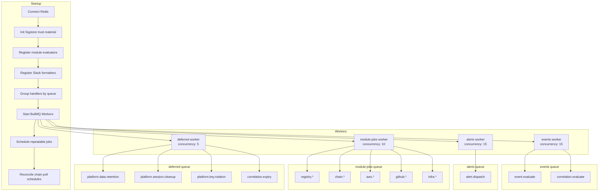
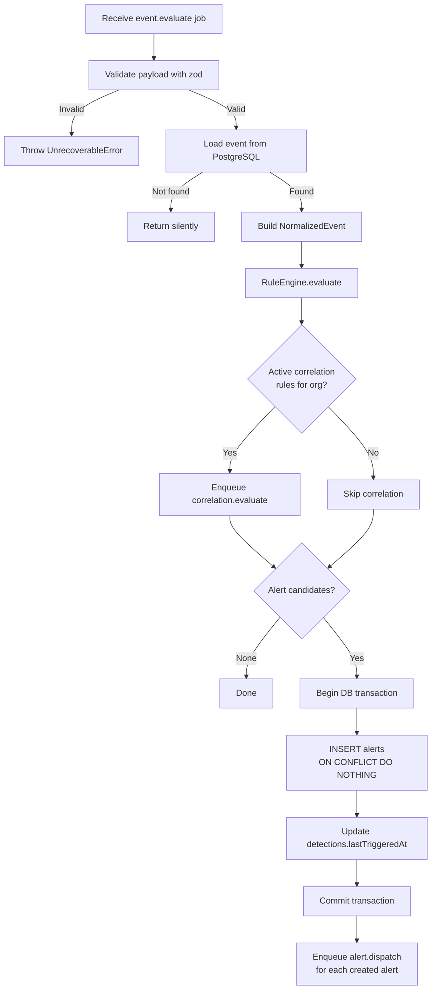
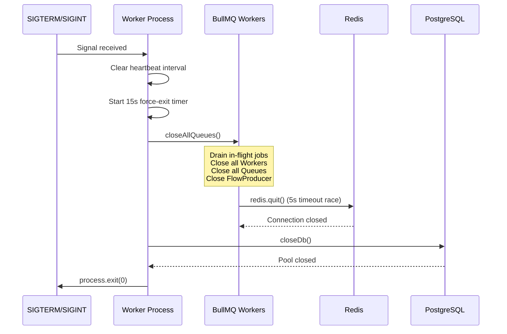

# Worker Service

The Sentinel worker service processes asynchronous jobs for rule evaluation, alert dispatch,
correlation analysis, and platform maintenance. It is built on
[BullMQ 5](https://docs.bullmq.io/) backed by Redis 7 and runs as a standalone Node.js process
separate from the API server.

**Source:** `apps/worker/src/index.ts`

## Architecture overview



On startup, the worker:

1. Initializes Sentry for error tracking and sets up global unhandled-rejection handlers.
2. Initializes Sigstore trust material for registry artifact signature verification.
3. Connects to Redis using a shared `IORedis` connection for Queue instances (producers) and
   registers a connection factory that gives each BullMQ Worker its own dedicated Redis
   connection, preventing head-of-line blocking on the blocking `BRPOPLPUSH` command.
4. Verifies Redis and PostgreSQL connectivity with probe queries. If either is unreachable,
   the process exits with code 1 so Docker can restart it.
5. Initializes the PostgreSQL connection pool with `maxConnections: 50` to match the total
   concurrent job slots across all queues (15 + 15 + 10 + 5 = 45).
6. Writes an initial heartbeat file at `/tmp/.worker-heartbeat` for the Docker healthcheck.
7. Registers all module evaluators (GitHub, Registry, Chain, Infra, AWS) plus the platform-level
   compound evaluator into the evaluator map.
8. Registers module-specific Slack formatters for alert dispatch.
9. Collects all core and module job handlers, groups them by declared `queueName`.
10. Creates a `sentinel-dead-letter` queue for jobs that exhaust all retries.
11. Starts one BullMQ `Worker` per queue with per-queue concurrency settings.
12. Schedules recurring jobs using `upsertJobScheduler()`.
13. Enqueues a one-time `chain.rule.sync` reconciliation job on startup.

## Handler registration

Handlers are registered by adding them to one of two lists in `apps/worker/src/index.ts`:

- **`coreHandlers`**: Platform-level handlers imported directly from `apps/worker/src/handlers/`.
- **`moduleHandlers`**: Collected from `modules.flatMap(m => m.jobHandlers)`.

All handlers are merged into a single array, then grouped into a `Map<string, JobHandler[]>`
keyed by `queueName`. For each entry in the map, a BullMQ `Worker` is created. The worker's
processor function looks up the handler by `job.name` in a pre-built `handlerMap` and throws
if no match is found.

## Queue names and concurrency

| Queue name    | Constant                     | Concurrency | Primary purpose                                              |
|---------------|------------------------------|-------------|--------------------------------------------------------------|
| `events`      | `QUEUE_NAMES.EVENTS`         | 15          | Normalized event processing and correlation evaluation.      |
| `alerts`      | `QUEUE_NAMES.ALERTS`         | 15          | Alert notification dispatch.                                 |
| `module-jobs` | `QUEUE_NAMES.MODULE_JOBS`    | 10          | Module-specific work: polling, webhook processing, scanning. |
| `deferred`    | `QUEUE_NAMES.DEFERRED`       | 5           | Scheduled/deferred jobs: retention, cleanup, key rotation.   |

## Job handlers

### Core handlers

| Handler file            | Job name                   | Queue         | Schedule / trigger                          |
|-------------------------|----------------------------|---------------|---------------------------------------------|
| `event-processing.ts`   | `event.evaluate`           | `events`      | Enqueued by API on event receipt.           |
| `correlation-evaluate.ts`| `correlation.evaluate`    | `events`      | Enqueued by `event.evaluate` handler.       |
| `correlation-expiry.ts` | `correlation.expiry`       | `deferred`    | Every 5 minutes.                            |
| `alert-dispatch.ts`     | `alert.dispatch`           | `alerts`      | Enqueued by event and correlation handlers. |
| `data-retention.ts`     | `platform.data.retention`  | `deferred`    | Every 24 hours.                             |
| `poll-sweep.ts`         | `registry.poll-sweep`      | `module-jobs` | Every 60 seconds.                           |
| `session-cleanup.ts`    | `platform.session.cleanup` | `deferred`    | Every 1 hour.                               |
| `key-rotation.ts`       | `platform.key.rotation`    | `deferred`    | Every 5 minutes.                            |

### Module handlers

| Module   | Job handlers                                                                                |
|----------|---------------------------------------------------------------------------------------------|
| GitHub   | `github.webhook-process`, `github.repo-sync`                                                |
| Registry | `registry.webhook-process`, `registry.poll`, `registry.attribution`, `registry.ci-notify`, `registry.verify`, `registry.verify.aggregate` |
| Chain    | `chain.block-poll`, `chain.block-process`, `chain.state-poll`, `chain.rule.sync`, `chain.contract-verify`, `chain.rpc-usage.flush`, `chain.block-aggregate` |
| Infra    | `infra.scan`, `infra.probe`, `infra.schedule.load`, `infra.scan-aggregate`                  |
| AWS      | `aws.poll-sweep`, `aws.sqs.poll`, `aws.event.process`                                      |

## Handler details

### event-processing: normalize, evaluate, alert

**Source:** `apps/worker/src/handlers/event-processing.ts`
**Job name:** `event.evaluate`
**Queue:** `events`



This handler performs the core detection pipeline for a single event:

1. **Validate**: Parses `job.data` with zod. Throws `UnrecoverableError` for invalid payloads.
2. **Load**: Reads the event row from PostgreSQL by `eventId`. Returns silently if not found.
3. **Evaluate**: Constructs a `NormalizedEvent` and passes it to the `RuleEngine`. Evaluators
   that use windowed counters (count, spike, sum) read and update state in Redis.
4. **Correlation guard**: Checks whether the org has at least one active correlation rule
   before enqueuing `correlation.evaluate`. This prevents queue churn for orgs without
   correlation rules.
5. **Alert creation**: All alert inserts are wrapped in a single database transaction. The
   `onConflictDoNothing` clause on insert uses the `uq_alerts_event_detection_rule` unique
   constraint for deduplication. If any insert fails, the entire batch rolls back.
6. **Dispatch**: Alert dispatch jobs are enqueued outside the transaction to prevent queue
   writes from being rolled back. If dispatch enqueue fails for any alert, the handler throws
   so BullMQ retries. On retry, `onConflictDoNothing` makes the alert inserts idempotent.

### alert-dispatch: format, send to channels

**Source:** `apps/worker/src/handlers/alert-dispatch.ts`
**Job name:** `alert.dispatch`
**Queue:** `alerts`

This handler delivers notifications for a triggered alert:

1. **Load**: Reads the alert and its associated detection from PostgreSQL.
2. **Channels**: Reads `detection.channelIds` and queries enabled, non-deleted channel rows.
3. **Slack token**: If the detection has a `slackChannelId`, loads and decrypts the Slack bot
   token from `slack_installations`.
4. **Idempotency**: Queries `notification_deliveries` for channels already marked `sent`.
   Already-sent channels are filtered out. The Slack channel ID check uses the workspace
   channel ID (e.g., `C0XXXXXX`) rather than a notification channel UUID.
5. **Module formatter**: Resolves the module-specific `formatSlackBlocks` formatter.
6. **Dispatch**: Calls `dispatchAlert()` from `@sentinel/notifications`, which routes the
   payload to Slack, email, or webhook delivery functions. Each channel is protected by an
   in-memory circuit breaker.
7. **Record**: Writes delivery records and updates `alerts.notificationStatus` in a single
   transaction. Delivery records are inserted first, then the status update.

If all channels fail, `dispatchAlert` throws to trigger a BullMQ retry. Partial success does
not retry; the `partial` status is recorded.

### correlation-evaluate: sequence, aggregation, absence

**Source:** `apps/worker/src/handlers/correlation-evaluate.ts`
**Job name:** `correlation.evaluate`
**Queue:** `events`

This handler runs correlation rule evaluation after an event has been ingested:

1. **Load**: Reads the event from PostgreSQL and constructs a `NormalizedEvent`.
2. **Evaluate**: Passes the event to the `CorrelationEngine`, which evaluates all active
   correlation rules. Rule state (sequence progress, aggregation counters, absence timers)
   is maintained in Redis under keys prefixed `sentinel:corr:*`.
3. **Alert creation**: For each `CorrelatedAlertCandidate`:
   - Inserts an alert row with `triggerType = 'correlated'`. The `detectionId` and `ruleId`
     columns are `null`; the correlation rule ID is stored in `triggerData.correlationRuleId`.
   - Uses `onConflictDoNothing` backed by the `uq_alerts_event_correlation` constraint.
   - If the insert returns nothing (duplicate), the handler still re-enqueues `alert.dispatch`
     in case the previous attempt failed after insert but before dispatch enqueue.
   - Updates `correlationRules.lastTriggeredAt`.
4. **Partial failure**: Successfully created alerts are preserved even if later candidates
   fail. The handler re-throws after processing all candidates so the job retries for the
   failed ones. On retry, `onConflictDoNothing` skips already-created alerts.

### correlation-expiry: cleanup expired instances

**Source:** `apps/worker/src/handlers/correlation-expiry.ts`
**Job name:** `correlation.expiry`
**Queue:** `deferred`
**Schedule:** Every 5 minutes.

This handler finds expired absence-pattern correlation instances and creates alerts when the
expected follow-up event was never observed within the grace period.

**Primary path (sorted set index):** Calls `ZRANGEBYSCORE` on `sentinel:corr:absence:index`
to retrieve up to 500 keys whose `expiresAt` is at or before the current time. This is
O(log N + M) and handles the steady-state case efficiently.

**Fallback path (SCAN):** Every 30 minutes, runs a `SCAN` over keys matching
`sentinel:corr:absence:*` to catch un-indexed keys from before the index was deployed. Found
keys are re-indexed with `ZADD`. The SCAN is capped at 1,000 iterations.

For each expired key:

1. Acquires a per-key processing lock (30 s TTL, random token) to prevent duplicate
   processing across worker replicas. Uses a Lua script for safe lock release.
2. Loads the correlation rule. If deleted or paused, cleans up the Redis key.
3. Inserts the absence alert into PostgreSQL first. Only after a successful insert does it
   delete the Redis key and index entry.
4. If the insert fails, the key survives for the next sweep. A `retryCount` is incremented
   inside the serialized instance. After 5 consecutive failures, the handler logs at `error`
   level.
5. Enqueues `alert.dispatch` for created alerts.

### data-retention: scheduled old data cleanup

**Source:** `apps/worker/src/handlers/data-retention.ts`
**Job name:** `platform.data.retention`
**Queue:** `deferred`
**Schedule:** Every 24 hours.

This handler purges old records according to configurable retention policies.

**Default policies:**

| Table                     | Timestamp column | Retention |
|---------------------------|------------------|-----------|
| `events`                  | `received_at`    | 90 days   |
| `alerts`                  | `created_at`     | 365 days  |
| `notification_deliveries` | `created_at`     | 30 days   |

**Module-specific policies (appended at startup):**

| Module   | Table                       | Timestamp column | Retention |
|----------|-----------------------------|------------------|-----------|
| AWS      | `aws_raw_events`            | `received_at`    | 7 days    |
| AWS      | `events` (filtered)         | `received_at`    | 14 days   |
| Chain    | `chain_state_snapshots`     | `polled_at`      | 30 days   |
| Chain    | `chain_container_metrics`   | `recorded_at`    | 30 days   |
| Chain    | `chain_rpc_usage_hourly`    | `bucket`         | 90 days   |
| Infra    | `infra_reachability_checks` | `checked_at`     | 30 days   |
| Infra    | `infra_snapshots`           | `created_at`     | 90 days   |
| Infra    | `infra_scan_step_results`   | `created_at`     | 90 days   |
| Infra    | `infra_score_history`       | `recorded_at`    | 180 days  |
| Registry | `rc_ci_notifications`       | `created_at`     | 90 days   |

Each policy is executed in batches of 1,000 rows, looping until fewer than 1,000 rows are
deleted in a single batch. This prevents long-held table locks.

**Security**: Table names, timestamp column names, and filter expressions are validated
against allowlists before being interpolated into SQL. The `retentionDays` value must be
an integer >= 1 to prevent accidental full-table deletion. Tables with composite primary
keys (no `id` column) use `ctid` for batched deletes.

### poll-sweep: trigger polling modules

**Source:** `apps/worker/src/handlers/poll-sweep.ts`
**Job name:** `registry.poll-sweep`
**Queue:** `module-jobs`
**Schedule:** Every 60 seconds.

This handler queries all enabled registry artifacts whose `lastPolledAt` is either `NULL` or
has exceeded the artifact's configured `pollIntervalSeconds`. For each due artifact:

1. Batch-loads all stored versions for every due artifact in a single query (avoiding N+1).
2. Builds a `monitoredArtifact` payload including tag patterns, ignore patterns, and
   credentials.
3. Enqueues a `registry.poll` job with `jobId: poll-${artifact.id}-${Date.now()}`.
   The timestamped job ID ensures each sweep cycle creates a fresh job rather than being
   silently deduped against completed jobs retained in Redis.

If any enqueue fails, the handler throws after attempting all artifacts so the job retries.

### session-cleanup: expired session removal

**Source:** `apps/worker/src/handlers/session-cleanup.ts`
**Job name:** `platform.session.cleanup`
**Queue:** `deferred`
**Schedule:** Every 1 hour.

Issues a batched `DELETE` that removes up to 1,000 expired sessions per iteration:

```sql
DELETE FROM sessions WHERE sid IN (
  SELECT sid FROM sessions WHERE expire < now() LIMIT 1000
)
```

The loop continues until fewer than 1,000 rows are deleted in a single batch. The deleted
count is logged when at least one row is removed.

### key-rotation: encryption key rotation

**Source:** `apps/worker/src/handlers/key-rotation.ts`
**Job name:** `platform.key.rotation`
**Queue:** `deferred`
**Schedule:** Every 5 minutes.

Re-encrypts database rows that carry stale ciphertext when an `ENCRYPTION_KEY` rotation is
in progress.

**Short-circuit**: If `ENCRYPTION_KEY_PREV` is not set, the handler returns immediately. This
avoids full table scans across 7+ tables every 5 minutes when no rotation is in progress.

**Encrypted columns:**

| Table                        | Column                      |
|------------------------------|-----------------------------|
| `organizations`              | `inviteSecretEncrypted`     |
| `organizations`              | `webhookSecretEncrypted`    |
| `slack_installations`        | `botToken`                  |
| `github_installations`       | `webhookSecretEncrypted`    |
| `rc_artifacts`               | `credentialsEncrypted`      |
| `infra_cdn_provider_configs` | `encryptedCredentials`      |
| `aws_integrations`           | `credentialsEncrypted`      |

For each column, the handler uses cursor-based pagination (`WHERE id > lastSeenId ORDER BY id ASC`)
in batches of 100. Each row is checked with `needsReEncrypt()` to determine if the ciphertext
was encrypted with the previous key. Rows already current are skipped.

The `UPDATE` uses an optimistic concurrency guard (`WHERE id = ? AND column = ?`) to detect
concurrent modifications. If the row was modified between read and write, the update
affects 0 rows and the handler logs a warning; the row will be retried on the next cycle.

**Sessions** are handled in two passes:
1. **Legacy plaintext sessions**: Rows where `sess` has no `_encrypted` key are encrypted
   with the current key.
2. **Encrypted sessions**: Rows with `_encrypted` are checked with `needsReEncrypt()` and
   re-encrypted if stale.

If a single row fails to decrypt, the error is logged at `warn` level and that row is
skipped. The job does not fail for partial rotation errors.

### Module-specific handlers

Additional handlers are registered by each feature module. These run on the `module-jobs`
queue unless otherwise noted.

**GitHub module:**
- `github.webhook-process`: Parse and normalize inbound GitHub webhook events.
- `github.repo-sync`: Sync repository metadata from the GitHub API.

**Registry module:**
- `registry.webhook-process`: Process inbound registry webhooks.
- `registry.poll`: Fetch artifact tags from Docker Hub or npm.
- `registry.attribution`: Resolve package attribution data.
- `registry.ci-notify`: Send CI build notifications.
- `registry.verify`: Verify Sigstore signatures and provenance.
- `registry.verify.aggregate`: Aggregate verification results.

**Chain module:**
- `chain.block-poll`: Fetch new blocks from the EVM RPC node.
- `chain.block-process`: Decode block transactions and emit normalized events.
- `chain.state-poll`: Poll contract state variables.
- `chain.rule.sync`: Sync active chain detection rules. Also triggered on startup with
  `action: 'reconcile'` to recreate poll schedules after Redis data loss.
- `chain.contract-verify`: Verify contract source via Etherscan.
- `chain.rpc-usage.flush`: Flush RPC call usage counters to persistent storage.
- `chain.block-aggregate`: Aggregate block-level metrics.

**Infra module:**
- `infra.scan`: Run infrastructure security scan.
- `infra.probe`: Run reachability probe.
- `infra.schedule.load`: Load scheduled scan/probe configurations.
- `infra.scan-aggregate`: Aggregate scan results.

**AWS module:**
- `aws.poll-sweep`: Query due AWS integrations and enqueue `aws.sqs.poll`.
- `aws.sqs.poll`: Poll an SQS queue for CloudTrail event notifications.
- `aws.event.process`: Parse raw CloudTrail event and promote to platform events.

## Concurrency model

### Per-queue workers and DB pool sizing

Each queue gets exactly one BullMQ `Worker` instance with a dedicated Redis connection.
The concurrency setting controls how many jobs that worker processes in parallel.

```
events:      15 concurrent jobs
alerts:      15 concurrent jobs
module-jobs: 10 concurrent jobs
deferred:     5 concurrent jobs
---------------------------------
Total:       45 concurrent jobs
```

The PostgreSQL pool is sized at **50 connections** (45 concurrent slots + 5 headroom)
to ensure no job blocks waiting for a database connection.

Each BullMQ Worker gets its own Redis connection via the connection factory. This prevents
the blocking `BRPOPLPUSH` on one queue from stalling job delivery to other queues.

### Worker scaling

The worker process is stateless with respect to job routing. All coordination state lives
in Redis (BullMQ metadata, windowed counters, correlation state) and PostgreSQL (events,
alerts, correlation rules).

- **Horizontal scaling**: Multiple worker replicas run simultaneously. BullMQ distributes
  jobs across all workers listening on the same queue. Docker Compose runs 2 replicas by
  default.
- **Scheduled jobs**: `upsertJobScheduler()` atomically creates or updates repeatable job
  schedules, avoiding the remove-then-add race during rolling deploys with multiple replicas.
- **Redis dependency**: All workers must share the same Redis instance. Windowed evaluators
  store counters in Redis; separate Redis instances would produce incorrect results.

## Data retention policies per module

| Module   | Table                       | Retention | Volume notes                               |
|----------|-----------------------------|-----------|---------------------------------------------|
| Platform | `events`                    | 90 days   | All normalized events.                      |
| Platform | `alerts`                    | 365 days  | Full incident context preserved.            |
| Platform | `notification_deliveries`   | 30 days   | Delivery audit log.                         |
| AWS      | `aws_raw_events`            | 7 days    | Short buffer; only triggered events promoted.|
| AWS      | `events` (module_id='aws')  | 14 days   | High volume from CloudTrail.                |
| Chain    | `chain_state_snapshots`     | 30 days   | One row per rule per poll cycle.            |
| Chain    | `chain_container_metrics`   | 30 days   | Periodic Docker stats samples.              |
| Chain    | `chain_rpc_usage_hourly`    | 90 days   | Billing/capacity analysis; composite PK.    |
| Infra    | `infra_reachability_checks` | 30 days   | Every few minutes per host.                 |
| Infra    | `infra_snapshots`           | 90 days   | One per scan per host.                      |
| Infra    | `infra_scan_step_results`   | 90 days   | Moderate volume.                            |
| Infra    | `infra_score_history`       | 180 days  | Long-term trend analysis.                   |
| Registry | `rc_ci_notifications`       | 90 days   | One row per CI workflow report.             |

## Scheduled jobs

All scheduled jobs use `upsertJobScheduler()` for atomic create-or-update semantics.

| Scheduler ID               | Job name                   | Queue         | Interval     |
|----------------------------|----------------------------|---------------|--------------|
| `daily-retention`          | `platform.data.retention`  | `deferred`    | 24 hours     |
| `session-cleanup`          | `platform.session.cleanup` | `deferred`    | 1 hour       |
| `key-rotation`             | `platform.key.rotation`    | `deferred`    | 5 minutes    |
| `correlation-expiry-sweep` | `correlation.expiry`       | `deferred`    | 5 minutes    |
| `rpc-usage-flush`          | `chain.rpc-usage.flush`    | `module-jobs` | 5 minutes    |
| `registry-poll-sweep`      | `registry.poll-sweep`      | `module-jobs` | 60 seconds   |
| `aws-poll-sweep`           | `aws.poll-sweep`           | `module-jobs` | 60 seconds   |
| `infra-schedule-load`      | `infra.schedule.load`      | `module-jobs` | 60 seconds   |

## Graceful shutdown



The worker listens for `SIGTERM` and `SIGINT`. On receipt:

1. Clears the heartbeat interval to stop queue depth reporting.
2. Starts a 15-second force-exit timer (`setTimeout` with `.unref()`) as a safety net. If
   graceful shutdown stalls (for example, a BullMQ worker or Redis connection hangs), the
   process force-exits before Docker's default stop timeout.
3. Calls `closeAllQueues()`, which closes all tracked Workers (draining in-flight jobs),
   all Queue handles, and the FlowProducer. The shared Redis connection is quit with a
   5-second timeout race.
4. Closes the PostgreSQL connection pool with `closeDb()`.
5. Exits with code 0.

**Important**: `closeAllQueues()` handles the shared Redis connection quit internally. The
shutdown function does not call `redis.quit()` separately to avoid double-quitting the same
connection, which can hang if Redis is unresponsive.

## Health checking

The worker writes to `/tmp/.worker-heartbeat` every 15 seconds. The Docker healthcheck
verifies that this file's modification time is less than 60 seconds old. This approach
detects both process hangs and event loop stalls.

An initial heartbeat is written immediately on startup so the Docker healthcheck passes
during the `start_period`.

## Observability

### Logging

The worker uses Pino structured logging via `@sentinel/shared/logger`. In production, output
is JSON for log aggregators. In development, `pino-pretty` provides human-readable output.

### Metrics

Prometheus metrics are exported via `@sentinel/shared/metrics`:

| Metric                             | Type      | Labels                       | Description                      |
|------------------------------------|-----------|------------------------------|----------------------------------|
| `sentinel_jobs_processed_total`    | Counter   | `queue`, `jobName`, `status` | Completed and failed job counts. |
| `sentinel_job_duration_seconds`    | Histogram | `queue`, `jobName`           | Processing time per job.         |
| `sentinel_queue_depth`             | Gauge     | `queue`                      | Waiting jobs per queue.          |
| `sentinel_dead_letter_total`       | Counter   | `queue`, `jobName`           | Jobs moved to DLQ.              |

### Error tracking

Sentry is initialized at startup for exception capture. Dead-letter fallback failures are
reported to Sentry with context including queue name, job name, job ID, and attempt count.

---

## Bug audit

The following issues were identified during source review:

- **[LOW]** `packages/notifications/src/email.ts:25` -- **Hardcoded fallback**: The `getTransporter()` function uses `Number(parsed.port) || 587` as a fallback port. If the SMTP URL explicitly specifies port `0`, it silently falls back to `587` instead of raising an error. Impact: misconfigured SMTP URLs may appear to work but connect to the wrong port.

- **[LOW]** `packages/notifications/src/webhook.ts:53` -- **DNS lookup returns only first address**: `dns.lookup(parsed.hostname)` returns only the first resolved IP address. If a hostname resolves to multiple IPs where the first is public but others are private, the SSRF check passes but a subsequent retry or DNS round-robin could route the request to a private IP. Impact: narrow SSRF bypass under specific multi-record DNS conditions.

- **[MEDIUM]** `packages/notifications/src/dispatcher.ts:34` -- **Unbounded circuit breaker map**: The `circuits` Map grows without bound as new `channelId` values are encountered. Deleted channels or one-time Slack channel IDs are never evicted. Impact: memory leak proportional to the number of unique channels over the process lifetime; significant only for very long-running workers with high channel churn.

- **[LOW]** `apps/worker/src/handlers/correlation-expiry.ts:260-265` -- **Race condition on instance update**: After incrementing `retryCount`, the handler writes the updated instance back to Redis using the key's remaining `PTTL`. If `PTTL` returns `-2` (key expired between `GET` and `PTTL`), the `SET ... PX` call uses a negative TTL, which Redis rejects. The instance is then lost. Impact: under rare timing, a repeatedly-failing absence key loses its retry counter and the key silently disappears.

- **[MEDIUM]** `apps/worker/src/index.ts:171` -- **Unchecked attemptsMade comparison**: The dead-letter logic compares `attemptsMade >= maxAttempts` but reads `maxAttempts` from `job?.opts?.attempts ?? 3`. If a job is individually configured with `attempts: 1`, the DLQ path triggers on the first failure since `attemptsMade` is `1` after the first attempt and `1 >= 1` is true. However, BullMQ may still have internal retries pending depending on how `attempts` interacts with the retry counter. Impact: possible premature DLQ routing for jobs with non-default `attempts` settings, or missed DLQ routing if BullMQ's internal accounting differs from the manual check.

- **[LOW]** `apps/worker/src/handlers/alert-dispatch.ts:96-98` -- **Fragile module ID extraction**: The `moduleId` for the alert payload is extracted from `triggerData` via a deeply nested type-narrowing chain. If `triggerData` is unexpectedly `null` or missing the `moduleId` key, the fallback is `'unknown'`. This causes the module formatter lookup to fail silently (no custom Slack formatting). Impact: alerts from corrupted or legacy trigger data render with generic Block Kit formatting instead of module-specific blocks.

- **[LOW]** `packages/notifications/src/email.ts:9` -- **Module-level singleton transporter**: The `_transporter` singleton means the SMTP connection is cached indefinitely. If SMTP credentials are rotated or the server IP changes, the worker must be restarted to pick up the change. Impact: stale SMTP configuration requires a worker restart; not self-healing.
